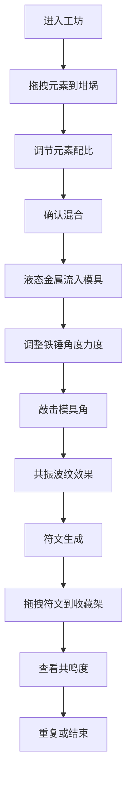

## 1. 产品概述

虚拟中世纪炼金术符文熔铸与元素共振交互应用，让用户扮演炼金术士在地下实验室中通过元素配比、模具敲击和元素共振来创造独特的魔法符文。

- **核心目标**：提供沉浸式炼金体验，通过视觉、听觉反馈创造独特魔法符文
- **目标用户**：对炼金术、魔法元素、交互艺术感兴趣的用户
- **市场价值**：独特的交互体验，融合艺术创作与游戏化元素

## 2. 核心功能

### 2.1 用户角色
| 角色 | 注册方式 | 核心权限 |
|------|----------|----------|
| 炼金术士 | 无需注册，直接使用 | 元素配比、符文熔铸、符文收藏 |

### 2.2 功能模块
1. **元素配比区**：三种基础元素（火、水、土）的拖拽与配比调节
2. **熔铸台**：中央坩埚混合、六边形模具熔铸、符文生成
3. **铁锤交互**：角度力度调节、敲击模具触发共振
4. **仪表盘**：元素共鸣度实时显示
5. **符文收藏架**：已生成符文的拖拽收藏与展示
6. **进度条**：炼金四步骤进度追踪

### 2.3 页面详情
| 页面名称 | 模块名称 | 功能描述 |
|-----------|-------------|---------------------|
| 主工坊界面 | 背景层 | 煤灰黑到暗炉红渐变全屏背景，营造地下实验室氛围 |
| 主工坊界面 | 元素药瓶架 | 三隔层竖排药瓶，SVG绘制带气泡动画，支持拖拽配比 |
| 主工坊界面 | 熔铸台 | SVG绘制圆形熔铸台，六芒星浮雕，铜合金边缘，中央坩埚 |
| 主工坊界面 | 六边形模具 | 边宽120px，内壁凹槽线条，六个角对应不同音频频率 |
| 主工坊界面 | 铁锤交互区 | 可拖拽调整角度和力度，力度条0-100滑动 |
| 主工坊界面 | 共鸣度仪表盘 | Canvas弧形表盘，0-100%范围，实时显示匹配度 |
| 主工坊界面 | 符文收藏架 | 右侧竖排，最多容纳8个符文，支持拖拽放置 |
| 主工坊界面 | 进度横幅 | 顶部渐变条，四步骤流水线状态灯 |

## 3. 核心流程

### 用户操作流程
1. 用户进入工坊，看到完整的炼金界面
2. 从左侧药瓶架拖拽火、水、土三种元素到中央坩埚
3. 通过滑块调节各元素比例（火30-70%、水10-60%、土10-50%）
4. 观察坩埚内颜色随配比实时渐变，涡旋粒子效果
5. 确认混合后，液态金属流入六边形模具
6. 使用铁锤调整角度和力度，敲击模具六个角之一
7. 触发共振波纹和光晕效果，持续3秒
8. 模具中逐渐形成符文图案，伴随金色脉冲波
9. 符文凝聚成发光圆盘，可拖拽到收藏架
10. 仪表盘实时显示共鸣度，影响符文复杂度

### 流程图

## 4. 用户界面设计

### 4.1 设计风格
- **主色调**：煤灰黑(#2c2c2c)、暗炉红(#6d1b1b)、深赭石、暗金
- **元素色**：火红(#e53935)、水蓝(#1e88e5)、土黄(#fdd835)
- **按钮风格**：暗金描边，中世纪羊皮纸质感，悬停亮金色光晕扩散
- **字体**：古典衬线字体搭配中世纪风格装饰字体
- **布局风格**：桌面端横向布局（左-中-右），移动端纵向布局（上-中-下）
- **图标风格**：炼金术符号、几何纹路、魔法元素

### 4.2 页面设计概述
| 页面名称 | 模块名称 | UI元素 |
|-----------|-------------|-------------|
| 主工坊界面 | 背景层 | 径向渐变、微妙噪点纹理、光影层次 |
| 主工坊界面 | 熔铸台 | 700px直径圆形SVG、六芒星浮雕、铜合金描边、坩埚涡旋粒子 |
| 主工坊界面 | 元素药瓶 | SVG绘制玻璃瓶、液体填充、气泡上升动画、拖拽反馈 |
| 主工坊界面 | 模具 | 六边形SVG、内壁凹槽、敲击点高亮、共振波纹Canvas |
| 主工坊界面 | 铁锤 | 可拖拽SVG、力度条滑块、角度指示 |
| 主工坊界面 | 仪表盘 | Canvas弧形表盘、指针动画、数字跳动效果 |
| 主工坊界面 | 符文 | 64种几何纹路、发光效果、粒子光晕、可拖拽圆盘 |
| 主工坊界面 | 进度条 | 顶部渐变横幅、四步骤状态灯、已完成亮金色 |

### 4.3 响应式设计
- **桌面端**：横向布局，熔铸台直径700px，药瓶架左侧竖排，铁锤和仪表盘右侧
- **平板端**：熔铸台缩小至600px，保留横向布局
- **移动端**：纵向布局，熔铸台缩小至500px，药瓶架顶部横排，交互元素底部排列
- **触摸优化**：增大点击区域，优化拖拽体验，支持触摸手势

### 4.4 动画与交互
- **气泡动画**：药瓶内气泡缓慢上升，大小随机
- **涡旋粒子**：30个粒子，4-8px，随机旋转，半透明
- **共振波纹**：Canvas同心圆波纹，频率随敲击参数变化，幅度10-30px
- **光晕效果**：敲击后模具角光晕，冷蓝到暖橙渐变
- **脉冲波**：符文形成时中心向外金色脉冲，强度与力度正相关
- **悬停效果**：交互元素悬停0.3s亮金色光晕扩散
- **符文形成**：3秒渐变生成，线条逐笔绘制效果
