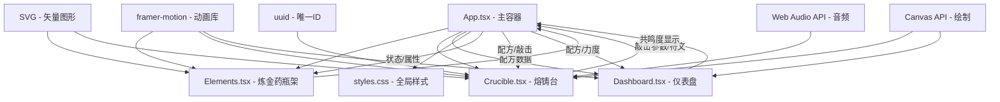

## 1. 架构设计



## 2. 技术描述

- **前端框架**: React@18 + TypeScript@5
- **构建工具**: Vite@5
- **动画库**: framer-motion@11
- **唯一ID生成**: uuid@9
- **图形渲染**: SVG + Canvas API
- **音频处理**: Web Audio API
- **状态管理**: React useState/useCallback (组件内状态)
- **样式方案**: 原生CSS + CSS变量

### 依赖说明
| 包名 | 版本 | 用途 |
|------|------|------|
| react | ^18.2.0 | 前端框架 |
| react-dom | ^18.2.0 | React DOM渲染 |
| typescript | ^5.0.0 | TypeScript支持 |
| vite | ^5.0.0 | 构建工具 |
| @vitejs/plugin-react | ^4.0.0 | Vite React插件 |
| framer-motion | ^11.0.0 | 动画效果 |
| uuid | ^9.0.0 | 唯一ID生成 |

## 3. 项目结构

```
e:\solo\VersionFast\tasks\auto268\
├── package.json
├── vite.config.js
├── tsconfig.json
├── index.html
└── src/
    ├── App.tsx          # 主容器，布局组合和状态管理
    ├── Elements.tsx     # 炼金药瓶架组件，元素拖拽和配比滑块
    ├── Crucible.tsx     # 熔铸台组件，坩埚/模具/符文生成
    ├── Dashboard.tsx    # 仪表盘组件，元素共鸣度显示
    └── styles.css       # 全局样式，主题/动画/响应式
```

## 4. 数据模型与类型定义

### 4.1 核心类型定义

```typescript
// 元素类型
type ElementType = 'fire' | 'water' | 'earth';

// 配方数据
interface Recipe {
  fire: number;    // 30-70%
  water: number;   // 10-60%
  earth: number;   // 10-50%
}

// 敲击参数
interface StrikeParams {
  angle: number;      // 0-360度
  force: number;      // 0-100
  frequency: number;  // 240|360|480|600|720|840 Hz
  cornerIndex: number; // 0-5
}

// 符文数据
interface Rune {
  id: string;
  patternIndex: number;  // 0-63，共64种纹路
  complexity: number;    // 基于共鸣度
  color: string;
  glowIntensity: number;
  createdAt: number;
}

// 炼金步骤
type AlchemyStep = 1 | 2 | 3 | 4;
// 1: 元素配比, 2: 混合确认, 3: 敲击共振, 4: 符文完成

// 共振波纹
interface Ripple {
  id: string;
  x: number;
  y: number;
  radius: number;
  maxRadius: number;
  opacity: number;
  frequency: number;
}

// 涡旋粒子
interface VortexParticle {
  id: string;
  x: number;
  y: number;
  vx: number;
  vy: number;
  size: number;
  rotation: number;
  rotationSpeed: number;
  opacity: number;
}
```

### 4.2 符文图案映射表

```typescript
// 6种频率组合映射到64种符文纹路
// 使用frequencyIndex (0-5)的组合生成0-63的索引
const frequencyToRunePattern = (frequencies: number[]): number => {
  // 将6个角的敲击频率编码为6位二进制数
  // 每位代表是否敲击过对应频率的角
  // 生成0-63的索引
};
```

## 5. 组件API定义

### 5.1 Elements.tsx Props
```typescript
interface ElementsProps {
  recipe: Recipe;
  onRecipeChange: (recipe: Recipe) => void;
  disabled: boolean;
}
```

### 5.2 Crucible.tsx Props
```typescript
interface CrucibleProps {
  recipe: Recipe;
  currentStep: AlchemyStep;
  onMixConfirm: () => void;
  onStrike: (params: StrikeParams) => void;
  onRuneCreated: (rune: Rune) => void;
  collectedRunes: Rune[];
  onRuneCollect: (runeId: string) => void;
}
```

### 5.3 Dashboard.tsx Props
```typescript
interface DashboardProps {
  recipe: Recipe;
  strikeForce: number;
  strikeFrequency: number | null;
  currentStep: AlchemyStep;
}
```

## 6. 核心算法

### 6.1 混合颜色计算
```typescript
const calculateMixedColor = (recipe: Recipe): string => {
  const r = Math.round(229 * recipe.fire/100 + 30 * recipe.water/100 + 253 * recipe.earth/100);
  const g = Math.round(57 * recipe.fire/100 + 136 * recipe.water/100 + 216 * recipe.earth/100);
  const b = Math.round(53 * recipe.fire/100 + 229 * recipe.water/100 + 53 * recipe.earth/100);
  return `rgb(${r}, ${g}, ${b})`;
};
```

### 6.2 共鸣度计算
```typescript
const calculateResonance = (
  recipe: Recipe, 
  strikeParams: StrikeParams
): number => {
  // 理想配比与敲击频率的对应关系
  // 火元素多 -> 高频共鸣好
  // 水元素多 -> 中频共鸣好
  // 土元素多 -> 低频共鸣好
  
  const fireBias = recipe.fire * (strikeParams.frequency / 840);
  const waterBias = recipe.water * (1 - Math.abs(strikeParams.frequency - 480) / 360);
  const earthBias = recipe.earth * (1 - strikeParams.frequency / 840);
  
  const forceMultiplier = 0.5 + (strikeParams.force / 200);
  
  return Math.min(100, (fireBias + waterBias + earthBias) * forceMultiplier);
};
```

### 6.3 符文复杂度计算
```typescript
const calculateComplexity = (resonance: number): number => {
  if (resonance >= 90) return 5;    // 最复杂
  if (resonance >= 75) return 4;
  if (resonance >= 55) return 3;
  if (resonance >= 35) return 2;
  return 1;                          // 最简单
};
```

## 7. 性能优化策略

1. **Canvas分层渲染**：
   - 静态背景层：熔铸台、模具边框（SVG）
   - 动态效果层：涡旋粒子、共振波纹（Canvas）
   - 符文绘制层：符文图案、发光效果（Canvas）

2. **粒子数量控制**：
   - 涡旋粒子：最多30个
   - 总粒子数：不超过80个
   - 离屏粒子自动回收复用

3. **动画帧率控制**：
   - 使用requestAnimationFrame
   - 目标帧率：50+ fps
   - 后台标签页自动降频

4. **React渲染优化**：
   - 使用React.memo包裹纯展示组件
   - 使用useCallback缓存事件处理函数
   - 避免不必要的重渲染

5. **资源复用**：
   - 粒子对象池复用
   - 音频上下文单例
   - Canvas上下文缓存

## 8. 构建配置

### vite.config.js
```javascript
import { defineConfig } from 'vite';
import react from '@vitejs/plugin-react';

export default defineConfig({
  plugins: [react()],
  server: {
    port: 5173,
    open: true
  },
  build: {
    target: 'es2020',
    sourcemap: true
  }
});
```

### tsconfig.json
```json
{
  "compilerOptions": {
    "target": "ES2020",
    "lib": ["ES2020", "DOM", "DOM.Iterable"],
    "module": "ESNext",
    "skipLibCheck": true,
    "moduleResolution": "bundler",
    "allowImportingTsExtensions": true,
    "resolveJsonModule": true,
    "isolatedModules": true,
    "noEmit": true,
    "jsx": "react-jsx",
    "strict": true,
    "noUnusedLocals": true,
    "noUnusedParameters": true,
    "noFallthroughCasesInSwitch": true
  },
  "include": ["src"]
}
```
