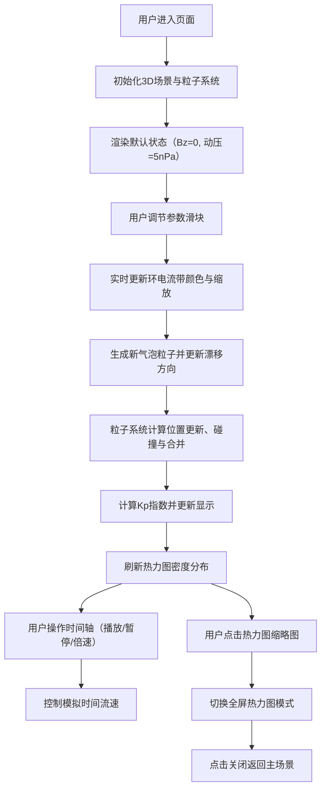

## 1. 产品概述

磁暴环电流与极区电离层气泡漂移交互可视化应用，面向空间物理学研究者和教育领域，提供沉浸式的地球磁层物理过程模拟体验。用户通过调节行星际磁场参数和太阳风动压，实时观察磁层环电流的动态响应以及电离层气泡的漂移、形变与合并过程。

- **核心价值**：将抽象的空间物理概念转化为直观的可视化交互，助力科研教学与科普展示
- **目标用户**：空间物理学家、高校师生、天文爱好者
- **技术亮点**：Three.js 3D渲染 + Canvas 2D高性能粒子系统 + 实时物理模拟

## 2. 核心功能

### 2.1 用户角色
| 角色 | 注册方式 | 核心权限 |
|------|----------|----------|
| 访客用户 | 无需注册 | 完整使用所有模拟功能，调节参数观察物理过程 |

### 2.2 功能模块
1. **3D地球场景**：球形地球渲染、大气辉光效果、环电流带动态展示
2. **参数控制面板**：Bz分量滑块、太阳风动压滑块、电场强度滑块
3. **电离层气泡粒子系统**：500-1500个气泡粒子实时模拟、漂移运动、碰撞检测、合并机制
4. **时间轴控制**：播放/暂停、1x/2x/5x/10x倍速调节、Kp指数实时显示
5. **热力图展示**：气泡密度分布热力图、缩略图/全屏切换
6. **响应式适配**：桌面端侧边栏、移动端底部横向图标栏

### 2.3 页面详情
| 页面名称 | 模块名称 | 功能描述 |
|---------|----------|---------|
| 主模拟页面 | 3D地球场景 | 三维透视俯视视角（45°俯角）展示地球与环电流带，随参数实时变化 |
| 主模拟页面 | 左侧控制面板 | 三个参数滑块，带hover动画和发光效果，实时更新物理状态 |
| 主模拟页面 | 气泡粒子层 | Canvas 2D双缓冲渲染，气泡漂移、碰撞发光、合并效果 |
| 主模拟页面 | 底部时间轴 | SVG刻度时间轴，播放控制按钮，Kp指数显示（#ff6f00橙色） |
| 主模拟页面 | 右上角热力图 | 150x150px缩略图，5秒刷新，点击展开全屏 |

## 3. 核心流程

## 4. 用户界面设计

### 4.1 设计风格
- **主色调**：深空黑 #0a0b1c → 磁层蓝 #1a3f6a 渐变背景
- **主题色**：深蓝黑 #0d1b2a，亮蓝高亮 #00b4d8，紫色强调 #7b2d8e
- **环电流带**：洋红 #e040fb → 青蓝 #00e5ff 渐变，透明度0.4
- **气泡粒子**：蓝绿色 #b0e0e6，透明度0.6，碰撞发光 #ffffff
- **控件样式**：圆角矩形 border-radius: 8px，hover过渡0.3s（#1e2a3a → #2a3a4a）
- **滑块设计**：轨道8px高 #37474f，手柄16px发光圆点 #00e5ff，外发光4px
- **字体方向**：采用现代科技感无衬线字体，Kp指数使用大号橙色 #ff6f00 字体
- **整体氛围**：深色科技风，宇宙空间感，微妙的辉光与发光效果

### 4.2 页面设计概述
| 页面名称 | 模块名称 | UI元素 |
|---------|----------|--------|
| 主模拟页面 | 3D地球场景 | 半径80px球体，蓝绿色纹理，大气辉光，环电流带动态闪烁 |
| 主模拟页面 | 左侧控制面板 | 半透明磨砂玻璃 #1e2a3a，三个带标签滑块，单位显示 |
| 主模拟页面 | 气泡粒子层 | Canvas全屏覆盖，500-1500个半透明粒子，拖尾效果 |
| 主模拟页面 | 底部时间轴 | 800x30px SVG刻度条，播放按钮，倍速切换，Kp指数显示 |
| 主模拟页面 | 热力图组件 | 150x150px Canvas缩略图，蓝红渐变，点击全屏遮罩 |

### 4.3 响应式设计
- **桌面端（≥768px）**：左侧垂直控制面板，右上角热力图，底部居中时间轴
- **移动端（<768px）**：控制面板移至底部横向排列，压缩为图标模式，热力图缩小至80x80px移至左上角
- **触控优化**：滑块加大触控区域，按钮最小44x44px，双击重置参数

### 4.4 3D场景指导
- **环境背景**：深空渐变（#0a0b1c → #1a3f6a），无HDRI，添加星点粒子背景
- **光照设置**：半球光模拟太阳光（偏黄）+ 环境光（弱蓝），方向光产生地球阴影
- **相机设置**：PerspectiveCamera，45°俯角，距离250px，自动环绕微调
- **地球材质**：MeshStandardMaterial，蓝绿色纹理贴图，粗糙度0.7，金属度0.1
- **大气辉光**：球体外侧添加半透明发光层，使用AdditiveBlending混合模式
- **环电流带**：TorusGeometry，渐变色材质，随磁场扰动频率正弦闪烁
- **后处理**：轻微Bloom效果增强辉光，无抗锯齿（性能考虑）

## 5. 性能指标
- **帧率目标**：60fps稳定运行
- **粒子上限**：2000个粒子时单帧渲染≤12ms
- **渲染策略**：Canvas 2D双缓冲，空间划分碰撞检测，粒子对象池复用
- **热力图优化**：每5秒计算一次密度矩阵，避免实时计算开销
