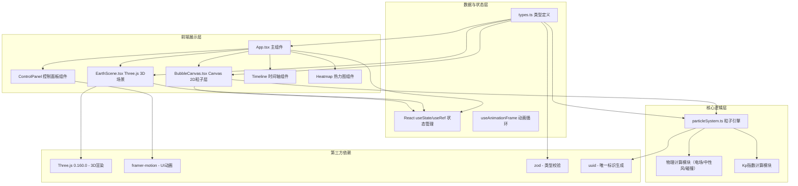

## 1. 架构设计



## 2. 技术描述

### 2.1 技术栈选择
| 类别 | 技术 | 版本 | 用途 |
|------|------|------|------|
| 前端框架 | React | ^18.2.0 | 组件化UI开发 |
| 编程语言 | TypeScript | ^5.3.0 | 类型安全开发 |
| 构建工具 | Vite | ^5.0.0 | 快速开发构建 |
| 3D渲染 | Three.js | 0.160.0 | 地球与环电流带3D渲染 |
| UI动画 | framer-motion | ^10.16.0 | 控制面板过渡动画 |
| 类型校验 | zod | ^3.22.0 | 参数运行时校验 |
| 唯一标识 | uuid | ^9.0.0 | 粒子ID生成 |

### 2.2 初始化方式
- Windows系统执行：`npm init vite-init@latest -y . "--" --template react-ts --force`
- 项目创建后手动更新 package.json 添加指定依赖版本
- 配置路径别名 `@/` 指向 `src/` 目录

## 3. 目录结构

```
auto269/
├── .trae/documents/          # 项目文档
│   ├── PRD_磁暴环电流模拟.md
│   └── 技术架构_磁暴环电流模拟.md
├── src/
│   ├── components/           # React组件
│   │   ├── EarthScene.tsx    # Three.js 3D地球场景
│   │   └── BubbleCanvas.tsx  # Canvas 2D气泡粒子层
│   ├── core/                 # 核心业务逻辑
│   │   └── particleSystem.ts # 粒子系统引擎
│   ├── types.ts              # 全局类型定义
│   ├── App.tsx               # 主应用组件
│   ├── main.tsx              # 应用入口
│   └── index.css             # 全局样式
├── index.html                # HTML入口
├── package.json              # 依赖配置
├── vite.config.js            # Vite配置
├── tsconfig.json             # TypeScript配置
└── README.md                 # 项目说明
```

## 4. 核心模块设计

### 4.1 类型定义 (src/types.ts)
```typescript
export interface MagneticFieldParams {
  bz: number;           // Bz分量 [-10, 10] nT
  dynamicPressure: number; // 太阳风动压 [1, 20] nPa
  electricField: number;    // 电场强度 [0, 100] mV/m
}

export interface BubbleParticle {
  id: string;
  x: number;           // 屏幕X坐标
  y: number;           // 屏幕Y坐标
  vx: number;          // X方向速度
  vy: number;          // Y方向速度
  size: number;        // 粒子大小 5-10px
  opacity: number;     // 透明度
  latitude: number;    // 纬度 60°-80°
  longitude: number;   // 经度
  isColliding: boolean; // 是否正在碰撞
  collisionTime: number; // 碰撞开始时间
  age: number;         // 粒子存活时间
}

export interface RingCurrentState {
  scale: number;       // 环电流带缩放
  brightness: number;  // 亮度 [0, 1]
  colorStart: string;  // 起始颜色
  colorEnd: string;    // 结束颜色
  flickerFrequency: number; // 闪烁频率
}

export interface KPIndex {
  value: number;       // Kp指数 [0, 9]
  timestamp: number;
}

export interface ParticleSystemResult {
  particles: BubbleParticle[];
  densityMatrix: number[][]; // 热力图密度矩阵
}

export interface HeatmapData {
  matrix: number[][];
  lastUpdate: number;
}
```

### 4.2 粒子系统引擎 (src/core/particleSystem.ts)
- **粒子生命周期管理**：对象池复用、生成与消亡策略
- **位置更新算法**：基于电场(E × B漂移) + 中性风拖拽的合力计算
- **碰撞检测**：空间网格划分（20x20网格），近邻检测优化
- **合并机制**：距离<15px时，大者吞噬小者，大小增加30%
- **密度场计算**：将粒子位置投影到30x30网格，高斯模糊平滑
- **双缓冲更新**：读缓冲区计算，写缓冲区输出，避免闪烁

### 4.3 3D场景组件 (src/components/EarthScene.tsx)
- **地球渲染**：SphereGeometry(80px, 64, 64)，程序化蓝绿色纹理
- **大气辉光**：外层Sphere(85px)，BackSide + AdditiveBlending
- **环电流带**：TorusGeometry(120px, 20px, 16, 100)，自定义ShaderMaterial
- **响应参数**：
  - Bz < 0：scale增大，brightness提高，向洋红色偏移
  - Bz > 0：scale减小，brightness降低，向青蓝色偏移
  - 动压增大：整体缩放，闪烁频率提高

### 4.4 Canvas组件 (src/components/BubbleCanvas.tsx)
- **双缓冲Canvas**：离屏Canvas进行粒子更新，主Canvas绘制
- **气泡渲染**：径向渐变 + 半透明，碰撞时白色发光叠加
- **时间轴绘制**：SVG嵌入，刻度标记，播放按钮交互
- **热力图**：150x150px离屏Canvas，蓝红颜色映射，5秒刷新
- **全屏切换**：fixed定位覆盖，ESC/点击关闭按钮退出

### 4.5 主应用组件 (src/App.tsx)
- **全局状态**：
  - `params: MagneticFieldParams` 磁场参数
  - `isPlaying: boolean` 播放状态
  - `timeScale: 1 | 2 | 5 | 10` 时间倍速
  - `kpIndex: KPIndex` Kp指数
  - `isFullscreenHeatmap: boolean` 热力图全屏状态
- **动画循环**：`useAnimationFrame` 60fps更新
- **数据流**：参数变更 → 粒子系统更新 → 3D场景 + Canvas渲染
- **响应式**：`useMediaQuery` 检测窗口宽度，动态调整布局

## 5. 性能优化策略

### 5.1 粒子系统优化
- **空间网格碰撞检测**：将画布分为20x20网格，每帧仅检测相邻网格粒子，复杂度从O(n²)降至O(n)
- **对象池模式**：预分配2000个粒子对象，避免频繁GC
- **双缓冲渲染**：离屏Canvas计算，一次性绘制到主Canvas
- **requestAnimationFrame**：与浏览器刷新率同步，避免掉帧

### 5.2 Three.js优化
- **几何体复用**：地球与环电流带几何体仅创建一次
- **材质Uniform更新**：通过uniforms动态更新颜色，避免重建材质
- **禁用阴影**：出于性能考虑关闭实时阴影计算
- **像素比限制**：`renderer.setPixelRatio(Math.min(window.devicePixelRatio, 2))`

### 5.3 热力图优化
- **节流更新**：每5秒计算一次密度矩阵，而非每帧
- **离屏渲染**：使用独立Canvas渲染缩略图，避免干扰主场景
- **颜色查表**：预计算256色渐变色阶，实时渲染时直接查表

## 6. Kp指数计算算法

```
Kp指数 = clamp(
  round(
    (|Bz| / 10) * 5 +          // Bz贡献，最大5
    (dynamicPressure / 20) * 4 // 动压贡献，最大4
  ),
  0, 9
)

其中：
- Bz负值时额外+1（南向磁场更易引发磁暴）
- 结果取整到0-9范围
```

## 7. 粒子漂移物理模型

电场漂移速度：v_E = E × B / |B|²
中性风拖拽：v_drag = -k × (v - v_wind)

综合合力：
```
vx = (electricField * 0.1) * cos(angle) + wind_x * 0.05
vy = (electricField * 0.1) * sin(angle) + wind_y * 0.05

angle随Bz变化：
  Bz < 0: angle = π/4 (顺时针漂移)
  Bz > 0: angle = -π/4 (逆时针漂移)
  Bz = 0: 随机小角度扰动
```
