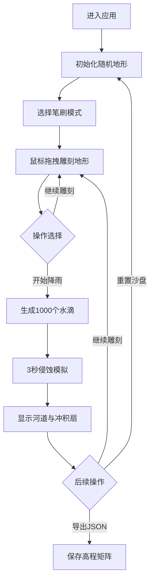

## 1. 产品概述

虚拟微缩沙盘地形雕刻与流体侵蚀模拟工具，面向沙盘模型收藏家和景观设计爱好者，提供沉浸式的数字地形创作与自然侵蚀模拟体验。用户可通过鼠标拖拽塑造山脉河谷，观察虚拟降雨冲刷出自然地貌。

- **核心价值**：将物理沙盘的创作乐趣数字化，结合真实的流体物理模拟，让用户直观理解地形与水文的互动关系
- **目标用户**：沙盘收藏家、景观设计师、地理教育工作者、自然模拟爱好者

## 2. 核心特性

### 2.1 功能模块

1. **主界面**：中央沙盘画布 + 顶部工具栏
2. **地形雕刻模块**：支持鼠标拖拽编辑20×16网格地形
3. **笔刷切换模块**：平滑刷（均值滤波）与陡峭刷（随机噪声）两种编辑模式
4. **流体侵蚀模拟模块**：1000个水滴沿梯度下降的物理模拟
5. **数据管理模块**：重置沙盘与导出JSON功能

### 2.2 页面详情

| 页面名称 | 模块名称 | 功能描述 |
|-----------|-------------|---------------------|
| 主界面 | 地形画布 | 800×640px Canvas，显示带等高线的俯视地形图，支持鼠标交互 |
| 主界面 | 工具栏 | 两个SVG旋钮（平滑/陡峭模式切换）、播放/重置/导出按钮 |
| 主界面 | 悬浮提示 | 鼠标悬停显示当前格子海拔值 |
| 主界面 | 侵蚀可视化 | 蓝色河道线条与黄色冲积扇渐变填充 |

## 3. 核心流程

用户进入应用 → 查看初始随机地形 → 选择笔刷模式（平滑/陡峭）→ 鼠标左键拖拽提高海拔/右键拖拽降低海拔 → 点击"开始降雨"按钮 → 观察3秒内1000水滴侵蚀过程 → 查看形成的河道与冲积扇 → 可重置沙盘或导出地形数据

## 4. 用户界面设计

### 4.1 设计风格
- **主色调**：深沙色(#c2a77a)到浅沙色(#e8dcc5)的渐变背景
- **地形色阶**：低海拔深绿(#2e7d32) → 中海拔黄褐(#a1887f) → 高海拔灰白(#bdbdbd)
- **点缀色**：绿色播放按钮(#4caf50)、橙色重置按钮(#ff7043)、蓝色导出按钮(#42a5f5)
- **木色边框**：深木色(#6b4c3b)，4px宽度，带毛玻璃内阴影
- **字体**：采用具有自然人文气息的衬线字体搭配清晰易读的无衬线字体

### 4.2 页面设计概述

| 页面名称 | 模块名称 | UI元素 |
|-----------|-------------|-------------|
| 主界面 | 整体布局 | 居中画布，顶部可折叠工具栏，沙色渐变背景 |
| 主界面 | 工具栏 | 圆形SVG旋钮(直径30px，白色圆点刻度)，圆形/矩形按钮，hover上浮动画 |
| 主界面 | 沙盘画布 | 20×16网格(每格40px)，细虚线网格(rgba(100,80,60,0.15))，等高线 |
| 主界面 | 侵蚀效果 | 蓝色河道(rgba(30,100,200,0.6))，黄色冲积扇(rgba(200,180,50,0.4))渐变，白色水滴拖尾 |

### 4.3 响应式设计
- **桌面端**：画布固定800×640px，工具栏完整展开
- **移动端**(<768px)：画布宽度100%保持比例，工具栏折叠为图标式
- **触控优化**：禁用页面缩放(user-scalable=no)，确保画布触控精准

### 4.4 动画与交互
- **按钮hover**：translateY(-2px)，持续0.2s，透明度变化
- **水滴模拟**：白色圆点(直径3px，透明度0.8)带拖尾效果
- **降雨状态**：播放按钮变红禁用，3秒模拟过程
- **平滑过渡**：地形颜色渐变、工具栏展开折叠动画
