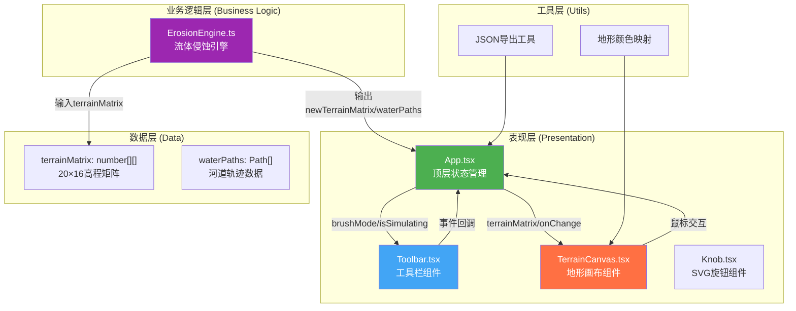

## 1. 架构设计



## 2. 技术描述

- **前端框架**：React@18 + TypeScript@5 + Vite@5
- **构建工具**：Vite@5，启用@vitejs/plugin-react，配置alias路径映射
- **动画库**：framer-motion@11，用于按钮hover动画、工具栏展开折叠
- **工具库**：uuid（生成唯一ID）、zod（运行时类型校验）
- **状态管理**：React useState + useCallback，轻量级场景无需额外状态管理库
- **渲染技术**：Canvas 2D API，分帧渲染确保30fps以上
- **样式方案**：CSS Modules + CSS Variables，确保组件样式隔离

## 3. 文件结构与调用关系

```
src/
├── App.tsx                    # 顶层组件，管理全局状态
│   ├── 维护terrainMatrix状态
│   ├── 监听工具栏事件
│   ├── 调用ErosionEngine进行模拟
│   └── 传递props给子组件
├── components/
│   ├── TerrainCanvas.tsx      # 核心画布组件
│   │   ├── 接收terrainMatrix进行渲染
│   │   ├── 处理鼠标拖拽事件
│   │   ├── 通过onChange回调上报地形变动
│   │   └── 绘制等高线、网格、河道、冲积扇
│   ├── Toolbar.tsx            # 工具栏组件
│   │   ├── 渲染两个Knob控件
│   │   ├── 渲染播放/重置/导出按钮
│   │   └── 处理用户交互事件
│   └── Knob.tsx               # SVG旋钮组件
│       ├── 接收value/onChange
│       └── 渲染圆形旋钮与刻度
├── engine/
│   └── ErosionEngine.ts       # 流体侵蚀引擎
│       ├── simulate(): 执行1000水滴模拟
│       ├── calculateGradient(): 计算坡度
│       ├── erode(): 单水滴侵蚀逻辑
│       └── deposit(): 泥沙沉积逻辑
├── utils/
│   ├── terrainColors.ts       # 海拔到颜色映射
│   └── export.ts              # JSON导出工具
├── types/
│   └── index.ts               # TypeScript类型定义
├── main.tsx                   # 应用入口
└── index.css                  # 全局样式
```

**数据流向说明**：
1. 用户操作 → Toolbar → App → 更新terrainMatrix → TerrainCanvas重新渲染
2. 鼠标拖拽 → TerrainCanvas → 计算格子坐标 → 调用onChange → App更新terrainMatrix
3. 点击降雨 → App → 调用ErosionEngine.simulate() → 返回新terrainMatrix + waterPaths → 更新状态
4. 导出JSON → App → 调用export工具 → 生成文件下载

## 4. 类型定义

```typescript
// types/index.ts
export type TerrainMatrix = number[][];  // 20x16, 值范围0-255

export interface CellPosition {
  row: number;    // 0-15
  col: number;    // 0-19
}

export interface WaterDroplet {
  x: number;
  y: number;
  sediment: number;      // 当前携带泥沙量
  maxSediment: number;   // 最大泥沙容量50
  active: boolean;
}

export interface PathPoint {
  x: number;
  y: number;
  isDeposition: boolean;  // 是否为沉积点
}

export interface WaterPath {
  id: string;
  points: PathPoint[];
  depositionAmount: number;
}

export type BrushMode = 'normal' | 'smooth' | 'steep';

export interface ToolbarState {
  brushMode: BrushMode;
  isSimulating: boolean;
  isToolbarCollapsed: boolean;
}

export interface ErosionResult {
  newTerrain: TerrainMatrix;
  waterPaths: WaterPath[];
}
```

## 5. 核心算法设计

### 5.1 地形雕刻算法
- **左键拖拽**：目标格子海拔 += 8，钳制在[0, 255]
- **右键拖拽**：目标格子海拔 -= 6，钳制在[0, 255]
- **平滑刷**：对目标格子及相邻4格做均值滤波，平滑系数0.3
  - `newVal = currentVal * 0.7 + (neighborsAvg) * 0.3`
- **陡峭刷**：在目标格子增加±15随机噪声
  - `newVal = currentVal + random(-15, 15)`

### 5.2 流体侵蚀算法
- **梯度计算**：使用中心差分计算每个格子的坡度方向
- **水滴运动**：沿最陡梯度方向移动，每步检查边界
- **侵蚀规则**：坡度 > 阈值时，从地形侵蚀泥沙进入水滴
- **沉积规则**：坡度变缓或到达低洼处，沉积当前携带量的1/2
- **分帧计算**：使用requestAnimationFrame，每帧处理最多50个水滴

### 5.3 颜色映射算法
- 海拔 < 85：深绿(#2e7d32) → 黄绿渐变
- 85 ≤ 海拔 < 170：黄绿 → 黄褐(#a1887f)渐变
- 海拔 ≥ 170：黄褐 → 灰白(#bdbdbd)渐变

## 6. 性能优化策略

1. **Canvas分层渲染**：地形层、网格层、水层分离，按需重绘
2. **requestAnimationFrame分帧**：1000水滴分20帧处理，每帧50个
3. **离屏Canvas缓存**：静态地形预渲染到离屏canvas
4. **防抖节流**：鼠标事件节流到16ms（60fps）
5. **批量状态更新**：使用useTransition标记非紧急更新

## 7. 响应式断点

| 断点 | 画布宽度 | 工具栏状态 |
|------|---------|-----------|
| ≥768px | 800px（固定） | 展开，显示完整文字 |
| <768px | 100%（保持比例） | 折叠，仅显示图标 |
