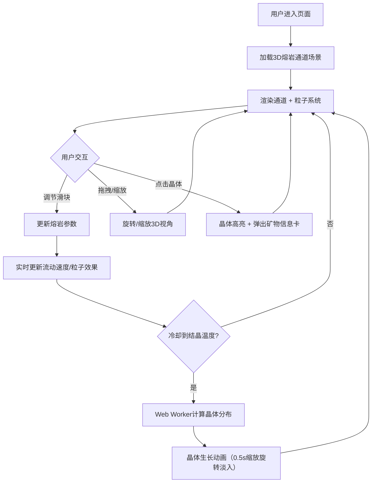

## 1. 产品概述

虚拟熔岩通道与矿物结晶交互可视化——让用户化身火山学家，通过调节熔岩的温度、粘度和冷却速率，实时观察熔岩在通道中流动、冷却固化的过程，以及不同冷却条件下矿物晶体（橄榄石、辉石、长石）的生长差异。

- 目标用户：地球科学爱好者、教育工作者、火山学学生
- 核心价值：以沉浸式3D交互方式直观理解岩浆冷却结晶的科学原理

## 2. 核心功能

### 2.1 功能模块

1. **3D熔岩通道场景**：全屏Three.js三维场景，弯曲熔岩通道（TubeGeometry）、熔岩流粒子系统、矿物晶体生长动画
2. **控制面板**：温度/粘度/冷却速率三滑块实时调节，数值带颜色编码
3. **矿物信息卡片**：点击晶体弹出详情（名称、化学式、晶系、莫氏硬度）

### 2.2 页面详情

| 页面名称 | 模块名称 | 功能描述 |
|----------|----------|----------|
| 主场景 | 熔岩通道 | TubeGeometry生成弯曲通道，壁面半透明发光流动纹理，熔岩从入口涌出 |
| 主场景 | 粒子系统 | 3000+粒子模拟高温飞溅火花，颜色从亮黄#ffeb3b到暗红#b71c1c，透明度0.6-1.0，大小3-8px |
| 主场景 | 矿物晶体 | 六棱柱CylinderGeometry，高度5-20px，橄榄石#388e3c/辉石#5d4037/长石#795548，受冷却速率影响数量和分布 |
| 主场景 | 鼠标交互 | 拖拽旋转视角、滚轮缩放、点击晶体高亮 |
| 控制面板 | 温度滑块 | 800°C-1200°C，高温段#ff5722/中温段#ff9800/低温段#ffc107颜色编码 |
| 控制面板 | 粘度滑块 | 0.1-1.0，影响熔岩流动速度和粒子飞溅高度 |
| 控制面板 | 冷却速率滑块 | 慢速-快速，影响晶体生长数量、尺寸和分布密度 |
| 矿物信息卡 | 详情展示 | 矿物名称、化学式、晶系、莫氏硬度，带进入/退出动画 |

## 3. 核心流程

用户进入页面→看到全屏3D熔岩通道场景→通过鼠标拖拽旋转和缩放探索场景→使用右侧控制面板调节温度/粘度/冷却速率→观察熔岩流动和粒子效果实时变化→当冷却到特定温度区间时晶体开始生长→点击任意晶体→右上角弹出矿物信息卡片→继续调节参数观察不同结晶效果

## 4. 用户界面设计

### 4.1 设计风格

- 主色调：熔岩红橙 #e65100 → 黑曜石黑 #1a1a1a 渐变
- 强调色：荧光描边 #ff6f00
- 控件风格：极简扁平，半透明深色玻璃质感面板
- 字体：数据数值使用等宽字体，标签使用无衬线字体
- 布局：全屏3D场景为主，右侧悬浮控制面板

### 4.2 页面设计概览

| 页面名称 | 模块名称 | UI元素 |
|----------|----------|--------|
| 主场景 | 背景 | 从#e65100到#1a1a1a径向渐变，全屏 |
| 主场景 | 熔岩通道 | 半透明壁面+发光流动纹理，宽约150px |
| 主场景 | 粒子流 | 连续帧动画，亮黄到暗红渐变粒子 |
| 主场景 | 晶体 | 六棱柱3D模型，0.5s缩放旋转淡入生长 |
| 控制面板 | 面板容器 | 半透明深色玻璃bg，右侧悬浮，圆角 |
| 控制面板 | 滑块 | 荧光描边#ff6f00，悬停发光脉冲1.5s周期 |
| 控制面板 | 数值显示 | 滑块右侧，颜色编码温度段 |
| 矿物信息卡 | 卡片容器 | 右上角悬浮，玻璃质感，进入/退出CSS动画 |

### 4.3 响应式设计

- 桌面端（≥768px）：3D场景全屏，右侧悬浮控制面板
- 移动端（<768px）：控制面板自动折叠为底部可展开抽屉
- 所有UI元素全屏缩放时保持合理间距

### 4.4 3D场景指引

- 环境/氛围：火山内部深沉暗色调，熔岩发光照亮周围
- 灯光设置：环境光低强度暖色 + 熔岩点光源橙红色 + 晶体微弱自发光
- 相机设置：透视相机，初始位置俯视通道入口，OrbitControls交互
- 构图焦点：中央弯曲熔岩通道为视觉中心
- 交互动画：粒子连续帧动画、晶体0.5s生长动画、滑块悬停1.5s脉冲
- 后处理：通道壁发光效果（Bloom）
- 性能预算：3000+粒子维持60FPS，晶体计算在Web Worker中执行
