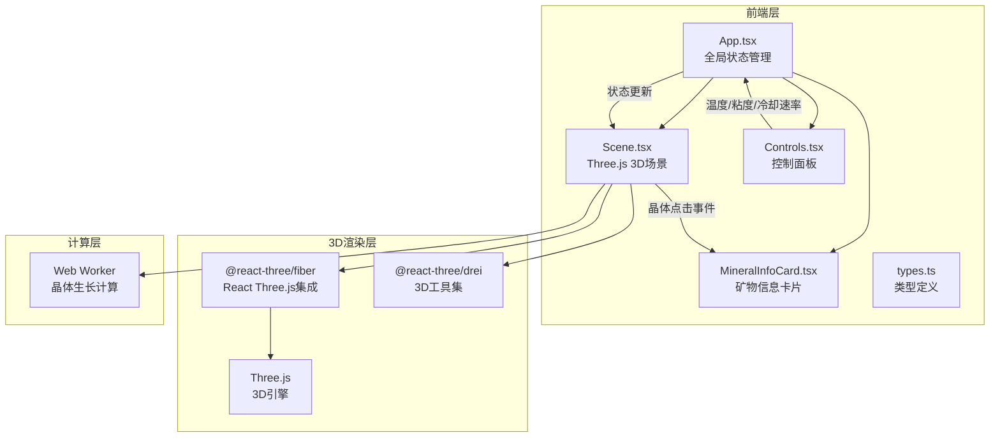

## 1. 架构设计



## 2. 技术说明

- 前端框架：React@18 + TypeScript（严格模式）
- 3D渲染：Three.js@0.160.0 + @react-three/fiber + @react-three/drei
- 构建工具：Vite@5 + @vitejs/plugin-react
- 状态管理：React useState/useCallback（项目规模无需Redux）
- 后台计算：Web Worker（晶体生长分布计算，避免主线程卡顿）
- 样式方案：CSS-in-JS（内联样式 + CSS keyframes动画）
- 后端：无
- 数据库：无

## 3. 路由定义

| 路由 | 用途 |
|------|------|
| / | 主场景页面，包含3D熔岩通道、控制面板和矿物信息卡 |

## 4. 文件结构

```
project-root/
├── package.json
├── vite.config.js
├── tsconfig.json
├── index.html
└── src/
    ├── App.tsx          # 主组件，全局状态管理
    ├── Scene.tsx        # Three.js 3D场景（通道/粒子/晶体）
    ├── Controls.tsx     # 控制面板（三个滑块）
    ├── MineralInfoCard.tsx # 矿物信息卡片
    ├── types.ts         # TypeScript类型定义
    └── crystalWorker.ts # Web Worker晶体计算
```

## 5. 核心数据模型

### 5.1 TypeScript类型定义

```typescript
interface ControlState {
  temperature: number;    // 800-1200
  viscosity: number;      // 0.1-1.0
  coolingRate: number;    // 0-1 (慢到快)
}

interface CrystalData {
  id: string;
  type: MineralType;
  position: [number, number, number];
  height: number;         // 5-20px
  rotation: number;
  growthProgress: number; // 0-1 动画进度
}

type MineralType = 'olivine' | 'pyroxene' | 'feldspar';

interface MineralInfo {
  name: string;
  formula: string;
  crystalSystem: string;
  mohsHardness: string;
  color: string;
}

interface ParticleParams {
  count: number;          // 3000+
  sizeRange: [number, number]; // 3-8px
  colorRange: [string, string]; // #ffeb3b - #b71c1c
  opacityRange: [number, number]; // 0.6-1.0
}
```

### 5.2 矿物数据映射

| 矿物类型 | 名称 | 化学式 | 晶系 | 莫氏硬度 | 颜色 | 形成温度区间 |
|----------|------|--------|------|----------|------|-------------|
| olivine | 橄榄石 | (Mg,Fe)₂SiO₄ | 斜方晶系 | 6.5-7 | #388e3c | 1200-1000°C |
| pyroxene | 辉石 | (Mg,Fe)SiO₃ | 单斜晶系 | 5-6 | #5d4037 | 1000-800°C |
| feldspar | 长石 | KAlSi₃O₈ | 三斜晶系 | 6-6.5 | #795548 | <800°C |

## 6. 性能策略

- **粒子系统**：使用Three.js BufferGeometry + Points，保持3000+粒子60FPS
- **晶体计算**：Web Worker中执行分布计算，通过postMessage回传结果
- **状态更新**：使用useCallback和useMemo避免不必要的重渲染
- **3D场景**：使用React.memo包裹场景子组件，仅在参数变化时更新
- **响应式**：使用ResizeObserver监听视口变化，CSS媒体查询处理面板折叠
