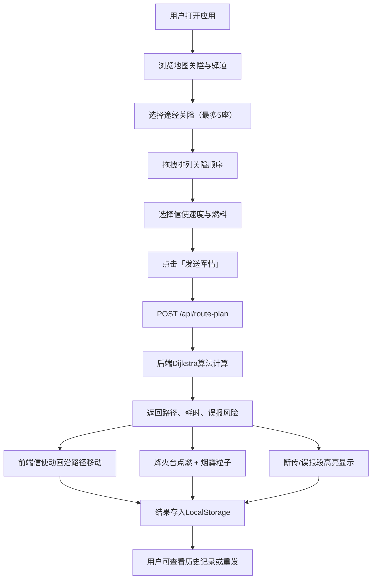

## 1. 产品概述

明代驿站信使路径规划与烽火传递模拟系统——一款沉浸式全栈Web应用，让用户扮演明代信使，在七座关隘与三条驿道构成的虚拟地图上规划骑马路径、点燃烽火传递军情，以最快速度将边关急报送达京城，同时规避因风偏与可见度衰减导致的信号误报。

- 目标用户：历史爱好者、策略游戏玩家、交互式教育场景
- 核心价值：将图论最短路径算法与古代军事通信知识结合，提供兼具教育性与趣味性的沉浸体验

## 2. 核心功能

### 2.1 用户角色

| 角色 | 注册方式 | 核心权限 |
|------|----------|----------|
| 信使（默认） | 无需注册 | 规划路径、点燃烽火、查看战报历史 |

### 2.2 功能模块

1. **主地图页**：交互式Leaflet地图，展示七座关隘标记与三条驿道连线，信使移动动画，烽火烟雾粒子效果
2. **路径规划面板**：左侧控制面板，关隘拖拽排序、速度选择、燃料选择、发送军情按钮
3. **烽火控制弹窗**：点击烽火台弹出设置面板，配置点燃时机、燃料类型、风偏校正角
4. **战报历史侧栏**：历史记录卡片列表，最多20条，支持一键重发

### 2.3 页面详情

| 页面名称 | 模块名称 | 功能描述 |
|----------|----------|----------|
| 主地图页 | 地图容器 | 加载OpenStreetMap瓦片，绘制七座关隘金色圆形标记与三条驿道虚线，支持平移缩放 |
| 主地图页 | 关隘标记 | 金色24px圆形SVG图标，点击放大显示名称与烽火状态 |
| 主地图页 | 驿道绘制 | 虚线3px宽度，颜色根据风险等级从绿渐变到红 |
| 路径规划面板 | 关隘选择 | 最多选择5座关隘，拖拽排列经过顺序 |
| 路径规划面板 | 速度选择 | 步行3km/h、骑马12km/h、快马25km/h |
| 路径规划面板 | 燃料选择 | 干草/木材/沥青 |
| 路径规划面板 | 发送军情 | POST到后端计算最优路线并返回结果 |
| 烽火控制弹窗 | 点燃时机 | 立即/延时10分钟/禁火 |
| 烽火控制弹窗 | 燃料类型 | 干草(5分钟/黄焰/3km)、木材(10分钟/橙焰/5km)、沥青(20分钟/红焰/8km) |
| 烽火控制弹窗 | 风偏校正 | -30°到+30°滑块 |
| 烽火控制弹窗 | 烟雾粒子 | Canvas粒子系统，向上飘散，受风偏影响倾斜 |
| 主地图页 | 信使动画 | 小人标志沿路径匀速移动，速度与计算同步 |
| 主地图页 | 断传/误报高亮 | 断传段红色闪烁，误报段橙色渐变 |
| 战报历史侧栏 | 历史记录 | LocalStorage存储，最多20条，点击恢复，一键重发 |

## 3. 核心流程

用户打开应用→浏览地图上的七座关隘与三条驿道→在左侧面板选择途经关隘（最多5座）→拖拽排列顺序→选择每段信使速度与燃料类型→点击"发送军情"→后端Dijkstra算法计算最短时间路径→返回节点顺序、每段耗时、误报风险概率→前端地图上信使小人沿路径移动→沿途烽火台按设置自动点燃并显示烟雾粒子动画→断传段红色闪烁、误报段橙色渐变→结果存入历史记录

## 4. 用户界面设计

### 4.1 设计风格

- **主色调**：中国古典青绿山水色——主色 #2D5A3D（青绿），辅色 #8B6914（暗金），背景 #F5ECD7（宣纸米白）
- **控制面板**：深棕色木纹样式 #3E2723，浮雕边框效果，边缘内阴影
- **按钮**：圆角矩形 border-radius 6px，悬停木纹色渐变到暗金色，点击0.2秒缩放反馈
- **字体**：标题使用"ZCOOL XiaoWei"（站酷小薇体），正文使用"Noto Serif SC"
- **地图底层**：绵延淡绿色山脉纹理，透明度0.15，固定于地图底层

### 4.2 页面设计概览

| 页面名称 | 模块名称 | UI元素 |
|----------|----------|--------|
| 主地图页 | 地图容器 | 全屏Leaflet地图，OpenStreetMap瓦片，山脉纹理覆盖层（0.15透明度） |
| 主地图页 | 关隘标记 | 金色圆形SVG 24px，悬停放大，点击弹出名称+烽火状态 |
| 主地图页 | 驿道连线 | 虚线3px，绿→红渐变色表示风险等级 |
| 主地图页 | 信使动画 | 沿路径移动的小人图标，速度与计算同步 |
| 主地图页 | 断传段 | 红色闪烁线段 |
| 主地图页 | 误报段 | 橙色渐变光晕，3秒闪烁 |
| 路径规划面板 | 面板容器 | 左侧280px宽，深棕木纹背景，浮雕边框 |
| 路径规划面板 | 拖拽列表 | 关隘名称卡片，可拖拽排序，选中高亮 |
| 路径规划面板 | 速度选择 | 三选一按钮组（步行/骑马/快马） |
| 路径规划面板 | 燃料选择 | 三选一按钮组（干草/木材/沥青） |
| 路径规划面板 | 发送按钮 | 暗金渐变按钮，点击缩放反馈 |
| 烽火控制弹窗 | 弹窗面板 | Leaflet Popup样式覆盖，木纹背景 |
| 烽火控制弹窗 | 点燃时机 | 三选一按钮（立即/延时/禁火） |
| 烽火控制弹窗 | 燃料类型 | 三选一按钮 |
| 烽火控制弹窗 | 风偏滑块 | -30°到+30°范围滑块 |
| 烽火控制弹窗 | 烟雾动画 | Canvas粒子，干草30/s黄色、木材20/s橙色、沥青10/s红色 |
| 战报历史侧栏 | 历史卡片 | 卡片列表，含时间、路线、耗时、风险、状态，点击恢复，重发按钮 |

### 4.3 响应式适配

- 桌面优先设计（≥768px）：左侧面板280px固定宽度，地图占满剩余空间
- 移动端（<768px）：控制面板折叠为悬浮按钮，点击展开半透明浮窗；地图全屏；字体缩放至12px

### 4.4 动画规格

- 信使移动：沿路径匀速前进，每秒更新位置
- 烽火烟雾：粒子从升起持续5-20秒（依燃料类型），渐隐消失
- 误报区域：橙红色光晕每3秒闪烁一次
- 关隘点击：放大动画
- 按钮交互：悬停渐变色、0.2秒缩放反馈
