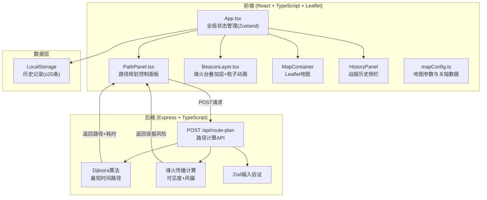
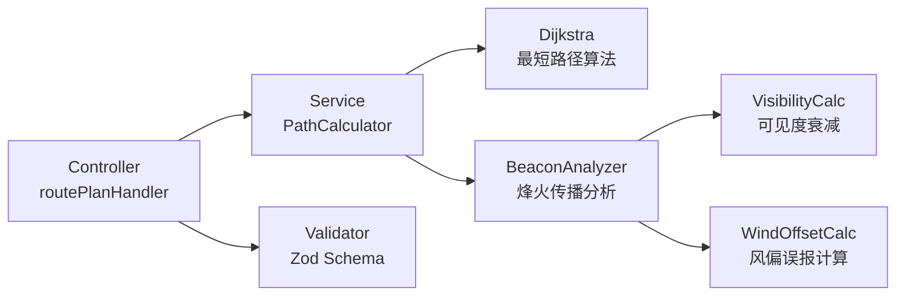
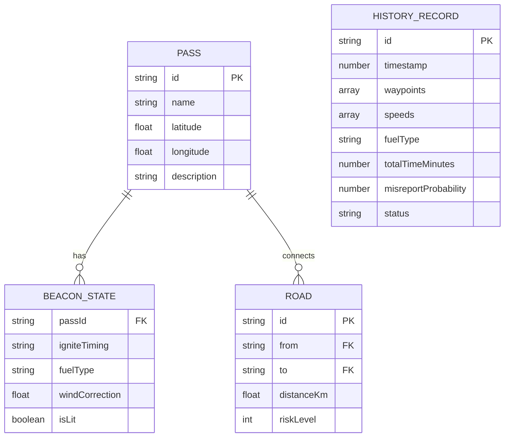

## 1. 架构设计



## 2. 技术说明

- **前端**：React@18 + TypeScript + Vite@5 + TailwindCSS@3 + Zustand
- **初始化工具**：vite-init (react-express-ts模板)
- **地图库**：Leaflet + react-leaflet
- **后端**：Express@4 + TypeScript (ESM格式)
- **验证**：Zod
- **唯一标识**：uuid
- **路由**：react-router-dom
- **数据库**：无后端数据库，前端LocalStorage存储历史记录

## 3. 路由定义

| 路由 | 用途 |
|------|------|
| `/` | 主地图页面，包含地图、控制面板、烽火台、历史记录 |

## 4. API定义

### POST /api/route-plan

**请求体（Zod验证）：**

```typescript
const RoutePlanRequestSchema = z.object({
  waypoints: z.array(z.string()).min(2).max(5),
  speeds: z.array(z.enum(["walk", "horse", "fast_horse"])),
  fuelType: z.enum(["hay", "wood", "pitch"]),
  beaconSettings: z.array(z.object({
    passId: z.string(),
    igniteTiming: z.enum(["immediate", "delayed", "disabled"]),
    fuelType: z.enum(["hay", "wood", "pitch"]),
    windCorrection: z.number().min(-30).max(30)
  }))
});
```

**响应体：**

```typescript
interface RoutePlanResponse {
  path: {
    nodes: string[];
    segments: {
      from: string;
      to: string;
      distance: number;
      speed: number;
      timeMinutes: number;
    }[];
  };
  totalTimeMinutes: number;
  beaconResults: {
    passId: string;
    visible: boolean;
    misreportProbability: number;
  }[];
  riskSegments: {
    from: string;
    to: string;
    type: "broken" | "misreport";
    probability?: number;
  }[];
}
```

## 5. 服务端架构图



## 6. 数据模型

### 6.1 关隘数据模型



### 6.2 初始数据定义

**七座关隘：**

| ID | 名称 | 纬度 | 经度 | 描述 |
|----|------|------|------|------|
| jiayuguan | 嘉峪关 | 39.7732 | 98.2894 | 西陲第一关 |
| yumenguan | 玉门关 | 40.3485 | 93.7446 | 丝路咽喉 |
| yangguan | 阳关 | 39.8850 | 94.0200 | 西域门户 |
| dunhuang | 敦煌 | 40.1420 | 94.6620 | 沙漠绿洲 |
| lanzhou | 兰州 | 36.0611 | 103.8343 | 陇上要塞 |
| changan | 长安 | 34.2637 | 108.9423 | 帝都 |
| datong | 大同 | 40.0769 | 113.3001 | 北疆锁钥 |

**三条驿道：**

| ID | 起点 | 终点 | 距离(km) | 风险等级(1-5) |
|----|------|------|----------|---------------|
| road1 | 嘉峪关 | 玉门关 | 220 | 2 |
| road2 | 玉门关 | 敦煌 | 160 | 1 |
| road3 | 敦煌 | 兰州 | 800 | 4 |
| road4 | 兰州 | 长安 | 620 | 3 |
| road5 | 长安 | 大同 | 560 | 3 |
| road6 | 阳关 | 敦煌 | 70 | 1 |
| road7 | 嘉峪关 | 阳关 | 180 | 2 |
| road8 | 兰州 | 大同 | 860 | 5 |
