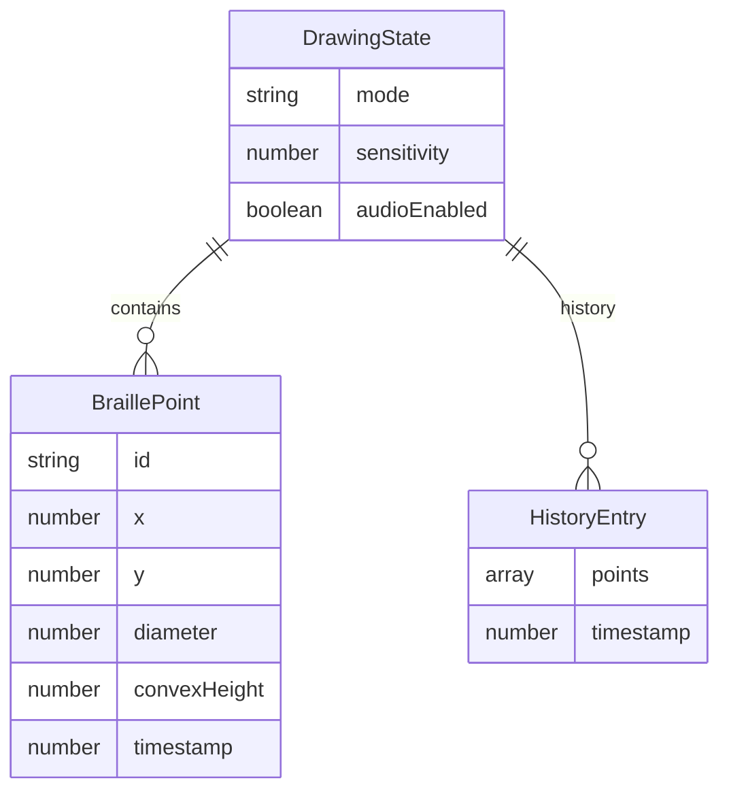

## 1. 架构设计

```mermaid
flowchart TB
    subgraph "前端层"
        "App.tsx" --> "useBrailleCanvas.ts"
        "App.tsx" --> "useAudioFeedback.ts"
        "App.tsx" --> "ToolBar.tsx"
        "useBrailleCanvas.ts" --> "Canvas 2D 绘制引擎"
        "useAudioFeedback.ts" --> "Web Audio API"
        "ToolBar.tsx" --> "framer-motion 动画"
    end

    subgraph "数据层"
        "useBrailleCanvas.ts" --> "盲文点数据: 坐标/大小/凹凸高度"
        "useAudioFeedback.ts" --> "音频节点状态"
        "App.tsx" --> "历史记录栈（10次）"
    end

    subgraph "事件流"
        "触摸/鼠标事件" --> "App.tsx"
        "App.tsx" --> "useBrailleCanvas.ts"
        "useBrailleCanvas.ts" --> "凹凸高度数组"
        "凹凸高度数组" --> "useAudioFeedback.ts"
    end
```

## 2. 技术说明

- **前端框架**：React@18 + TypeScript（严格模式）+ Vite@5
- **构建工具**：Vite@5 + @vitejs/plugin-react
- **UI动画**：framer-motion
- **状态管理**：React useState/useReducer（应用状态简单，无需引入zustand）
- **数据验证**：zod（用于验证用户输入参数）
- **唯一标识**：uuid（用于标识每个盲文点）
- **后端**：无（纯前端应用）
- **数据库**：无（状态全部在内存中管理）

## 3. 路由定义

| 路由 | 用途 |
|------|------|
| / | 主绘画页面（单页应用，无路由切换） |

## 4. API定义

无后端API，所有逻辑在前端完成。

### 4.1 核心数据类型定义

```typescript
interface BraillePoint {
  id: string;
  x: number;
  y: number;
  diameter: number;
  convexHeight: number;
  timestamp: number;
}

interface DrawingState {
  points: BraillePoint[];
  mode: 'dot' | 'line';
  sensitivity: number;
  audioEnabled: boolean;
}

interface HistoryEntry {
  points: BraillePoint[];
  timestamp: number;
}
```

## 5. 服务端架构图

不适用（纯前端应用）

## 6. 数据模型

### 6.1 数据模型定义



### 6.2 文件间调用关系与数据流向

```
index.html
  └── src/App.tsx（主应用组件）
        ├── src/hooks/useBrailleCanvas.ts
        │     输入: 触摸/鼠标事件流, 绘制模式, 灵敏度
        │     输出: BraillePoint[], 凹凸高度数组, 画布ref
        │     数据流: App传递事件 → Hook处理轨迹 → 返回点数据
        │
        ├── src/hooks/useAudioFeedback.ts
        │     输入: 凹凸高度数组, 点水平位置, 音频开关
        │     输出: 音频播放控制器, 音频节点状态
        │     数据流: useBrailleCanvas输出凹凸高度 → Hook生成音频
        │
        └── src/components/ToolBar.tsx
              输入: 模式/灵敏度/音频开关状态
              输出: 模式切换/清空/撤销/灵敏度调节回调
              数据流: 用户操作 → 回调通知App → App更新状态
```
