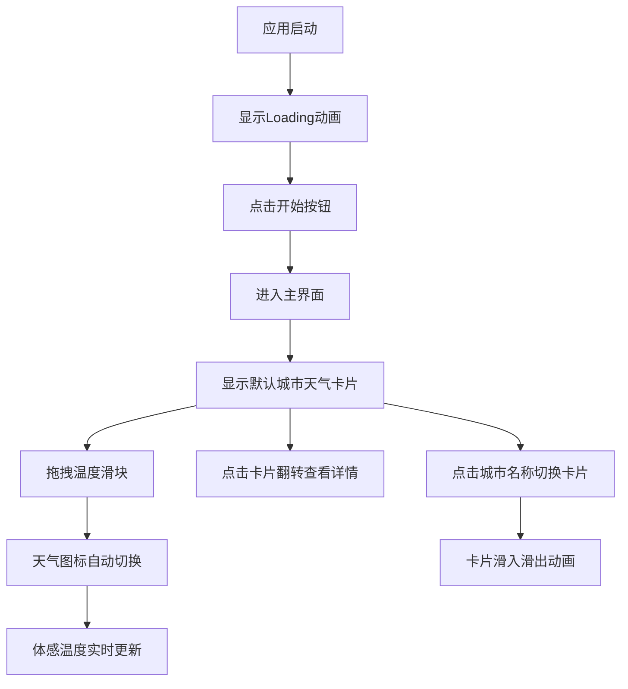

## 1. 产品概述

像素风格天气预报模拟器是一个交互式天气可视化应用，用户可以通过切换城市卡片查看不同城市的气象数据，并通过调节温度滑块观察天气图标的动态变化。应用采用复古8-bit像素艺术风格，结合流畅的动画效果，为用户提供趣味性和教育性兼备的天气体验。

- 主要目的：提供沉浸式像素风格天气交互体验，让用户直观了解温度与天气现象的关系
- 目标用户：复古游戏爱好者、天气爱好者、UI/UX设计师
- 产品价值：将枯燥的气象数据转化为有趣的视觉交互体验

## 2. 核心功能

### 2.1 用户角色

| 角色 | 注册方式 | 核心权限 |
|------|----------|----------|
| 访客用户 | 无需注册 | 浏览城市天气、调节温度、查看体感温度 |

### 2.2 功能模块

1. **加载界面**：8-bit像素风格Loading动画，开始按钮
2. **主界面**：城市切换导航、天气卡片、温度滑块、体感温度显示
3. **天气卡片**：城市名显示、像素天气图标、温度湿度风速、翻转动画
4. **温度控制**：像素风格滑块、温度区间图标自动切换

### 2.3 页面详情

| 页面名称 | 模块名称 | 功能描述 |
|----------|----------|----------|
| 加载页面 | Loading动画 | 下落方块反复弹跳动画，点击开始按钮进入主界面 |
| 主页面 | 城市导航栏 | 5个城市名称按钮，点击切换天气卡片，带滑动动画 |
| 主页面 | 天气卡片 | 正面显示城市名和温度图标，点击翻转显示详细信息 |
| 主页面 | 温度滑块 | 范围-10°C到45°C，调节时天气图标动态变化 |
| 主页面 | 体感温度卡片 | 右下角显示，数字滚动动画，公式：温度 - (湿度/20) |

## 3. 核心流程

用户进入应用 → 查看8-bit Loading动画 → 点击"开始"按钮 → 进入主界面查看默认城市天气 → 点击其他城市名称切换卡片 → 点击卡片翻转查看详情 → 拖拽温度滑块观察图标变化 → 实时查看体感温度变化

## 4. 用户界面设计

### 4.1 设计风格

- **主色调**：深色背景 `#1a1a2e`，卡片正面深蓝 `#16213e`，卡片背面浅橙 `#e94560`
- **辅助色**：像素图标多彩色（黄、蓝、白、红），滑块光晕 `#00fff5`
- **字体**：Press Start 2P（像素风格字体）
- **按钮风格**：像素方块按钮，点击时1.5倍缩放再恢复，0.15秒动画
- **布局风格**：卡片式布局，居中对齐，网格背景纹理
- **图标风格**：纯CSS绘制的8-bit像素风格天气图标（太阳、云、雨滴、雪花、火焰）

### 4.2 页面设计概述

| 页面名称 | 模块名称 | UI元素 |
|----------|----------|----------|
| 加载页面 | Loading动画 | 下落弹跳方块、8-bit像素文字、开始按钮 |
| 主页面 | 城市导航栏 | 5个彩色方块拼贴城市名、横向排列、点击高亮 |
| 主页面 | 天气卡片 | 圆角锯齿边框、3D翻转效果、正面/背面互补色、像素图标 |
| 主页面 | 温度滑块 | 像素阶梯轨道、16x16像素滑块、拖拽光晕、温度数值显示 |
| 主页面 | 体感温度 | 右下角固定卡片、数字滚动动画、像素边框 |

### 4.3 响应式设计

- **桌面端**：卡片最大宽度480px，城市导航横向排列，滑块宽度400px
- **移动端**：卡片全宽显示，城市导航可横向滚动，滑块宽度自适应
- **触摸优化**：所有可点击元素最小尺寸44x44px，支持触摸滑动切换城市
- **断点**：768px以下切换为移动端布局

### 4.4 动画性能要求

- 卡片切换动画：≥30fps，0.4秒缓动效果
- 图标更新延迟：≤100ms
- 翻转动画：0.6秒Y轴180度旋转
- 数字滚动：0.5秒递增/递减动画
- 图标切换：0.3秒淡入淡出
