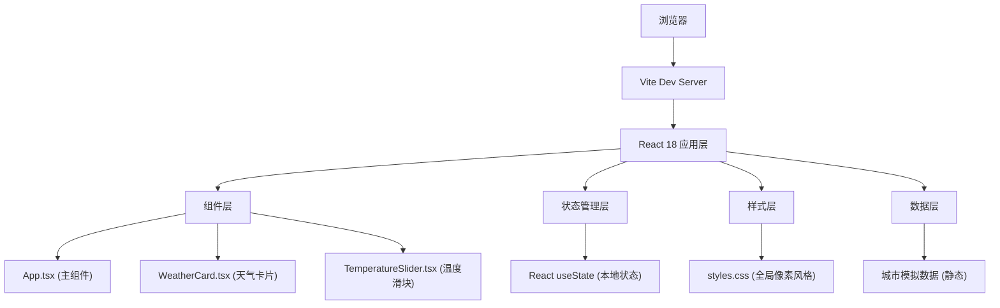

## 1. 架构设计



## 2. 技术描述

- **前端框架**：React 18 + TypeScript 5
- **构建工具**：Vite 5 + @vitejs/plugin-react
- **HTTP客户端**：axios（预留API接口支持）
- **状态管理**：React useState Hook（轻量本地状态）
- **样式方案**：纯CSS（像素风格关键帧动画、CSS变量、CSS Transform）
- **字体**：Google Fonts - Press Start 2P
- **后端**：无（纯前端应用，静态模拟数据）
- **数据库**：无

## 3. 目录结构

```
auto28/
├── index.html                 # 入口HTML
├── package.json               # 项目依赖
├── vite.config.js             # Vite构建配置
├── tsconfig.json              # TypeScript配置
└── src/
    ├── main.tsx               # 应用入口
    ├── App.tsx                # 主组件
    ├── WeatherCard.tsx        # 天气卡片组件
    ├── TemperatureSlider.tsx  # 温度滑块组件
    └── styles.css             # 全局样式
```

## 4. 组件接口定义

### 4.1 数据类型定义

```typescript
interface CityWeather {
  id: string;
  name: string;
  temperature: number;
  humidity: number;
  windSpeed: number;
  condition: 'sunny' | 'cloudy' | 'rainy' | 'snowy' | 'hot';
  sunrise: string;
  sunset: string;
}

type WeatherCondition = 'sunny' | 'cloudy' | 'rainy' | 'snowy' | 'hot';
```

### 4.2 组件Props定义

```typescript
// WeatherCard Props
interface WeatherCardProps {
  city: CityWeather;
  adjustedTemp: number;
  isFlipped: boolean;
  onFlip: () => void;
  slideDirection: 'left' | 'right' | 'none';
}

// TemperatureSlider Props
interface TemperatureSliderProps {
  value: number;
  min: number;
  max: number;
  onChange: (value: number) => void;
  condition: WeatherCondition;
}

// App State
interface AppState {
  cities: CityWeather[];
  currentCityIndex: number;
  adjustedTemperature: number;
  isFlipped: boolean;
  isLoading: boolean;
  slideDirection: 'left' | 'right' | 'none';
}
```

## 5. 核心逻辑实现

### 5.1 天气图标切换逻辑

```typescript
function getWeatherCondition(temperature: number): WeatherCondition {
  if (temperature < 0) return 'snowy';
  if (temperature < 15) return 'cloudy';
  if (temperature < 30) return 'sunny';
  return 'hot';
}
```

### 5.2 体感温度计算

```typescript
function calculateFeelsLike(temperature: number, humidity: number): number {
  return Math.round((temperature - humidity / 20) * 10) / 10;
}
```

### 5.3 预设城市数据

```typescript
const CITIES: CityWeather[] = [
  { id: 'beijing', name: '北京', temperature: 25, humidity: 60, windSpeed: 12, condition: 'sunny', sunrise: '05:32', sunset: '19:45' },
  { id: 'tokyo', name: '东京', temperature: 28, humidity: 75, windSpeed: 8, condition: 'cloudy', sunrise: '04:45', sunset: '18:52' },
  { id: 'london', name: '伦敦', temperature: 15, humidity: 85, windSpeed: 20, condition: 'rainy', sunrise: '05:02', sunset: '21:10' },
  { id: 'newyork', name: '纽约', temperature: 32, humidity: 55, windSpeed: 15, condition: 'hot', sunrise: '05:25', sunset: '20:30' },
  { id: 'sydney', name: '悉尼', temperature: 12, humidity: 70, windSpeed: 25, condition: 'cloudy', sunrise: '06:55', sunset: '17:20' }
];
```

## 6. 动画实现方案

### 6.1 CSS关键帧动画

| 动画名称 | 用途 | 时长 | 缓动函数 |
|----------|------|------|----------|
| bounce | Loading方块弹跳 | 1s | cubic-bezier(0.28, 0.84, 0.42, 1) |
| slideInRight | 卡片从右滑入 | 0.4s | ease-out |
| slideOutLeft | 卡片从左滑出 | 0.4s | ease-in |
| flipCard | 卡片Y轴翻转 | 0.6s | ease-in-out |
| fadeIn | 图标淡入 | 0.3s | ease-out |
| fadeOut | 图标淡出 | 0.3s | ease-in |
| pulseGlow | 滑块光晕 | 1.5s | ease-in-out infinite |
| numberRoll | 数字滚动 | 0.5s | ease-out |
| btnClick | 按钮点击缩放 | 0.15s | ease-out |

### 6.2 性能优化策略

1. 使用 `will-change: transform` 提升动画性能
2. 避免在动画中触发重排（reflow）
3. 使用 CSS Transform 和 Opacity 实现动画（GPU加速）
4. 合理使用 `requestAnimationFrame` 处理数字滚动
5. 组件懒加载（按需渲染）
6. 使用 React.memo 优化组件重渲染

## 7. 响应式断点

| 断点 | 卡片宽度 | 城市导航 | 滑块宽度 |
|------|----------|----------|----------|
| ≥ 768px | 480px | 横向排列 | 400px |
| < 768px | 100% | 横向滚动 | 自适应 |
