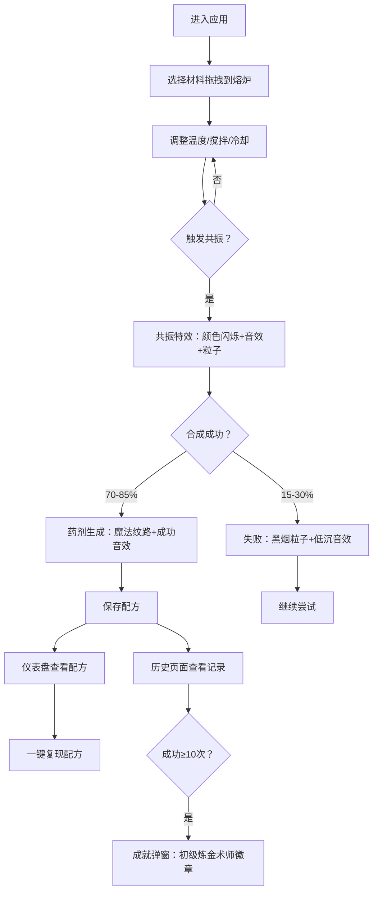

## 1. 产品概述

中世纪炼金工坊配方合成与元素共振实验应用，用户扮演昏暗实验室中的炼金术士，通过组合火、水、土、气四大属性的虚拟材料，在加热、搅拌、冷却等操作下触发元素共振，合成带有魔法纹路的药剂，并记录分享成功配方。

- 目标用户：炼金术爱好者、休闲游戏玩家、创意实验用户
- 产品价值：提供沉浸式炼金术体验，通过视觉、听觉反馈激发探索欲和成就感

## 2. 核心功能

### 2.1 用户角色
| 角色 | 注册方式 | 核心权限 |
|------|----------|----------|
| 普通用户 | 无需注册（本地存储+可选Firebase） | 材料合成、配方保存、查看历史、解锁成就 |

### 2.2 功能模块
1. **熔炉合成页（/）**：中央熔炉、左侧工具栏、材料拖拽、操作控制、Canvas粒子效果
2. **配方仪表盘（/dashboard）**：所有保存配方列表、配方详情、一键复现
3. **历史图谱（/history）**：个人合成历史、成就展示

### 2.3 页面详情
| 页面名称 | 模块名称 | 功能描述 |
|----------|----------|----------|
| 熔炉合成页 | 材料库 | 8种基础材料网格展示，拖拽到熔炉 |
| 熔炉合成页 | 中央熔炉 | SVG绘制熔炉，Canvas实时渲染反应液体和粒子效果 |
| 熔炉合成页 | 操作控制 | 温度滑块（0-100℃）、搅拌速度滑块（0-10）、冷却按钮 |
| 熔炉合成页 | 共振反馈 | 颜色闪烁、音效播放（howler）、粒子爆发 |
| 配方仪表盘 | 配方列表 | 卡片流式布局展示所有配方 |
| 配方仪表盘 | 配方详情 | 材料组合、操作参数、成功/失败、创建时间 |
| 历史图谱 | 历史记录 | 材料图标、合成结果、耗时统计 |
| 历史图谱 | 成就系统 | 累计10次成功合成触发徽章弹窗 |

## 3. 核心流程

用户从左侧材料库拖拽最多4种材料到中央熔炉 → 调整温度、搅拌速度，或点击冷却 → 观察材料融合、冒泡、发光 → 温度接近共振阈值时触发元素共振 → 合成成功（70%-85%概率）或失败 → 可保存配方 → 在仪表盘查看所有配方 → 历史页面查看个人记录和成就

## 4. 用户界面设计

### 4.1 设计风格
- **主色调**：煤灰黑 #1e1e1e → 暗炉红 #5c2a2a 渐变背景
- **强调色**：铜色 #cd7f32（熔炉镶边）、材料专属色（火硫磺 #ff6f00 等）
- **按钮风格**：圆角8px，hover放大1.05倍，click缩小0.95倍弹性动画（framer-motion）
- **字体**：展示字体采用神秘古老风格，正文字体清晰易读
- **布局风格**：桌面端左侧工具栏（220px固定宽）+ 中央熔炉；移动端底部横向工具栏

### 4.2 页面设计概览
| 页面名称 | 模块名称 | UI元素 |
|----------|----------|--------|
| 熔炉合成页 | 中央熔炉 | SVG圆形（直径600px），铜色镶边，六芒星浮雕，Canvas内部渲染 |
| 熔炉合成页 | 材料卡片 | 80×80px网格，微凸阴影，颜色描边，形状（圆/方/菱形） |
| 熔炉合成页 | 温度滑块 | 蓝色→红色渐变，当前温度实时显示 |
| 熔炉合成页 | 搅拌滑块 | 0-10档位，搅拌动画可视化 |
| 配方仪表盘 | 配方卡片 | 宽280px，背景#333333，圆角12px，hover上浮translateY(-4px) |
| 历史图谱 | 成就弹窗 | framer-motion缩放动画（0→1），半透明遮罩，SVG徽章 |

### 4.3 响应式设计
- **桌面大屏**：熔炉居中，工具栏固定左侧
- **平板（≤768px）**：工具栏折叠为底部横向条，材料库左右滑动
- **手机（≤480px）**：熔炉缩小至400px，工具栏按钮36px高度，字体14px

### 4.4 Canvas特效
- **成功粒子**：材料颜色，6-12px，向上飞散渐隐
- **失败黑烟**：#4a4a4a，4-8px，缓慢上升消散
- **液体渲染**：基于混合材料动态颜色变化，冒泡效果
