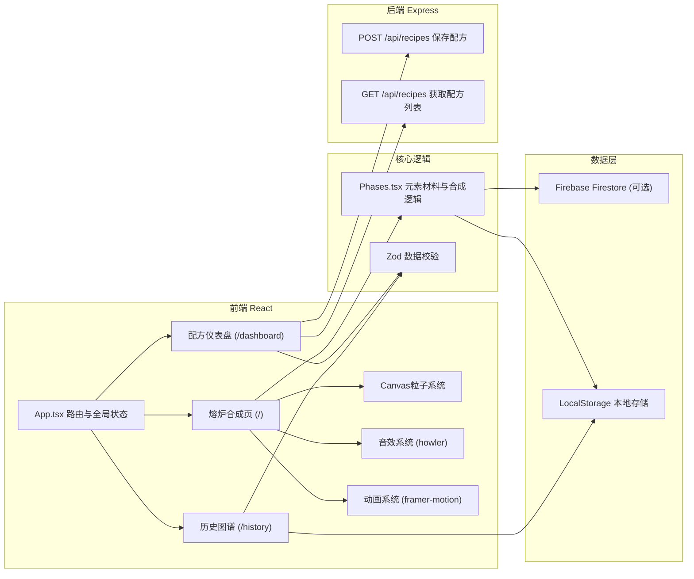
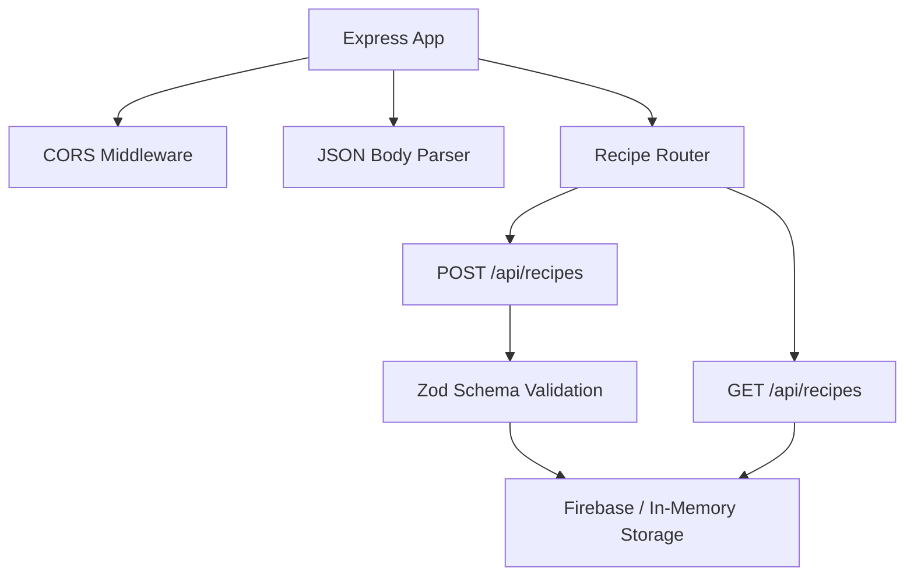
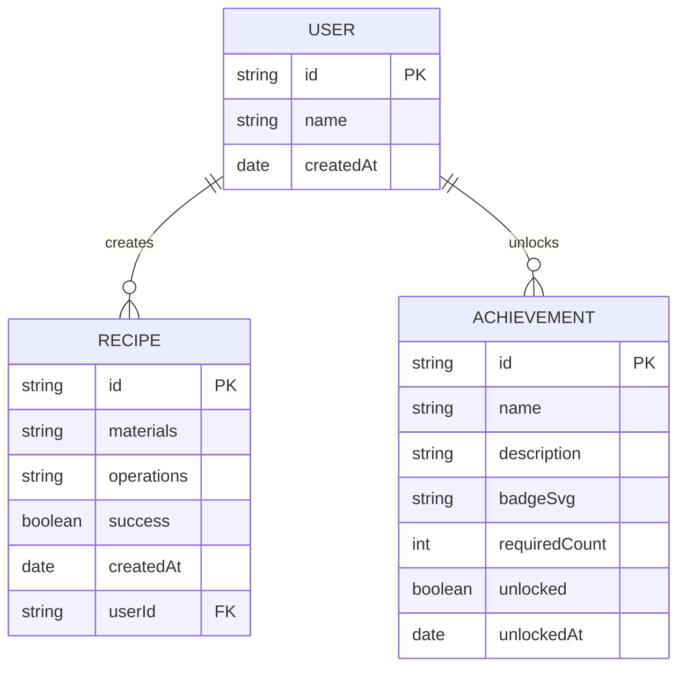

## 1. 架构设计



## 2. 技术描述
- **前端**：React@18 + TypeScript + Vite@5 + React Router DOM
- **后端**：Express@4 + cors
- **状态管理**：React useState/useContext
- **数据校验**：Zod
- **动画**：framer-motion
- **音效**：howler
- **唯一标识**：uuid
- **可选数据存储**：Firebase Firestore
- **初始化工具**：Vite

## 3. 路由定义
| 路由 | 用途 |
|------|------|
| / | 熔炉合成主页：材料拖拽、合成操作、Canvas特效 |
| /dashboard | 配方仪表盘：所有保存配方列表与详情 |
| /history | 历史图谱：个人合成记录与成就系统 |

## 4. API 定义

### 4.1 类型定义
```typescript
// 元素类型
type ElementType = 'fire' | 'water' | 'earth' | 'air';

// 材料形状
type MaterialShape = 'circle' | 'square' | 'diamond';

// 材料定义
interface Material {
  id: string;
  name: string;
  element: ElementType;
  color: string;
  shape: MaterialShape;
  resonanceFrequency: number; // 200-800Hz
  resonanceThreshold: number; // 共振温度阈值
}

// 配方材料组合
interface RecipeMaterial {
  materialId: string;
  position: { x: number; y: number };
}

// 操作参数
interface OperationParams {
  temperature: number; // 0-100
  stirSpeed: number; // 0-10
  cooling: boolean;
  duration: number; // 秒
}

// 配方
interface Recipe {
  id: string;
  materials: RecipeMaterial[];
  operations: OperationParams;
  success: boolean;
  createdAt: Date;
  userId?: string;
}
```

### 4.2 Zod 校验 Schema
```typescript
const RecipeSchema = z.object({
  id: z.string().uuid(),
  materials: z.array(z.object({
    materialId: z.string(),
    position: z.object({ x: z.number(), y: z.number() })
  })).min(1).max(4),
  operations: z.object({
    temperature: z.number().min(0).max(100),
    stirSpeed: z.number().min(0).max(10),
    cooling: z.boolean(),
    duration: z.number().positive()
  }),
  success: z.boolean(),
  createdAt: z.date(),
  userId: z.string().optional()
});
```

### 4.3 API 接口
| 方法 | 路径 | 描述 | 请求体 | 响应 |
|------|------|------|--------|------|
| POST | /api/recipes | 保存配方 | Recipe | { success: boolean, recipe: Recipe } |
| GET | /api/recipes | 获取所有配方 | - | { recipes: Recipe[] } |

## 5. 服务器架构图



## 6. 数据模型

### 6.1 实体关系图


### 6.2 基础材料数据（初始数据）
| 材料ID | 名称 | 元素 | 颜色 | 形状 | 共振频率(Hz) | 共振温度(℃) |
|--------|------|------|------|------|-------------|-------------|
| fire_sulfur | 火硫磺 | fire | #ff6f00 | circle | 450 | 75 |
| mercury | 水银 | water | #c0c0c0 | square | 320 | 40 |
| earth_stone | 土石 | earth | #8b4513 | diamond | 680 | 60 |
| air_wind | 气风 | air | #87ceeb | circle | 280 | 25 |
| dragon_blood | 龙血 | fire | #dc143c | diamond | 520 | 85 |
| moon_water | 月水 | water | #4169e1 | circle | 380 | 15 |
| crystal_earth | 晶土 | earth | #daa520 | square | 750 | 50 |
| thunder_air | 雷气 | air | #9932cc | diamond | 620 | 35 |

## 7. 项目文件结构
```
.
├── package.json
├── vite.config.js
├── tsconfig.json
├── index.html
├── server.ts                    # Express 后端
├── src/
│   ├── App.tsx                  # 主组件，路由和全局状态
│   ├── phases/
│   │   └── Phases.tsx           # 核心逻辑：元素类型、状态管理、合成引擎
│   ├── firebase/
│   │   └── firebaseConfig.ts    # Firebase 配置
│   ├── components/
│   │   ├── Furnace.tsx          # 熔炉SVG + Canvas
│   │   ├── MaterialLibrary.tsx  # 材料库工具栏
│   │   ├── ControlPanel.tsx     # 温度/搅拌/冷却控制
│   │   ├── ParticleSystem.tsx   # Canvas粒子系统
│   │   ├── RecipeCard.tsx       # 配方卡片
│   │   └── AchievementModal.tsx # 成就弹窗
│   ├── pages/
│   │   ├── HomePage.tsx         # 熔炉合成页
│   │   ├── DashboardPage.tsx    # 配方仪表盘
│   │   └── HistoryPage.tsx      # 历史图谱
│   ├── utils/
│   │   ├── audio.ts             # howler音效管理
│   │   ├── particles.ts         # 粒子逻辑
│   │   └── storage.ts           # 本地存储
│   ├── types/
│   │   └── index.ts             # 类型定义
│   └── data/
│       └── materials.ts         # 基础材料数据
```
