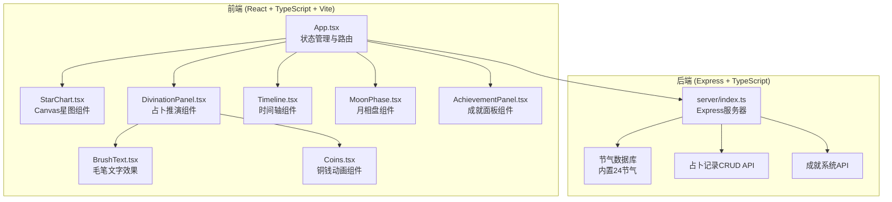
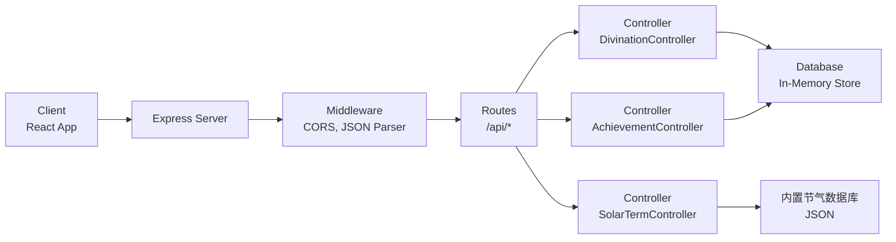
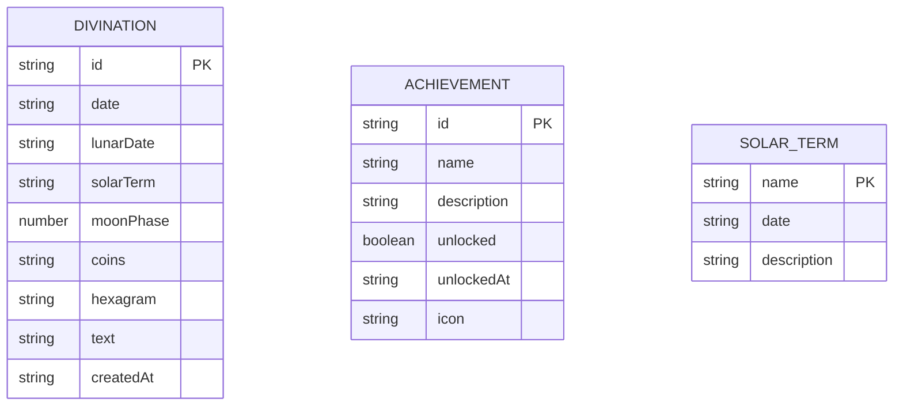

## 1. 架构设计



## 2. 技术描述

- **前端**：React 18 + TypeScript + Vite 5 + Framer Motion
- **状态管理**：React Hooks (useState, useEffect, useRef)
- **动画库**：Framer Motion
- **图形绘制**：Canvas API（星图、毛笔效果）+ SVG（月相）
- **后端**：Express 4 + TypeScript + CORS
- **数据校验**：Zod
- **ID生成**：UUID
- **构建工具**：Vite 5
- **代理配置**：Vite 代理 /api 到后端

## 3. 路由定义

| 路由 | 用途 |
|-------|---------|
| / | 主页面，星象占卜应用 |
| /api/divination | POST - 创建占卜记录 |
| /api/divination | GET - 获取占卜记录列表 |
| /api/divination/:id | GET - 获取单条占卜记录 |
| /api/divination/:id | DELETE - 删除占卜记录 |
| /api/achievements | GET - 获取用户成就 |
| /api/achievements | POST - 解锁新成就 |
| /api/solar-terms | GET - 获取节气数据 |

## 4. API 定义

### 4.1 类型定义

```typescript
interface Star {
  id: string;
  name: string;
  x: number;
  y: number;
  magnitude: number;
  isMain: boolean;
}

interface Planet {
  name: string;
  symbol: string;
  angle: number;
  color: string;
}

interface DivinationResult {
  id: string;
  date: string;
  lunarDate: string;
  solarTerm: string;
  moonPhase: number;
  coins: number[];
  hexagram: string;
  text: string;
  createdAt: string;
}

interface Achievement {
  id: string;
  name: string;
  description: string;
  unlocked: boolean;
  unlockedAt?: string;
  icon: string;
}

interface SolarTerm {
  name: string;
  date: string;
  description: string;
}
```

### 4.2 请求/响应 Schema

**POST /api/divination**
```typescript
// Request
{
  moonPhase: number;
  coins: number[];
  targetDate: string;
}

// Response
{
  success: true;
  data: DivinationResult;
  achievement?: Achievement;
}
```

**GET /api/achievements**
```typescript
// Response
{
  success: true;
  data: {
    totalDivinations: number;
    collectedTexts: number;
    unlockedTerms: string[];
    achievements: Achievement[];
  };
}
```

**GET /api/solar-terms**
```typescript
// Response
{
  success: true;
  data: SolarTerm[];
}
```

## 5. 服务器架构图



## 6. 数据模型

### 6.1 数据模型定义



### 6.2 数据初始化

- **节气数据**：内置24节气JSON数据库，包含名称、日期、描述
- **成就数据**：初始成就列表（首次观星、占卜达人、节气收藏家等）
- **星图数据**：前端生成200颗恒星随机数据，主星固定位置
