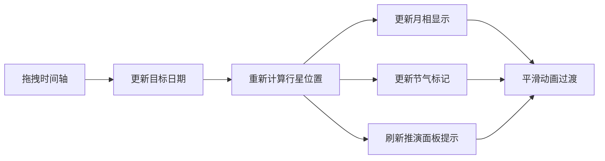

## 1. 产品概述

虚拟古代星象占卜与天文历法推演平台，让用户化身观星台司天监，通过实时星象数据推演吉凶，生成带古代历法注释的纸质风格占卜卷轴。

- **核心价值**：融合中国古代天文历法与占卜文化，提供沉浸式的传统文化体验
- **目标用户**：对传统文化、天文历法、占卜命理感兴趣的用户

## 2. 核心功能

### 2.1 功能模块

1. **星图展示模块**：Canvas绘制200颗恒星，支持行星位置实时更新
2. **月相显示模块**：SVG绘制八种月相，定时切换
3. **占卜推演模块**：三枚铜钱抛掷动画，生成文言占卜辞
4. **时间轴模块**：前后30天日期调节，实时更新星象数据
5. **成就系统模块**：占卜次数、节气成就、收藏记录
6. **后端服务模块**：占卜记录CRUD、节气数据库、成就系统

### 2.2 页面详情

| 页面名称 | 模块名称 | 功能描述 |
|-----------|-------------|---------------------|
| 主页面 | 星图展示 | Canvas绘制200颗恒星，按简化天球坐标排列，主星用楷体标注 |
| 主页面 | 月相盘 | 悬浮半透明月相盘，八种月相每5秒切换，响应时间轴变化 |
| 主页面 | 推演面板 | 古铜色边框，三枚铜钱点击抛掷动画，占卜按钮生成文言卦辞 |
| 主页面 | 时间轴 | 横向拖拽，前后30天范围，平滑过渡动画0.8秒 |
| 主页面 | 成就面板 | 左上角古书卷形态，点击展开动画，朱砂红与墨黑配色 |
| 主页面 | 占卜结果 | 毛笔书写效果Canvas渲染，含农历日期与节气标记 |

## 3. 核心流程

### 3.1 用户占卜流程

### 3.2 时间轴调节流程

## 4. 用户界面设计

### 4.1 设计风格

- **主色调**：深靛蓝 #0a1b3a → 古纸黄 #f5e6c8 渐变背景
- **强调色**：古铜色 #8b5a2b、朱砂红 #c62828、墨黑 #1a1a1a
- **字体**：楷体（星名）、行楷（成就面板）、毛笔书法（占卜结果）
- **动画风格**：卷轴展开、铜钱翻转、毛笔书写、星象平滑过渡
- **材质质感**：古纸纹理、青铜边框、朱砂印泥、墨迹浸润

### 4.2 页面设计概述

| 页面名称 | 模块名称 | UI元素 |
|-----------|-------------|-------------|
| 主页面 | 星图 | 深靛蓝背景，200颗随机大小恒星，主星楷体标注，行星位置标记 |
| 主页面 | 月相盘 | 半透明圆盘，SVG八种月相，悬浮于星图上方居中 |
| 主页面 | 推演面板 | 右侧固定，古铜色边框，三枚铜钱排列，占卜按钮，结果展示区 |
| 主页面 | 时间轴 | 星图下方横向卷轴样式，拖拽滑块，日期与节气标记 |
| 主页面 | 成就面板 | 左上角卷起卷轴，点击展开，朱砂红标题，行楷文字 |
| 主页面 | 占卜结果 | 古纸黄背景卷轴，毛笔书写效果，农历节气印章 |

### 4.3 响应式设计

- **桌面端（≥768px）**：星图居中，月相盘悬浮上方，推演面板右侧固定，时间轴横向
- **移动端（<768px）**：星图缩放居中，月相盘移至顶部，推演面板底部横条，时间轴竖排滚轮
- **动画优化**：移动端动画时间缩短至0.4秒，适配触屏操作
- **性能要求**：星图重绘帧率≥25fps，时间轴响应延迟<200ms

### 4.4 交互动效

- **页面加载**：卷轴从上至下展开，星图恒星逐颗点亮
- **铜钱抛掷**：3D翻转动画，落地后显示阴阳爻
- **占卜结果**：毛笔逐字书写效果，墨迹轻微扩散
- **成就解锁**：朱砂印泥盖章动画，金光闪烁
- **时间轴拖拽**：星图行星平滑移动，月相渐变过渡
