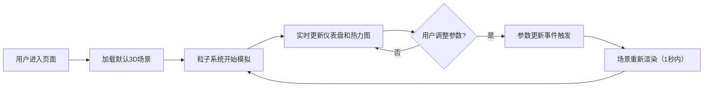

## 1. 产品概述

城市街区空气颗粒物扩散与绿化拦截3D交互可视化应用，为大气污染研究者和环境工程师提供直观的模拟工具。通过调整绿化配置参数，实时观察PM2.5颗粒物在风场中的扩散路径与沉积效率，辅助城市绿化规划决策。

- 目标用户：大气污染研究者、环境工程师、城市规划师
- 核心价值：可视化理解绿化对空气颗粒物的拦截效果，支持参数化实验
- 应用场景：教学演示、科研辅助、城市绿化方案评估

## 2. 核心功能

### 2.1 用户角色

| 角色 | 登录方式 | 核心权限 |
|------|----------|----------|
| 研究人员 | 无需登录 | 调整参数、观察模拟、查看统计数据 |

### 2.2 功能模块

1. **3D街区场景**：等轴测视角展示200mx200m街区，包含建筑、树木、风场粒子
2. **参数控制面板**：调节绿地面积、树木高度、排列方式三种绿化参数
3. **粒子扩散模拟**：500个PM2.5粒子实时运动，考虑重力、湍流、植被捕获
4. **统计仪表盘**：实时显示总颗粒物浓度和绿化拦截效率
5. **俯视热力图**：右下角小地图显示PM2.5浓度分布热力图

### 2.3 页面详情

| 页面名称 | 模块名称 | 功能描述 |
|---------|----------|----------|
| 主页面 | 3D场景模块 | Three.js渲染街区建筑、树木、粒子流，支持等轴测视角 |
| 主页面 | 控制面板模块 | 左侧毛玻璃面板，三个滑块/选择器调节绿化参数 |
| 主页面 | 统计仪表盘模块 | 右侧半圆形仪表盘，显示浓度和拦截效率 |
| 主页面 | 热力图模块 | 右下角200x200px小地图，Canvas 2D绘制浓度热力图 |

## 3. 核心流程

用户进入应用 → 查看默认配置下的3D街区和风场粒子运动 → 调整绿化参数（绿地面积/树木高度/排列方式）→ 观察粒子轨迹变化和拦截效果 → 查看实时统计数据和热力图 → 多次参数调整对比效果

## 4. 用户界面设计

### 4.1 设计风格

- 设计主题：科技感+自然环境融合，半透明毛玻璃材质
- 主色调：天空蓝 #b3d9ff → 城市灰 #a0a0a0 渐变背景
- 强调色：绿色系 #228b22 ~ #32cd32（树木）、橙色 #ff8c00（被拦截粒子）
- 数据可视化色：冷蓝 #2196f3 → 暖红 #f44336（热力图），红 #e53935 → 绿 #43a047（仪表盘）
- UI组件：圆角12px，毛玻璃效果 backdrop-filter: blur(8px)，柔和阴影
- 字体：现代无衬线字体，清晰的科技感

### 4.2 页面设计概览

| 页面名称 | 模块名称 | UI元素 |
|---------|----------|--------|
| 主页面 | 3D场景 | 全屏Three.js画布，等轴测45°俯角，建筑灰白渐变，树木绿色半透明 |
| 主页面 | 控制面板 | 左侧固定300px，半透明白色毛玻璃，三个参数控件带hover微缩放 |
| 主页面 | 仪表盘 | 右侧两个半圆形进度条，数值动态变化，颜色渐变 |
| 主页面 | 热力图 | 右下角200x200px，Canvas 2D绘制，带建筑树木轮廓叠加 |

### 4.3 响应式设计

- 大屏（>1200px）：左侧面板宽300px固定，右侧仪表盘独立显示
- 中屏（768-1200px）：控制面板折叠为顶部导航栏，仪表盘内联
- 小屏（<768px）：控制面板改为底部弹出式半屏，热力图可切换显示
- 触控优化：滑块增大触控区域，按钮最小44px

### 4.4 3D场景指引

- 环境：天空蓝→城市灰渐变背景，柔和环境光
- 光照：半球光+方向光组合，模拟日间自然光
- 相机：等轴测视角45°俯角，固定视角不旋转
- 构图：200mx200m街区居中，6栋建筑错落分布
- 动画：粒子流动态运动，参数调整时建筑生长动画（0.5秒）
- 后处理：轻微泛光效果增强科技感
- 性能：500粒子维持50fps以上，参数更新延迟<200ms
