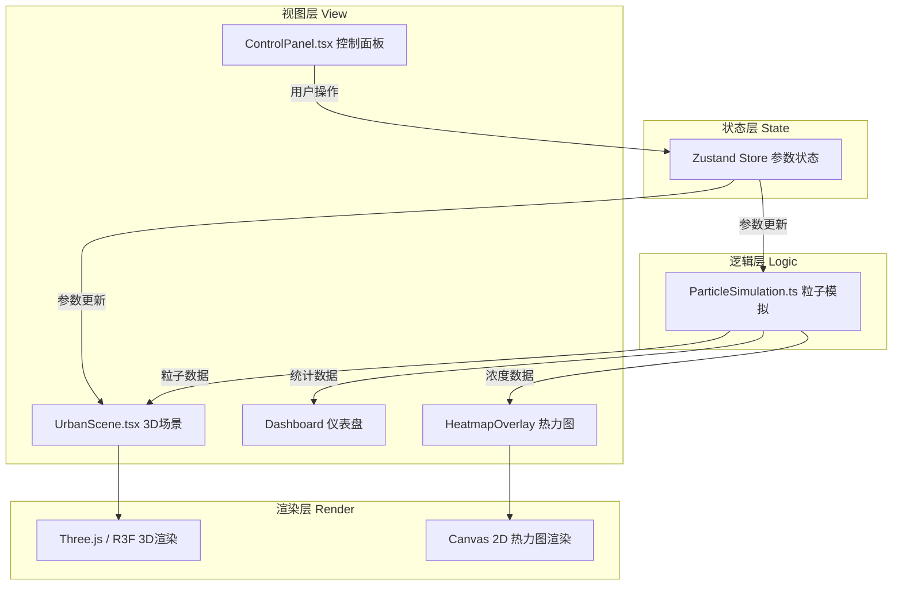

## 1. 架构设计

本项目为纯前端React应用，采用分层架构设计，数据单向流动，各模块职责清晰。



**数据流向说明：**
1. 用户通过 ControlPanel 调整参数 → 更新 Zustand Store
2. Store 参数变化 → 触发 UrbanScene 更新建筑/树木布局
3. Store 参数变化 → 触发 ParticleSimulation 更新模拟参数
4. ParticleSimulation 每帧计算 → 输出粒子位置数组给 Three.js 渲染
5. ParticleSimulation 统计数据 → 驱动 Dashboard 仪表盘显示
6. ParticleSimulation 浓度数据 → 驱动 Canvas 2D 热力图绘制

## 2. 技术描述

- **前端框架**：React 18 + TypeScript 5
- **构建工具**：Vite 5 + @vitejs/plugin-react
- **3D渲染**：three + @react-three/fiber + @react-three/drei
- **动画库**：framer-motion
- **状态管理**：zustand（轻量高性能，适合频繁更新的模拟状态）
- **数据校验**：zod
- **样式方案**：原生CSS + CSS变量（避免Tailwind与Three.js场景的样式冲突）
- **Canvas 2D**：原生Canvas API绘制热力图

## 3. 项目结构

```
src/
├── components/           # React UI组件
│   ├── ControlPanel.tsx  # 左侧控制面板（参数调节）
│   └── Dashboard.tsx     # 右侧统计仪表盘
├── scene/                # 3D场景模块
│   └── UrbanScene.tsx    # Three.js主场景组件
├── logic/                # 业务逻辑
│   └── ParticleSimulation.ts  # 粒子扩散模拟引擎
├── utils/                # 工具函数
│   └── HeatmapOverlay.ts # Canvas 2D热力图绘制
├── store/                # 状态管理
│   └── useSimStore.ts    # 模拟参数与状态store
├── types/                # TypeScript类型定义
│   └── index.ts
├── styles/               # 全局样式
│   └── index.css
├── App.tsx               # 主应用组件
└── main.tsx              # 入口文件
```

**模块调用关系：**
- App.tsx → 组合 ControlPanel + UrbanScene + Dashboard + HeatmapOverlay
- UrbanScene.tsx → 引入 ParticleSimulation 实例，使用 useFrame 驱动模拟
- ControlPanel.tsx → 通过 useSimStore 修改参数
- ParticleSimulation.ts → 纯逻辑类，不依赖React，由场景帧循环驱动
- HeatmapOverlay.ts → 纯工具类，接收粒子数据输出Canvas图像

## 4. 核心数据模型

### 4.1 绿化参数类型

```typescript
interface GreeneryConfig {
  greenArea: number;      // 绿地面积 50-500 m²
  treeHeight: number;     // 树木高度 5-30 m
  arrangement: 'array' | 'staggered' | 'cluster';  // 排列方式
}
```

### 4.2 粒子数据类型

```typescript
interface Particle {
  id: number;
  x: number; y: number; z: number;  // 三维位置
  vx: number; vy: number; vz: number; // 速度
  size: number;        // 粒子大小
  alive: boolean;      // 是否存活
  captured: boolean;   // 是否已被捕获
  age: number;         // 存活时间
}
```

### 4.3 建筑数据类型

```typescript
interface Building {
  id: number;
  x: number; z: number;  // 平面位置
  width: number; depth: number;  // 宽深
  height: number;        // 高度 20-80m
  color: string;         // 颜色
}
```

### 4.4 树木数据类型

```typescript
interface Tree {
  id: number;
  x: number; z: number;  // 平面位置
  height: number;        // 总高度
  trunkRadius: number;   // 树干半径
  crownRadius: number;   // 树冠半径
  crownHeight: number;   // 树冠高度
}
```

### 4.5 模拟统计类型

```typescript
interface SimStats {
  totalConcentration: number;   // 总浓度 μg/m³
  captureEfficiency: number;    // 拦截效率 %
  totalParticles: number;       // 总粒子数
  capturedParticles: number;    // 已捕获粒子数
}
```

## 5. 性能优化策略

1. **粒子池化**：预分配500个粒子对象，复用避免GC
2. **更新降频**：热力图每0.3秒刷新一次，而非每帧刷新
3. **批量渲染**：使用 InstancedMesh 渲染树木和粒子，减少Draw Call
4. **内存优化**：粒子轨迹使用环形缓冲区，限制最大轨迹点数
5. **状态分离**：高频更新的模拟数据与React状态解耦，避免不必要的重渲染

## 6. 关键算法

### 6.1 粒子运动方程
- 平流项：风速 × 时间步长
- 重力沉降：重力加速度 × 时间步长 × 粒子质量系数
- 湍流扩散：随机高斯扰动 × 湍流强度
- 植被捕获：粒子进入树冠区域概率性捕获

### 6.2 热力图生成
- 将街区平面网格化（如50×50）
- 每个网格统计粒子密度
- 使用颜色映射函数将密度映射为蓝→红渐变色
- 高斯模糊平滑处理
