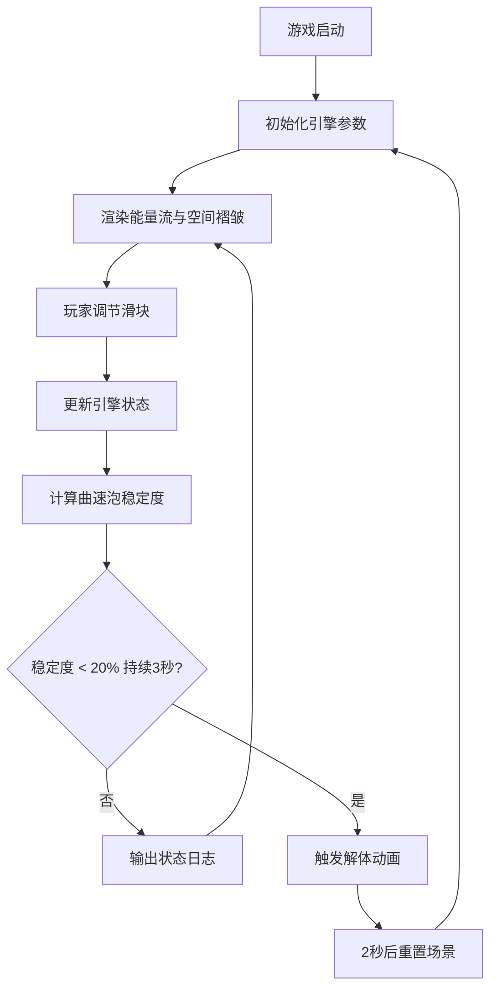

## 1. 产品概述

虚拟超光速飞船曲速引擎能量流调控与空间褶皱规避游戏，玩家扮演深空探索飞船的引擎工程师，通过调节曲速引擎参数维持曲速泡稳定，穿越不稳定的空间褶皱区。

- 核心目标：通过手动调节能量输出相位、频率和振幅，保持曲速泡稳定度在安全区间
- 目标用户：科幻游戏爱好者、策略模拟类玩家

## 2. 核心功能

### 2.1 用户角色
| 角色 | 注册方式 | 核心权限 |
|------|----------|----------|
| 玩家 | 无需注册，直接游玩 | 调节引擎参数、观察游戏状态、体验游戏流程 |

### 2.2 功能模块
1. **主游戏界面**：Canvas 能量流可视化、空间褶皱网格、参数控制滑块、稳定度指示器、任务日志

### 2.3 页面详情
| 页面名称 | 模块名称 | 功能描述 |
|----------|----------|----------|
| 主游戏界面 | 引擎参数控制 | 三个滑块控制相位(0-360°)、频率(1-100Hz)、振幅(0-100%)，带渐变轨道和实时数值显示 |
| 主游戏界面 | 能量流粒子系统 | 约500个粒子从引擎核心螺旋扩散，颜色随相位和频率动态变化，运动受空间褶皱干扰 |
| 主游戏界面 | 空间褶皱网格 | 半透明扭曲线段网格，密度和扭曲随振幅增大，稳定度<30%时出现撕裂裂口 |
| 主游戏界面 | 稳定度指示器 | 右下角环形进度条，颜色绿到红渐变，<50%时脉冲闪烁，动画过渡0.3s |
| 主游戏界面 | 解体动画 | 稳定度连续3秒<20%触发，全屏红闪+粒子飞溅+网格碎裂，2秒后重置 |
| 主游戏界面 | 任务日志 | 顶部滚动显示最近5条系统状态消息，带时戳和状态图标 |

## 3. 核心流程

玩家进入游戏 → 初始状态下曲速泡稳定度中等 → 拖动滑块调节相位/频率/振幅 → Canvas实时渲染能量流和褶皱变化 → 稳定度指示器动态更新 → 系统根据状态输出日志消息 → 若稳定度过低触发解体动画 → 重置场景重新开始

## 4. 用户界面设计

### 4.1 设计风格
- **主色调**：深空黑(#0a0f1c) → 星际紫(#1a0f2e)径向渐变背景
- **强调色**：蓝#2196F3、紫#9C27B0、红#F44336（滑块渐变）；绿#4CAF50、红#F44336（稳定度渐变）
- **粒子配色**：蓝紫(#3F51B5-#9C27B0)、红橙(#FF5722-#FF9800)、青绿(#00BCD4-#4CAF50)
- **控件风格**：磨砂玻璃效果（rgba(255,255,255,0.1)背景，8px模糊，12px圆角，1px半透明白色边框）
- **动画缓动**：easeInOutCubic
- **字体**：科幻感无衬线字体，标题加粗，正文清晰易读

### 4.2 页面设计概览
| 页面名称 | 模块名称 | UI元素 |
|----------|----------|--------|
| 主游戏界面 | 任务日志 | 顶部水平滚动，磨砂玻璃卡片，消息含图标+时戳+文字 |
| 主游戏界面 | Canvas可视化区域 | 中央大面积区域，引擎核心圆点居中，粒子螺旋扩散，背景褶皱网格 |
| 主游戏界面 | 参数滑块 | 底部横向排列（桌面端）/纵向堆叠（移动端），渐变轨道，弹性反馈动画 |
| 主游戏界面 | 稳定度指示器 | 右下角环形进度条，百分比数字居中显示，脉冲闪烁效果 |
| 主游戏界面 | 解体动画覆盖层 | 全屏红色闪烁，碎裂粒子效果 |

### 4.3 响应式设计
- 桌面端（≥1024px）：滑块横向排列在底部，稳定度指示器右下角，日志顶部水平滚动
- 移动端（<1024px）：滑块纵向堆叠，自适应屏幕宽度，触控区域优化

### 4.4 性能优化
- Canvas渲染稳定60fps
- 帧率<50fps时：粒子数减半（500→250），网格密度降低30%
- requestAnimationFrame驱动渲染循环
