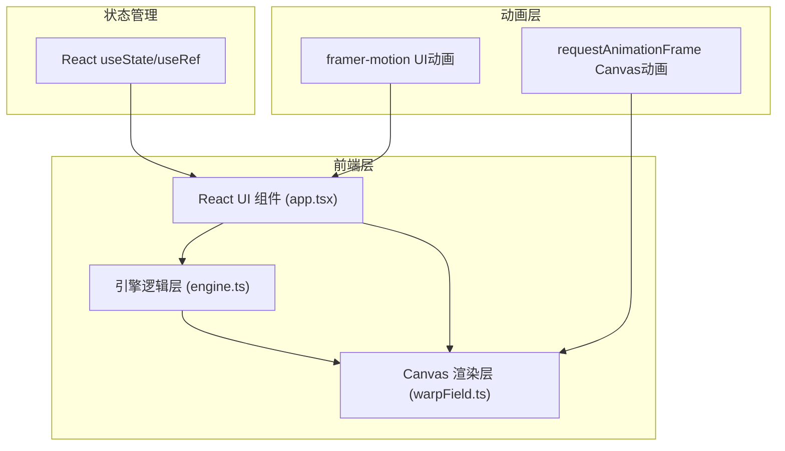

## 1. 架构设计



## 2. 技术描述

- **前端框架**：React@18 + TypeScript
- **构建工具**：Vite@5 + @vitejs/plugin-react
- **UI 动画**：framer-motion
- **图形渲染**：Canvas 2D API
- **工具库**：uuid（唯一ID生成）、zod（数据验证）
- **语言规范**：TypeScript 严格模式，target ES2020

## 3. 文件结构

| 文件路径 | 职责描述 |
|----------|----------|
| package.json | 项目依赖与脚本配置（dev/build） |
| vite.config.js | Vite 构建配置，启用 React 插件 |
| tsconfig.json | TypeScript 配置（严格模式，ES2020） |
| index.html | 入口页面，含 viewport meta |
| src/engine.ts | 曲速引擎核心逻辑：相位/频率/振幅状态管理、稳定度计算、曲速泡参数输出 |
| src/warpField.ts | 空间褶皱生成与 Canvas 渲染：动态扭曲网格、粒子系统、撕裂效果 |
| src/app.tsx | 主组件：集成滑块控制、Canvas 可视化、稳定度指示器、任务日志、解体动画 |

## 4. 模块设计

### 4.1 engine.ts 引擎模块

```typescript
// 引擎参数类型
interface EngineParams {
  phase: number;      // 相位 0-360 度
  frequency: number;  // 频率 1-100 Hz
  amplitude: number;  // 振幅 0-100%
}

// 引擎状态类型
interface EngineState {
  params: EngineParams;
  stability: number;        // 稳定度 0-100
  bubbleRadius: number;     // 曲速泡半径
  bubbleJitter: number;     // 曲速泡抖动值
  lowStabilityStartTime: number | null; // 低稳定度起始时间
}

// 核心方法
class WarpEngine {
  setPhase(value: number): void;
  setFrequency(value: number): void;
  setAmplitude(value: number): void;
  calculateStability(): number;
  getBubbleRadius(): number;
  getBubbleJitter(): number;
  checkCollapse(): boolean; // 是否触发解体
}
```

**稳定度算法**：
- 理想区间：相位 120-240°，频率 40-60Hz，振幅 40-60%
- 各参数独立计算偏离度，加权平均得出稳定度
- 当三项都处于理想区间时稳定度最高（>90%）

### 4.2 warpField.ts 渲染模块

```typescript
interface Particle {
  x: number; y: number;
  vx: number; vy: number;
  life: number; maxLife: number;
  color: string;
  size: number;
  angle: number; speed: number;
}

interface GridPoint {
  baseX: number; baseY: number;
  offsetX: number; offsetY: number;
}

interface Tear {
  x: number; y: number;
  width: number; height: number;
  points: { x: number; y: number }[];
}

class WarpFieldRenderer {
  particles: Particle[];
  grid: GridPoint[][];
  tears: Tear[];
  particleCount: number;
  gridDensity: number;
  
  init(canvas: HTMLCanvasElement): void;
  update(engineState: EngineState, dt: number): void;
  render(ctx: CanvasRenderingContext2D): void;
  adjustPerformance(fps: number): void;
  triggerCollapse(): void;
}
```

**渲染管线**：
1. 背景径向渐变填充
2. 空间褶皱网格（带扭曲和撕裂）
3. 曲速泡光环（根据半径和抖动）
4. 引擎核心发光圆点
5. 能量流粒子系统（螺旋扩散）

### 4.3 app.tsx 主组件模块

**子组件结构**：
- `SliderControl`：带渐变轨道和数值显示的滑块组件
- `StabilityIndicator`：环形进度条稳定度指示器
- `TaskLog`：顶部滚动任务日志组件
- `CollapseOverlay`：解体动画覆盖层

**核心 React Hooks**：
- `useState`：引擎参数、稳定度、日志列表、UI状态
- `useRef`：Canvas 引用、引擎实例引用、渲染器实例引用、动画帧ID
- `useEffect`：初始化渲染循环、监听参数变化、解体动画定时器
- `useCallback`：性能优化，避免不必要的重渲染

## 5. 性能优化策略

### 5.1 Canvas 渲染优化
- 使用 `requestAnimationFrame` 同步刷新率
- 粒子对象池复用，避免频繁 GC
- 离屏 Canvas 预渲染静态背景元素
- 脏矩形区域局部重绘（可选）

### 5.2 自适应性能调整
- FPS 监测：每 500ms 计算平均帧率
- 帧率 < 50fps 时：粒子数 500→250，网格密度 ×0.7
- 帧率恢复 > 55fps 持续 2s 时：恢复原配置

### 5.3 React 渲染优化
- 使用 `useRef` 存储高频变化的渲染状态
- 滑块组件使用 `framer-motion` 优化动画性能
- Canvas 尺寸变化时使用 `ResizeObserver` 一次性处理

## 6. 动画规范

### 6.1 UI 动画（framer-motion）
- 滑块拖动：弹性反馈 + 轻微缩放（spring 动画）
- 稳定度数值过渡：0.3s easeInOutCubic
- 日志消息入场：淡入 + 向上滑入
- 解体覆盖层：多次红色闪烁 + 透明度动画

### 6.2 Canvas 动画
- 粒子：基于 dt 的速度更新，螺旋路径 + 褶皱干扰
- 网格：基于正弦波的动态扭曲偏移
- 曲速泡：半径呼吸 + 抖动噪声
- 撕裂：锯齿边缘生成 + 边缘粒子消散效果
