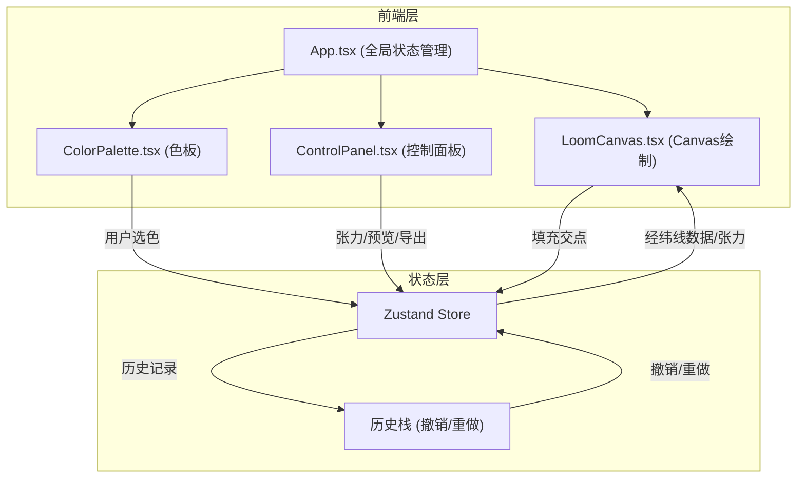

## 1. 架构设计



## 2. 技术说明

- 前端框架：React@18 + TypeScript
- 构建工具：Vite@5
- 状态管理：Zustand
- 动画库：framer-motion
- UI过渡动画：framer-motion（300ms ease-out）
- Canvas绘制：Canvas 2D API
- 图标：lucide-react
- 样式：Tailwind CSS
- 初始化工具：vite-init（react-ts模板）
- 后端：无
- 数据库：无（纯前端应用）

## 3. 路由定义

| 路由 | 用途 |
|------|------|
| / | 主页面，包含织机视图、色板、控制面板 |

## 4. 数据模型

### 4.1 核心数据结构

```typescript
interface LoomState {
  gridSize: number;
  warpColors: string[];
  weftColors: string[];
  tension: number;
  intersectionColors: string[][];
  selectedColor: string;
  fillMode: 'point' | 'warp' | 'weft' | 'drag';
}

interface HistoryEntry {
  intersectionColors: string[][];
  warpColors: string[];
  weftColors: string[];
}

interface LoomStore {
  loomState: LoomState;
  historyStack: HistoryEntry[];
  historyIndex: number;
  setSelectedColor: (color: string) => void;
  setFillMode: (mode: 'point' | 'warp' | 'weft' | 'drag') => void;
  setTension: (tension: number) => void;
  setGridSize: (size: number) => void;
  fillIntersection: (row: number, col: number) => void;
  fillWarpLine: (col: number) => void;
  fillWeftLine: (row: number) => void;
  fillDragArea: (startRow: number, startCol: number, endRow: number, endCol: number) => void;
  undo: () => void;
  redo: () => void;
  resetGrid: () => void;
}
```

### 4.2 色板预设颜色

```typescript
const PRESET_COLORS = [
  '#f5f5dc', '#1a237e', '#c62828', '#2e7d32',
  '#f9a825', '#4e342e', '#0d47a1', '#880e4f',
  '#00695c', '#e65100', '#311b92', '#bf360c',
  '#1b5e20', '#f57f17', '#263238', '#ad1457',
  '#004d40', '#ff6f00', '#3c096c', '#d4e157'
];
```

## 5. 文件结构与调用关系

```
项目根目录/
├── package.json          # 依赖管理，启动脚本
├── vite.config.ts        # Vite构建配置，React插件
├── tsconfig.json         # TypeScript严格模式，ES2020目标
├── index.html            # 入口HTML，加载src/main.tsx
├── tailwind.config.js    # Tailwind CSS配置
├── postcss.config.js     # PostCSS配置
└── src/
    ├── main.tsx          # React入口，挂载App到#root
    ├── App.tsx           # 主应用组件，管理全局状态
    │                     # 调用: LoomCanvas, ControlPanel, ColorPalette
    │                     # 数据流: 用户操作 → Zustand Store → 重新渲染
    ├── LoomCanvas.tsx    # Canvas织机视图组件
    │                     # Props: gridSize, warpColors, weftColors, tension,
    │                     #        intersectionColors, onFill, fillMode
    │                     # 职责: 绘制经纬线交织网格、色块、立体纹理
    ├── ControlPanel.tsx  # 控制面板组件
    │                     # Props: tension, onTensionChange, onPreview,
    │                     #        onExport, onUndo, onRedo, onReset,
    │                     #        gridSize, onGridSizeChange, previewImage
    │                     # 职责: 张力滑块、预览、导出、撤销重做
    ├── ColorPalette.tsx  # 色板组件
    │                     # Props: selectedColor, onSelectColor, fillMode,
    │                     #        onFillModeChange
    │                     # 职责: 20色色块展示、选色、填充模式切换
    ├── store.ts          # Zustand状态管理
    │                     # 被调用: App.tsx, LoomCanvas, ControlPanel, ColorPalette
    │                     # 职责: 全局状态、历史栈、撤销重做逻辑
    ├── types.ts          # TypeScript类型定义
    │                     # 被调用: 所有组件
    └── colors.ts         # 预设颜色常量
                          # 被调用: ColorPalette, LoomCanvas
```

## 6. 渲染算法

### 6.1 经纬线交织绘制

1. 根据gridSize计算每个网格单元的像素尺寸
2. 绘制经线（竖线）和纬线（横线）作为基础网格
3. 在每个交点处，根据经纬线颜色计算混合色（RGB加权平均）
4. 根据tension值调整纱线粗细：lineWidth = 2 + tension * 0.5
5. 根据tension值调整弯曲弧度：使用二次贝塞尔曲线，控制点偏移量 = tension * 1.5
6. 在交点上方绘制高光和阴影，模拟纱线凸起效果

### 6.2 颜色混合算法

```typescript
function blendColors(warpColor: string, weftColor: string): string {
  const warp = hexToRgb(warpColor);
  const weft = hexToRgb(weftColor);
  const mixed = {
    r: Math.round((warp.r + weft.r) / 2),
    g: Math.round((warp.g + weft.g) / 2),
    b: Math.round((warp.b + weft.b) / 2),
  };
  return rgbToHex(mixed);
}
```

### 6.3 立体纹理效果

- 交点处绘制椭圆模拟纱线截面
- 上方1px高光（白色半透明）模拟光泽
- 下方1px阴影（黑色半透明）模拟深度
- 张力越高，椭圆越大，高光/阴影越明显
