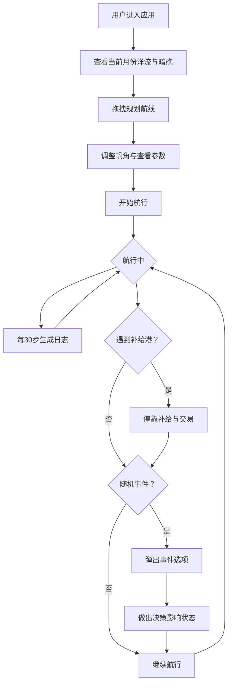

## 1. 产品概述

一款虚拟古代商船航海日志与洋流航行路径规划全栈Web应用，让用户扮演中世纪阿拉伯商船导航员，在印度洋季风洋流与暗礁密布的航线上，根据实时风向、洋流速度和月相数据规划航线、调整帆角、选择补给港口，并自动生成羊皮纸风格航海日志。

- 目标用户：航海模拟爱好者、历史文化爱好者、策略游戏玩家
- 核心价值：沉浸式中世纪航海体验，结合真实洋流模拟与策略决策

## 2. 核心功能

### 2.1 用户角色
| 角色 | 注册方式 | 核心权限 |
|------|----------|----------|
| 导航员 | 无需注册 | 规划航线、调整帆角、停靠补给、交易货物、查看日志 |

### 2.2 功能模块
1. **航海图页面**：交互式Leaflet地图、季风洋流箭头、暗礁红色标记、补给港口帆船图标、拖拽规划航线、实时位置
2. **航行控制面板**：帆角调整（0-90度）、转速表、月相盘、给养状态、货物清单
3. **航海日志面板**：自动生成日志条目、羊皮纸卷轴样式、滚动查看历史、导出打印
4. **补给交易面板**：停靠港口补充给养、买入卖出货物、价格波动
5. **随机事件面板**：古铜色边框弹窗、事件描述、应对选项

### 2.3 页面详情
| 页面名称 | 模块名称 | 功能描述 |
|----------|----------|----------|
| 航海图页面 | 交互式地图 | Leaflet地图显示印度洋区域，洋流箭头随月份变化，暗礁区红色标记，4个补给港口帆船emoji，用户拖拽规划航线，实时显示预期航行时长和风险等级 |
| 航海图页面 | 航行参数面板 | 指针式转速表显示船速，Canvas月相盘（8种月相15秒循环），帆角滑块（0-90度），给养状态条，当前风向/洋流速度 |
| 航海图页面 | 航海日志列表 | 每行日志带时间戳和风险等级色条，羊皮纸卷轴样式，每30时间步自动生成，懒加载每次20条，framer-motion展开/收起动画 |
| 航海图页面 | 补给交易面板 | 停靠港口时弹出，补充食物和水（最多200单位），货物交易（丝绸/香料/瓷器），价格随繁荣度和随机事件变化 |
| 航海图页面 | 随机事件面板 | 古铜色边框弹窗，10种随机事件，2-3个应对选项，选择影响船速/货物/给养 |

## 3. 核心流程

用户进入应用后，在交互式航海地图上查看当前月份的季风洋流方向和暗礁分布，通过拖拽在地图上规划从起点到目标港口的航线。系统根据风向、洋流速度和帆角设置实时计算预期航行时长和风险等级。航行过程中，每隔30个时间步自动生成一条日志条目。用户可调整帆角优化航速，在经过补给港口时停靠补充给养和交易货物。随机事件会触发弹窗，用户需做出决策。

## 4. 用户界面设计

### 4.1 设计风格
- 主色调：羊皮纸米黄（#f5deb3）
- 边框色：深木色（#5c4033）
- 点缀色：赭石红（#8b4513）
- 按钮色：旧化金属质感（#a0522d），按压动画缩放至0.95
- 字体：使用 MedievalSharp 或 UnifrakturMaguntia 作为标题字体，Noto Serif 作为正文
- 布局：左侧60%地图，右侧40%深木色面板
- 底部：麻绳纹理装饰条
- 日志：羊皮纸卷轴样式，framer-motion滑动动画（0.3秒）

### 4.2 页面设计概览
| 页面名称 | 模块名称 | UI元素 |
|----------|----------|--------|
| 主页面 | 航海地图 | Leaflet地图，洋流箭头层，暗礁红色圆圈标记，港口帆船emoji标记，航线虚线，商船图标 |
| 主页面 | 航行参数面板 | Canvas指针式转速表，Canvas月相盘，帆角滑块，给养进度条，风向罗盘 |
| 主页面 | 日志列表 | 羊皮纸背景卡片，时间戳，风险色条（绿/黄/红），展开/收起按钮 |
| 主页面 | 补给交易弹窗 | 港口名称，食物/水补充按钮，货物买卖列表，价格标签 |
| 主页面 | 随机事件弹窗 | 古铜色边框，事件标题，描述文字，2-3个选项按钮 |

### 4.3 响应式适配
- 桌面端：左侧60%地图 + 右侧40%面板
- 平板端：地图和日志面板竖向堆叠
- 手机端：地图全屏，日志面板默认收起只显示标题，点击展开

### 4.4 性能要求
- 地图拖拽和洋流箭头更新保持60FPS
- 日志列表懒加载（每次加载20条）
- 后端日志查询响应时间不超过200ms
- Canvas月相盘15秒循环8种月相
