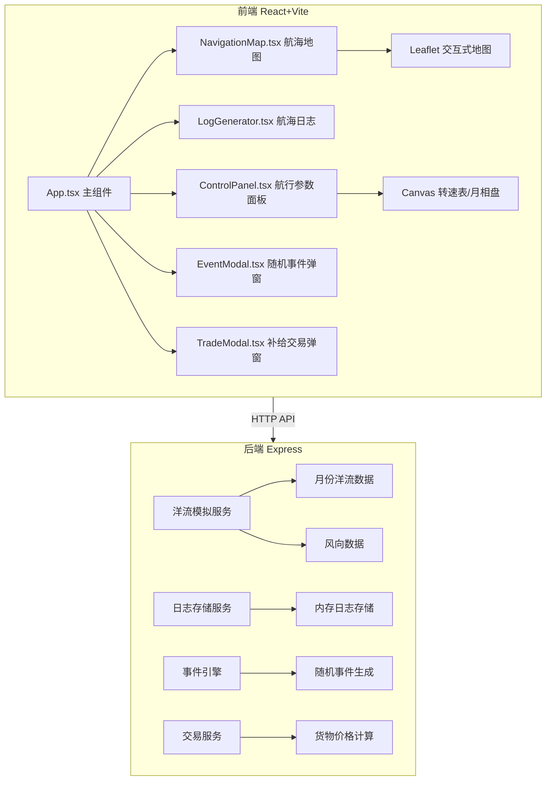
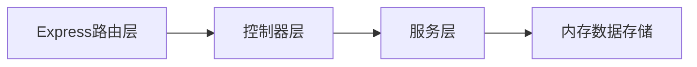
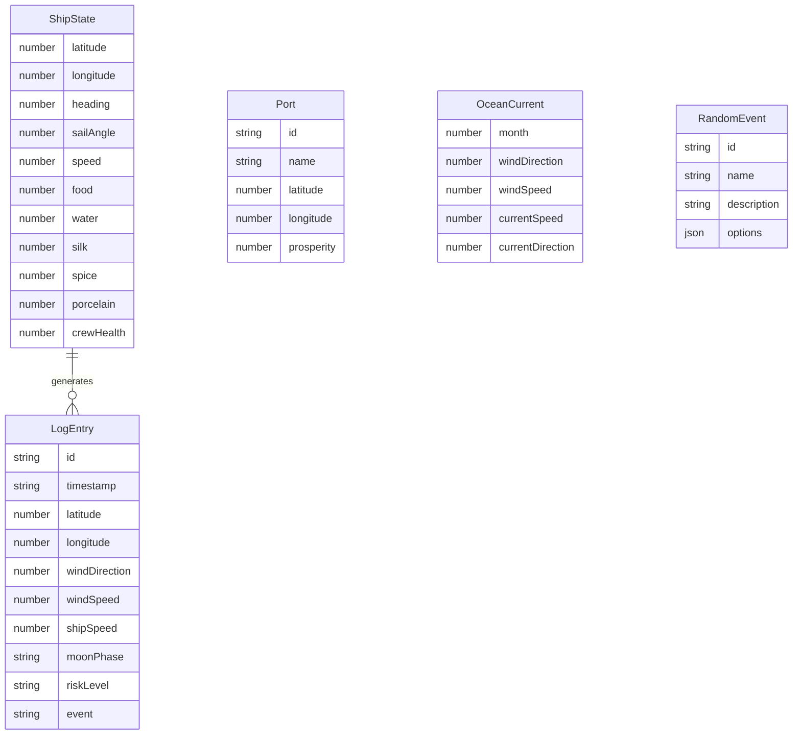

## 1. 架构设计



## 2. 技术说明
- 前端：React@18 + TypeScript + Vite@5 + TailwindCSS
- 初始化工具：vite-init (react-express-ts 模板)
- 后端：Express@4 + TypeScript (ESM格式)
- 数据库：无，使用内存数据存储
- 状态管理：Zustand
- 地图：Leaflet + react-leaflet
- 动画：framer-motion
- 校验：Zod
- ID生成：uuid

## 3. 路由定义
| 路由 | 用途 |
|------|------|
| / | 主页面，包含航海地图和所有面板 |

## 4. API定义

### 4.1 获取洋流数据
```
GET /api/currents?month={1-12}
Response: {
  month: number
  windDirection: number        // 风向角度 0-360
  windSpeed: number            // 风速 5-25节
  currentSpeed: number         // 洋流速度 0.5-2.5节
  currentDirection: number     // 洋流方向 0-360
}
```

### 4.2 计算航速
```
POST /api/speed
Body: {
  windDirection: number
  windSpeed: number
  currentSpeed: number
  currentDirection: number
  sailAngle: number            // 帆角 0-90度
  heading: number              // 航向角度
  supplies: number             // 给养余量
  crewHealth: number           // 船员健康 0-100
}
Response: {
  effectiveSpeed: number       // 有效船速
  riskLevel: "low" | "medium" | "high"
}
```

### 4.3 保存日志
```
POST /api/logs
Body: {
  timestamp: string
  latitude: number
  longitude: number
  windDirection: number
  windSpeed: number
  shipSpeed: number
  sailAngle: number
  supplies: { food: number, water: number }
  cargo: { silk: number, spice: number, porcelain: number }
  moonPhase: string
  riskLevel: string
  event?: string
}
Response: { id: string, success: boolean }
```

### 4.4 查询日志
```
GET /api/logs?page={n}&limit={20}
Response: {
  logs: LogEntry[]
  total: number
  page: number
  hasMore: boolean
}
```

### 4.5 触发随机事件
```
GET /api/events/random
Response: {
  id: string
  name: string
  description: string
  options: {
    label: string
    effects: { speed?: number, supplies?: number, cargo?: { silk?: number, spice?: number, porcelain?: number } }
  }[]
}
```

### 4.6 港口交易
```
GET /api/ports/:id/prices
Response: {
  portId: string
  portName: string
  prosperity: number           // 繁荣度 0-100
  buyPrices: { silk: number, spice: number, porcelain: number }
  sellPrices: { silk: number, spice: number, porcelain: number }
}
```

### 4.7 获取月相
```
GET /api/moonphase?step={number}
Response: {
  phase: string                // 新月/蛾眉月/上弦月/盈凸月/满月/亏凸月/下弦月/残月
  illumination: number         // 照明度 0-100
}
```

## 5. 服务器架构图



## 6. 数据模型

### 6.1 数据模型定义



### 6.2 关键数据定义

4个补给港口：
- 亚丁港 (12.78, 45.02)
- 马斯喀特港 (23.59, 58.54)
- 卡利卡特港 (11.26, 75.78)
- 霍尔木兹港 (27.19, 56.28)

10个随机事件：
1. 海盗袭击
2. 暴风雨
3. 海怪目击
4. 磁罗盘失灵
5. 船员叛变
6. 迷雾笼罩
7. 漂流瓶发现
8. 鲸鱼群出现
9. 船体漏水
10. 神秘岛屿

季风洋流数据（按月）：
- 冬季(11-3月)：东北季风，风速15-25节，洋流1.5-2.5节
- 夏季(6-9月)：西南季风，风速12-22节，洋流1.0-2.0节
- 过渡季(4-5, 10月)：风向多变，风速5-15节，洋流0.5-1.5节
