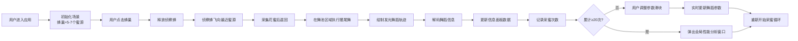

## 1. 产品概述

本应用是一个蜜蜂采蜜路径优化与舞蹈语言解码的交互学习平台，用户以蜜蜂行为学家的身份，通过调整蜜源位置、蜂巢角度和花朵密度，实时观察蜂群通过摆尾舞传递信息的过程，理解蜜蜂的舞蹈语言机制并探索最优觅食路径。

- 核心目标：通过可视化模拟帮助用户学习蜜蜂摆尾舞的信息传递机制，理解群体智能路径优化原理
- 目标用户：生物爱好者、学生、科普教育工作者
- 产品价值：将抽象的动物行为学转化为直观的交互式学习体验

## 2. 核心功能

### 2.1 功能模块

1. **主模拟画布**：蜂巢可视化、蜜源点分布、侦察蜂飞行与舞蹈模拟、粒子效果
2. **控制面板**：蜜源距离/角度/密度调节滑块、交互控件
3. **信息面板**：舞蹈解码信息展示、蜜源参数详情、适宜度评分
4. **统计分析面板**：历史最优路径对比、采蜜效率指数、全局性能分析窗口

### 2.2 页面详情

| 页面名称 | 模块名称 | 功能描述 |
|-----------|-------------|---------------------|
| 主模拟页面 | 蜂巢Canvas视图 | 绘制六边形蜂窝结构（边长15px，蜜糖金#ffb300到蜡白#f5e6ca渐变），半圆形巢门，舞池区域（直径120px半透明圆） |
| 主模拟页面 | 蜜源SVG组件 | 5-7个随机颜色花朵（30-40px直径，樱花粉到向日葵黄），周期性摆动，释放花蜜微粒 |
| 主模拟页面 | 侦察蜂Canvas渲染 | 黑黄条纹蜂身，半透明翅膀每秒扇动4次，飞行轨迹，摆尾舞动画 |
| 主模拟页面 | 舞蹈轨迹绘制 | 发光黄白轨迹线，垂直抖动频率与距离正相关，腹部摆幅对应方向 |
| 控制面板 | 距离滑块 | 1-10档调节，磨砂玻璃样式，蜜糖黄滑块柄 |
| 控制面板 | 角度滑块 | 0-360度调节，实时更新舞蹈角度参数 |
| 控制面板 | 密度选择器 | 稀疏/中等/密集三档花朵密度 |
| 信息面板 | 解码信息区 | 距离数值、方向角度、适宜度评分，弹簧数字动画 |
| 统计面板 | 最优路径对比 | 三条历史最优路径彩色高亮线，宽度随推荐度变化 |
| 统计面板 | 效率指数条 | 0-100分数条，红#e53935到绿#43a047渐变填充 |
| 分析窗口 | 直方图 | 路径效率分布柱状图，蓝到黄渐变 |
| 分析窗口 | 关系曲线 | 最优路径平均舞蹈强度与蜜源产量关系曲线 |

## 3. 核心流程

## 4. 用户界面设计

### 4.1 设计风格

- **主色调**：蜜糖黄#ffb300、暖白#fff8e1、草绿#c8e6c9
- **背景**：晨曦暖黄#fff8e1到田野绿#c8e6c9的全屏垂直渐变
- **字体**：Lexend Deca（Google Fonts）
- **按钮控件**：圆角矩形border-radius: 12px，阴影box-shadow: 0 4px 12px rgba(0,0,0,0.1)，悬停放大1.05倍，过渡动画transition: transform 0.2s ease
- **粒子效果**：蜂花粉粒子（2-5px，黄到白色），随机飘动，不超过100个
- **动画反馈**：弹簧动画（framer-motion），滑块数值改变时数字上下弹跳

### 4.2 页面布局

| 区域 | 位置 | 描述 |
|-----------|-------------|-------------|
| 主模拟区 | 全屏中央 | Canvas画布，蜂巢位于中央偏下，蜜源散布周围 |
| 控制面板 | 左侧/底部（响应式） | 三个控制滑块，磨砂玻璃半透明背景 |
| 信息面板 | 右侧/顶部（响应式） | 固定宽度300px，显示解码后的蜜源信息 |
| 统计面板 | 舞池下方 | 最优路径对比和效率指数 |
| 分析窗口 | 右上角 | 模糊背景圆角弹窗，采集20次后触发 |

### 4.3 响应式设计

- **桌面端（>1024px）**：信息面板右侧固定300px，控制面板左侧，主画布居中
- **平板端（768-1024px）**：信息面板折叠为顶部浮动条，控制面板置于底部
- **手机端（<768px）**：全屏滚动布局，所有面板依次排列

### 4.4 性能要求

- 粒子数≤100个
- 帧率稳定≥30FPS
- 路径重绘响应时间≤150ms
