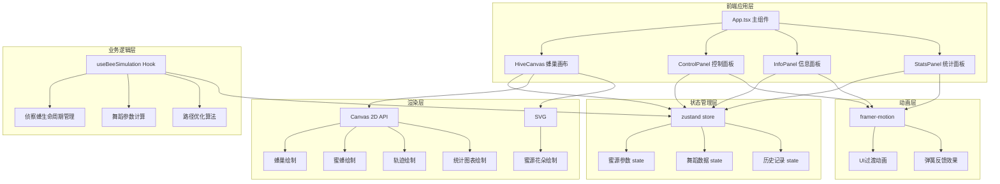

## 1. 架构设计



## 2. 技术描述

- **前端框架**：React@18 + TypeScript@5
- **构建工具**：Vite@5 + @vitejs/plugin-react@4
- **状态管理**：zustand@4
- **动画库**：framer-motion@11
- **渲染技术**：Canvas 2D API + SVG
- **字体**：Google Fonts - Lexend Deca
- **初始化方式**：手动配置项目结构

## 3. 目录结构

```
src/
├── main.tsx              # React DOM 渲染入口
├── App.tsx               # 主组件，组装所有模块
├── store/
│   └── useBeeStore.ts    # zustand 全局状态管理
├── hooks/
│   └── useBeeSimulation.ts  # 蜜蜂模拟逻辑Hook
├── components/
│   ├── HiveCanvas.tsx       # Canvas蜂巢视图组件
│   ├── ControlPanel.tsx     # 控制面板组件
│   ├── InfoPanel.tsx        # 信息面板组件
│   └── StatsPanel.tsx       # 统计分析面板组件
├── types/
│   └── index.ts          # TypeScript类型定义
└── utils/
    ├── canvas.ts         # Canvas绘制工具函数
    └── math.ts           # 数学计算工具函数
```

## 4. 数据模型

### 4.1 类型定义

```typescript
// 蜜源点
interface NectarSource {
  id: string;
  x: number;
  y: number;
  color: string;
  size: number;
  nectarAmount: number;
  distance: number;
  angle: number;
}

// 侦察蜂
interface ScoutBee {
  id: string;
  x: number;
  y: number;
  targetX: number;
  targetY: number;
  state: 'idle' | 'flying_to_source' | 'collecting' | 'flying_back' | 'dancing';
  wingPhase: number;
  danceProgress: number;
  currentSource: NectarSource | null;
}

// 舞蹈数据
interface DanceData {
  waggleFrequency: number;
  abdomenAngle: number;
  swingAmplitude: number;
  cycleDuration: number;
  decodedDistance: number;
  decodedAngle: number;
  suitabilityScore: number;
}

// 路径记录
interface PathRecord {
  id: string;
  sourceId: string;
  distance: number;
  angle: number;
  efficiency: number;
  pathPoints: { x: number; y: number }[];
  danceIntensity: number;
  nectarYield: number;
  timestamp: number;
}

// 全局状态
interface BeeState {
  // 蜜源参数
  nectarDistance: number;
  nectarAngle: number;
  flowerDensity: 'sparse' | 'medium' | 'dense';
  
  // 蜜源列表
  nectarSources: NectarSource[];
  
  // 侦察蜂
  scoutBee: ScoutBee | null;
  
  // 舞蹈数据
  currentDance: DanceData | null;
  danceTrail: { x: number; y: number; alpha: number }[];
  
  // 历史记录
  totalCollectCount: number;
  pathHistory: PathRecord[];
  topPaths: PathRecord[];
  
  // UI状态
  showAnalysis: boolean;
  efficiencyIndex: number;
  
  // Actions
  setNectarDistance: (value: number) => void;
  setNectarAngle: (value: number) => void;
  setFlowerDensity: (value: 'sparse' | 'medium' | 'dense') => void;
  releaseScoutBee: () => void;
  updateBeePosition: (x: number, y: number) => void;
  setBeeState: (state: ScoutBee['state']) => void;
  updateDanceData: (data: Partial<DanceData>) => void;
  addDanceTrailPoint: (x: number, y: number) => void;
  clearDanceTrail: () => void;
  recordPath: (record: PathRecord) => void;
  incrementCollectCount: () => void;
  setShowAnalysis: (show: boolean) => void;
  updateEfficiencyIndex: () => void;
  initializeSources: () => void;
}
```

## 5. 核心算法

### 5.1 舞蹈解码算法

```
摆尾舞解码规则：
1. 摆动频率 ∝ 1 / 蜜源距离（距离越远，频率越低）
   waggleFrequency = 10 - nectarDistance
   
2. 腹部摆动角度 = 蜜源方向角（相对于垂直向上）
   abdomenAngle = nectarAngle (degrees)
   
3. 摆幅大小 ∝ 蜜源质量/适宜度
   swingAmplitude = 10 + (nectarAmount / 100) * 20
   
4. 适宜度评分 = f(距离, 蜜量, 密度)
   suitabilityScore = 100 - distance*5 + nectarAmount*0.3 + densityBonus
```

### 5.2 路径效率计算

```
效率指数 = (实际采蜜量 / 理论最优采蜜量) * 100
其中：
- 实际采蜜量 = Σ(各路径蜜源产量)
- 理论最优采蜜量 = 最短路径蜜源产量 × 采集次数

路径优化算法：
1. 计算所有蜜源的综合得分 = 蜜量 / 距离
2. 优先选择得分最高的蜜源
3. 记录历史路径，维护Top 3最优路径
```

## 6. 性能优化策略

1. **Canvas分层渲染**：静态元素（蜂巢）单独缓存，动态元素（蜜蜂、轨迹）每帧重绘
2. **粒子池化**：预分配100个粒子对象，循环复用避免GC
3. **requestAnimationFrame**：统一动画循环，确保30FPS以上
4. **状态防抖**：滑块值变化使用debounce，避免频繁重计算
5. **轨迹点限制**：舞蹈轨迹最多保留200个点，超出后移除旧点
