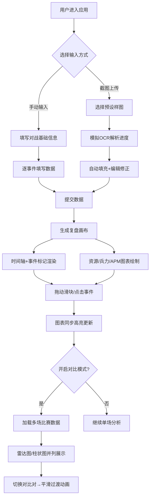

## 1. 产品概述

《星际争霸2》智能复盘系统是一款面向RTS电竞玩家的对战进程可视化工具，解决玩家赛后复盘时缺乏直观、自动化的对战分析手段的痛点。用户可以通过上传历史战绩截图（模拟OCR）或手动输入对战数据，自动生成带有时间轴的交互式复盘画布，实现对战过程的全维度可视化分析。

- **核心目标**：为SC2玩家提供专业级赛后复盘分析工具，将复杂的对战数据转化为直观的时间轴和图表
- **目标用户**：星际争霸2职业选手、业余玩家、电竞分析师、赛事解说
- **市场价值**：填补SC2生态中轻量化、可视化复盘工具的空白，提升玩家技战术分析效率

## 2. 核心功能

### 2.1 功能模块

1. **数据输入模块**：手动输入对战数据面板 + 截图上传模拟OCR功能
2. **时间轴复盘画布**：带彩色事件标记的时间轴、缩放平移交互、滑块精确定位
3. **多维度数据图表**：资源采集曲线、兵力价值对比、APM变化趋势
4. **事件详情面板**：点击时间轴标记点展示该时刻双方详细数据对比
5. **多场对比模式**：雷达图/柱状图并列展示多场复盘统计指标，带平滑过渡动画

### 2.2 页面详情

| 页面名称 | 模块名称 | 功能描述 |
|-----------|-------------|---------------------|
| 主应用页面 | 顶部导航区 | Logo展示、对比模式开关、主题切换 |
| 主应用页面 | 数据输入面板 | 双方基础信息填写、逐时间点数据录入、截图上传区域（含预设样图演示） |
| 主应用页面 | 复盘画布区 | 磨砂玻璃背景时间轴、可拖拽画布、缩放控制、事件圆点标记 |
| 主应用页面 | 图表展示区 | 资源曲线双折线图、兵力价值对比图、APM变化图、当前时刻高亮 |
| 主应用页面 | 事件详情弹窗 | 点击事件点弹出：精确时间、双方资源差、单位组成对比表 |
| 主应用页面 | 对比模式侧栏 | 多场比赛选择器、雷达图能力对比、柱状图指标并列、0.5秒过渡动画 |

## 3. 核心流程

### 主用户流程描述
用户进入应用后，首先选择数据输入方式：
1. **手动输入路径**：填写对战双方ID、种族、比赛时长 → 逐秒/逐关键事件点填写APM、资源、击杀、建筑等数据 → 提交生成
2. **截图上传路径**：点击上传区域选择预设样图 → 模拟OCR解析进度条 → 自动填充结构化数据 → 用户可编辑修正
数据准备完成后，系统自动渲染复盘画布：
- 时间轴生成所有关键事件标记（彩色圆点）
- 三条折线图表实时绘制（资源、兵力、APM）
- 用户可拖动底部滑块或直接点击事件点，所有图表同步高亮当前时刻
- 切换至对比模式可加载多场比赛，雷达图/柱状图平滑动画切换

## 4. 用户界面设计

### 4.1 设计风格
- **设计主题**：深色赛博朋克风格（Cyberpunk Dark）
- **主色调**：`#0a0e27` 深邃藏蓝（背景）
- **辅助色**：`#00d4aa` 赛博青绿（高亮、主操作、神族标识）
- **强调色**：`#ff6b6b` 霓虹粉红（告警、人族标识、虫族辅色）
- **补充色**：`#7c3aed` 电紫、`#fbbf24` 霓虹金
- **字体方案**：
  - 标题/数据展示：Orbitron（赛博朋克风格等宽字体）
  - 正文/说明：JetBrains Mono + 思源黑体
- **按钮样式**：12px圆角、霓虹外发光边框、hover时颜色填充扩散、点击涟漪扩散动画
- **布局风格**：固定宽度1200px居中、Flex弹性布局适配1440px+宽屏、卡片式模块分区
- **视觉特效**：时间轴区域磨砂玻璃（`backdrop-filter: blur(12px)`）、霓虹渐变边框、网格线动效背景

### 4.2 页面设计概述

| 页面名称 | 模块名称 | UI元素设计 |
|-----------|-------------|-------------|
| 主应用页面 | 顶部导航 | 渐变Logo、霓虹下划线导航项、发光开关按钮 |
| 主应用页面 | 数据输入面板 | 分组折叠卡片、输入框带霓虹焦点边框、上传区虚线框+悬浮高亮、样图预览网格 |
| 主应用页面 | 时间轴区 | 磨砂玻璃半透明白色5%背景、粗细双层时间线、脉冲发光事件圆点、滑块带发光手柄 |
| 主应用页面 | 图表区 | 网格背景、折线带渐变填充、当前时刻竖线发光标记、图例带hover效果 |
| 主应用页面 | 事件弹窗 | 尖角气泡定位、数据表格斑马纹、双方阵营色边框装饰 |
| 主应用页面 | 对比侧栏 | 滑入动画、雷达图带发光网格、柱状图渐变填充、数据切换时数字滚动动画 |

### 4.3 响应式设计
- **桌面优先**：默认1200px固定宽度居中布局，1440px+自动扩展左右留白
- **平板端（768px~1199px）**：主内容区自适应宽度，图表区两列变单列堆叠
- **移动端（<768px）**：整体折叠为单列布局，时间轴缩略显示，对比模式改为底部抽屉式弹出
- **触摸优化**：事件点热区扩大至48x48px，滑块增加触摸手柄，禁用hover依赖改用active状态

### 4.4 动画规范
- **入场动画**：所有卡片/图表从下方20px弹入，0.3s cubic-bezier(0.34, 1.56, 0.64, 1)缓动，按模块层级0.1s错峰延迟
- **数据更新**：折线图路径过渡0.2s线性，柱状图高度transition 0.4s ease-out
- **切换动画**：对比模式切换0.5s淡入淡出（opacity 0→1）+ 轻微缩放（scale 0.95→1）
- **微交互**：按钮点击涟漪0.6s扩散、事件点hover脉冲发光2倍放大、滑块拖动时数据数字tween过渡
