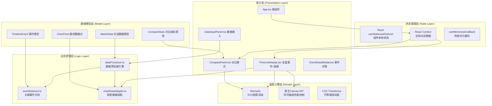
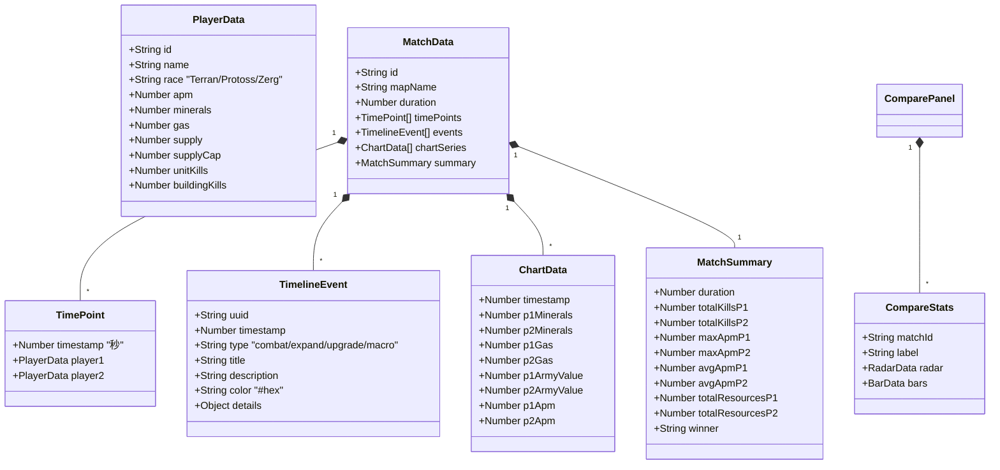
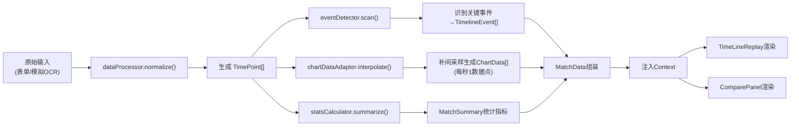

## 1. 架构设计

本项目为纯前端React单页应用，采用分层架构设计，确保数据处理、UI渲染、状态管理职责分离，满足高性能交互要求（16ms内图表更新、500ms首屏渲染）。



## 2. 技术说明

- **前端框架**：React 18 + TypeScript 5（JSX: react-jsx，strict严格模式）
- **构建工具**：Vite 5（@vitejs/plugin-react，base: './'）
- **图表库**：Recharts 2（折线图、雷达图、柱状图，SVG渲染）
- **工具库**：uuid（事件唯一ID生成）、html2canvas（截图导出功能）
- **样式方案**：原生CSS Modules + CSS Variables（主题色变量系统）
- **性能优化**：requestAnimationFrame驱动滑块联动、useDeferredValue降帧、useMemo缓存曲线数据、虚拟滚动事件列表

## 3. 项目文件结构

| 文件路径 | 职责说明 |
|---------|---------|
| `package.json` | 项目依赖配置：react、react-dom、typescript、vite、@vitejs/plugin-react、recharts、uuid、html2canvas；启动脚本 `npm run dev` |
| `vite.config.js` | Vite构建配置：React插件、TypeScript支持、base: './'、优化rollup分包 |
| `tsconfig.json` | TypeScript配置：严格模式、ES2020目标、jsx: react-jsx、路径别名 |
| `index.html` | 入口HTML：深色背景、viewport适配、预加载Google Fonts |
| `src/main.tsx` | React入口：挂载根组件、引入全局样式、错误边界 |
| `src/App.tsx` | 根组件：布局容器、状态管理、组件组装 |
| `src/components/TimeLineReplay.tsx` | 主体复盘组件：时间轴绘制、滑块交互、事件渲染、Recharts图表同步更新 |
| `src/components/DataInputPanel.tsx` | 数据输入组件：表单输入、截图上传区（预设样图模拟OCR） |
| `src/components/ComparePanel.tsx` | 对比模式组件：多场比赛统计摘要、雷达图/柱状图并列、0.5s过渡动画 |
| `src/components/EventDetailModal.tsx` | 事件详情弹窗组件：定位气泡、数据对比面板 |
| `src/utils/dataProcessor.ts` | 数据预处理模块：原始输入→标准化事件、资源差计算、平均APM统计、曲线数据生成 |
| `src/types/index.ts` | 全局TypeScript类型定义 |
| `src/styles/global.css` | 全局样式：CSS Variables主题、重置样式、动画关键帧、赛博朋克视觉风格 |
| `src/mock/sampleData.ts` | 预设演示数据：2-3场完整对战数据、模拟OCR样图数据 |

## 4. 核心数据模型

### 4.1 类型定义



### 4.2 关键数据处理流程



## 5. 性能优化方案

| 性能指标 | 目标 | 实现方案 |
|---------|------|---------|
| 滑块拖动响应 | <16ms | requestAnimationFrame驱动 + 增量渲染，仅更新高亮标记而非重绘全图 |
| 首屏数据渲染 | <500ms | useMemo预处理3条曲线数据，Recharts disable-initial-animation，虚拟事件点懒渲染 |
| 帧率稳定性 | ≥30fps | CSS transform实现画布平移缩放（GPU加速），避免频繁触发reflow，离屏Canvas预绘制时间轴 |
| 对比切换动画 | 0.5s平滑 | React key控制组件remount触发淡入淡出，CSS transition控制opacity/transform |
| 内存占用 | <200MB | 大数据量采用分段加载，组件卸载时清理requestAnimationFrame定时器，事件监听及时解绑 |

## 6. 运行方式

```bash
# 1. 安装依赖
npm install

# 2. 启动开发服务器
npm run dev

# 3. 浏览器打开（默认 http://localhost:5173）
# 无需额外配置，内置预设演示数据可直接体验
```
