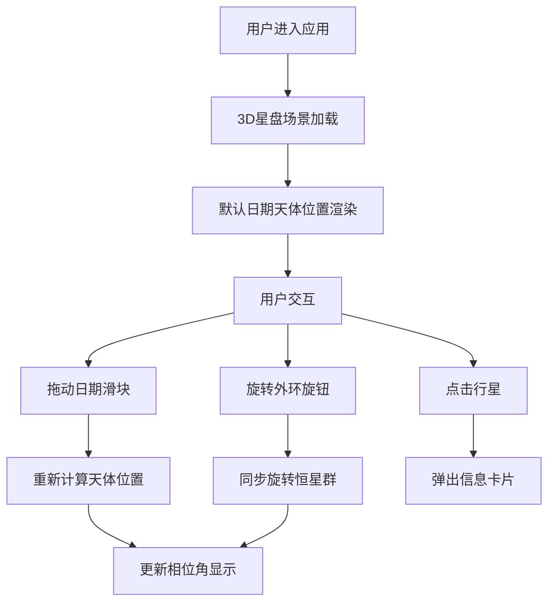

## 1. 产品概述

虚拟古代星盘仪天体运行与黄道十二宫轨迹交互可视化应用，让用户以中世纪占星家的视角，通过旋转星盘外环和调节日期滑块，沉浸式观察天体运行规律。

- 核心价值：将抽象的天文概念转化为直观的3D可视化体验，融合教育与美学
- 目标用户：天文爱好者、占星学研究者、历史文化爱好者、教育工作者

## 2. 核心特性

### 2.1 功能模块

1. **3D星盘主体**：黄铜质感古代星盘，含黄道十二宫、360度刻度、恒星群
2. **天体运行系统**：太阳、月亮及五颗古典行星的椭圆轨道运动与逆行效果
3. **交互控制面板**：日期滑块、外环旋转旋钮、相位角实时显示
4. **行星信息卡片**：点击行星展示宫位、相位角、视星等详细信息
5. **银河粒子背景**：深空渐变背景叠加动态银河粒子层

### 2.2 页面详情

| 页面名称 | 模块名称 | 功能描述 |
|---------|---------|---------|
| 主页面 | 3D星盘场景 | 中央悬浮黄铜星盘，黄道十二宫标志，360度刻度线 |
| 主页面 | 天体运行系统 | 7颗天体沿椭圆轨道运动，逆行时光螺旋线效果 |
| 主页面 | 恒星群 | 150颗随机恒星点阵，随外环同步旋转，闪烁动画 |
| 主页面 | 控制面板 | 日期滑块（前1000年-2000年）、旋转旋钮、相位显示 |
| 主页面 | 信息卡片 | 点击行星弹出羊皮纸风格信息卡 |
| 主页面 | 背景层 | 深空靛蓝到暮光紫渐变，银河粒子缓慢旋转 |

## 3. 核心流程

用户打开应用 → 看到中央悬浮的3D星盘与星空背景 → 拖动日期滑块观察天体位置变化 → 旋转外环调整星空视场 → 点击行星查看详细信息 → 通过控制面板实时观测相位角变化

## 4. 用户界面设计

### 4.1 设计风格

- **主色调**：深空靛蓝 `#0a0e27` → 暮光紫 `#2a1b4d` 渐变背景
- **强调色**：黄铜金色 `#d4a017`、深铜色 `#8b6508`、羊皮纸色 `#f5e6c8`
- **字体**：哥特体/衬线体用于标题，优雅的无衬线体用于正文
- **视觉风格**：中世纪天文手稿质感，暖色基调，黄铜与羊皮纸色对比
- **动效**：framer-motion 脉冲辉光、恒星闪烁、行星轨道光螺旋

### 4.2 页面设计概览

| 页面名称 | 模块名称 | UI元素 |
|---------|---------|-------|
| 主页面 | 星盘主体 | 450px直径黄铜外环，12个金色黄道宫SVG标志，罗马数字刻度 |
| 主页面 | 天体系统 | 高光材质行星球体，表面纹理条纹，椭圆轨迹线 |
| 主页面 | 控制面板 | 金色文字，深铜色滑块轨道，悬停发光反馈 |
| 主页面 | 信息卡片 | 半透明羊皮纸背景，哥特体标题，相位角颜色标识 |
| 主页面 | 背景 | 渐变+银河粒子层（1-3px粒子，透明度0.3，缓慢旋转） |

### 4.3 响应式设计

- 桌面端：星盘居中，控制面板位于右侧或底部
- 平板端：自适应缩放，控制面板可折叠
- 移动端（320px起）：柱状布局，控制面板折叠为底部浮动按钮
- 触摸优化：支持手指缩放和拖拽操作

### 4.4 3D场景指引

- **环境**：深空渐变背景 + 银河粒子层，营造宇宙深邃感
- **灯光**：环境光 + 方向光模拟太阳光，行星有高光反射
- **相机**：透视相机，支持轨道控制（OrbitControls），默认视角略俯视
- **构图**：星盘居中央，信息卡片从右侧滑入，控制面板居底或侧边
- **交互**：点击行星选中，拖拽旋转外环，滑块控制时间
- **后处理**：辉光效果（Bloom）、星盘边缘发光
- **性能**：总粒子数≤5000，维持60 FPS
