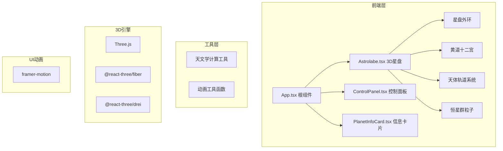

## 1. 架构设计



## 2. 技术描述

- **前端框架**：React 18 + TypeScript
- **构建工具**：Vite 5
- **3D引擎**：Three.js + @react-three/fiber + @react-three/drei
- **动画库**：framer-motion
- **状态管理**：React useState/useRef（轻量级，无需全局状态库）
- **工具库**：uuid、zod
- **样式方案**：CSS Modules / styled-components + 自定义CSS变量

## 3. 文件结构

```
src/
├── App.tsx              # 根组件，场景设置、灯光、轨道控件
├── components/
│   ├── Astrolabe.tsx    # 核心3D星盘组件
│   ├── ControlPanel.tsx # UI控制面板
│   └── PlanetInfoCard.tsx # 行星信息卡片
├── utils/
│   ├── astronomy.ts     # 天文学计算函数
│   └── constants.ts     # 常量定义
├── types/
│   └── index.ts         # TypeScript类型定义
└── assets/
    └── zodiac/          # 黄道十二宫SVG图标
```

## 4. 核心数据模型

### 4.1 行星数据

```typescript
interface Planet {
  id: string;
  name: string;
  nameCn: string;
  color: string;
  size: number;
  orbitRadius: number;
  orbitSpeed: number;
  eccentricity: number;
  retrogradePeriods: RetrogradePeriod[];
  apparentMagnitude: number;
}

interface RetrogradePeriod {
  startDate: Date;
  endDate: Date;
  intensity: number;
}
```

### 4.2 黄道十二宫

```typescript
interface ZodiacSign {
  id: string;
  name: string;
  nameCn: string;
  symbol: string;
  degree: number;
  element: 'fire' | 'earth' | 'air' | 'water';
}
```

### 4.3 相位角

```typescript
interface Aspect {
  type: 'conjunction' | 'opposition' | 'square' | 'trine' | 'sextile';
  angle: number;
  orb: number;
  color: string;
  name: string;
}
```

## 5. 性能优化策略

- 使用 Three.js Points 批量渲染恒星群
- 共享几何体和材质实例
- 限制粒子总数 ≤ 5000
- 使用 requestAnimationFrame 帧同步更新
- 组件 memo 化减少不必要重渲染
- 离屏计算天体位置，按需更新3D对象

## 6. 兼容性

- 浏览器：Chrome 90+、Firefox 88+、Safari 14+
- 移动端：iOS Safari 14+、Chrome Mobile 90+
- 最低 WebGL 2.0 支持
