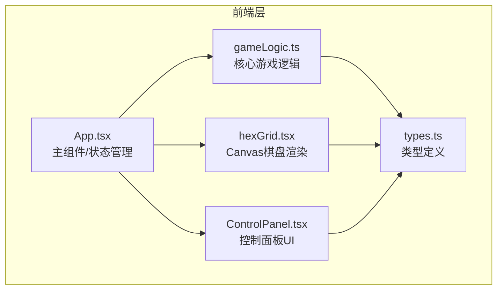

## 1. 架构设计



## 2. 技术说明

- 前端：React@18 + TypeScript + Vite@5
- 状态管理：Zustand
- 动画：framer-motion + Canvas 2D API
- 初始化工具：vite-init (react-ts模板)
- 后端：无
- 数据库：无（纯前端模拟）

## 3. 路由定义

| 路由 | 用途 |
|------|------|
| / | 主游戏页面，包含所有游戏交互 |

## 4. 核心算法设计

### 4.1 六边形网格坐标系统

- 使用axial坐标(q, r)表示100x80的六边形网格
- 每个六边形边长12px，pointy-top朝向
- 像素坐标转换：x = size * (√3 * q + √3/2 * r), y = size * (3/2 * r)

### 4.2 菌丝生长算法

- 每帧计算：遍历所有已覆盖细胞的前沿
- 扩散方向：6个邻居中阻力最小的方向优先
- 阻力 = 毒素浓度 + 1/营养值 + 已占用惩罚
- 速生型：spreadRate = 1.5x, energyCost = 1.5x
- 侵略型：inhibitionRadius = 2 cells, 争夺+20%
- 抗逆型：toxinImmune = true, 毒素区争夺+30%

### 4.3 信号扩散算法

- 二维扩散方程：C(t+1) = C(t) + D * ∇²C
- 扩散系数D = 0.1，每帧更新
- 孢子投放点信号源 = 100，自然衰减 -0.01/帧
- 毒素区域信号浓度调高

### 4.4 钙波传播

- 圆形波纹从感知点向外扩散
- 传播速度3-5细胞/秒
- 经过的细胞触发防御响应

## 5. 数据模型

### 5.1 核心数据结构

```typescript
interface HexCell {
  q: number;
  r: number;
  nutrition: number;       // 0-100
  toxinLevel: number;      // 0-100
  signalStrength: number;  // 0-100
  mycelium: Record<SporeType, number>; // 各类型菌丝浓度
  isBarrier: boolean;      // 抗逆型屏障
}

type SporeType = 'fast' | 'aggressive' | 'resistant';

interface CalciumWave {
  origin: { q: number; r: number };
  radius: number;
  maxRadius: number;
  speed: number;
  sporeType: SporeType;
}

interface GameState {
  grid: HexCell[][];
  timeRemaining: number;
  scores: Record<SporeType, number>;
  waves: CalciumWave[];
  viewMode: 'nutrition' | 'signal' | 'pressure';
  selectedSpore: SporeType | null;
  toxinLevel: number;
  droughtLevel: number;
  gameOver: boolean;
  winner: SporeType | null;
}
```

## 6. 文件结构

```
├── package.json
├── index.html
├── vite.config.ts
├── tsconfig.json
├── src/
│   ├── types.ts        # 类型定义与常量
│   ├── gameLogic.ts    # 核心游戏逻辑
│   ├── App.tsx         # 主组件
│   ├── hexGrid.tsx     # Canvas棋盘渲染
│   ├── ControlPanel.tsx # 控制面板
│   ├── store.ts        # Zustand状态管理
│   └── main.tsx        # 入口
```
