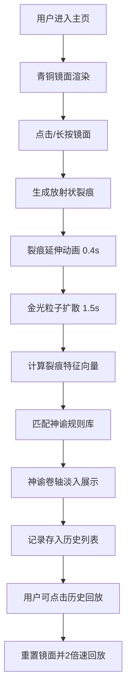

## 1. 产品概述

伊特鲁里亚青铜占卜镜面是一款沉浸式Web交互应用，让用户化身古罗马占卜官，通过点击青铜镜面生成独特的裂痕图案，系统基于裂痕特征自动匹配神谕规则库并生成带有兽形符号的解读卷轴。

- 核心价值：提供独特的文化体验与占卜乐趣，融合古罗马伊特鲁里亚文明的神秘美学
- 目标用户：对古代文明、神秘学、交互艺术感兴趣的用户
- 产品定位：高沉浸感的文化艺术交互体验Web应用

## 2. 核心特性

### 2.1 用户角色
无需注册，所有用户以访客身份直接使用全部功能。

### 2.2 功能模块
1. **占卜镜面**：青铜镜渲染、点击/长按触发裂痕生成、裂痕动画、金光粒子效果
2. **神谕解读**：裂痕特征计算、规则匹配、神谕卷轴展示、兽形符号SVG
3. **历史记录**：最近30条占卜记录存储、时间倒序展示、点击回放裂痕动画
4. **响应式布局**：桌面端侧边栏、移动端底部抽屉、自适应镜面尺寸

### 2.3 页面详情
| 页面名称 | 模块名称 | 功能描述 |
|---------|---------|---------|
| 主页 | 青铜镜面 | Canvas绘制青铜镜背景、希腊回纹装饰、噪点纹理、悬停旋转 |
| 主页 | 裂痕生成 | 放射状裂痕、分叉逻辑、延伸动画、金光粒子 |
| 主页 | 神谕卷轴 | 半透明羊皮纸卷轴、拉丁文神谕、中文释义、兽形符号 |
| 主页 | 历史面板 | 最近10条记录摘要、时间倒序、点击回放（2倍速） |
| 主页 | 残影过渡 | 碎片消散动画、新裂痕延迟生成 |

## 3. 核心流程

用户进入应用 → 查看青铜镜面 → 点击/长按镜面 → 裂痕放射状延伸动画 → 金光粒子扩散 → 计算裂痕特征 → 匹配神谕规则 → 卷轴淡入展示 → 记录存入历史 → 可点击历史回放

## 4. 用户界面设计

### 4.1 设计风格
- **主色调**：深棕黑色背景（#1a1410）、暗铜色（#b87333）、古铜绿（#4a7c59）、古铜色描边（#cd7f32）、淡金色（#d4af37）、暖黄烛光（#ffc107）、羊皮纸色（#f5e6c8）
- **按钮风格**：古铜色描边圆角矩形，悬停填充淡金色，0.2s亮度缓动
- **字体**：Cinzel Decorative（仿古标题字体）、系统衬线字体（正文）
- **布局风格**：居中镜面 + 右侧固定历史面板，深色学院风
- **装饰元素**：希腊回纹、兽形符号SVG（鹰、狼、蛇等）、烛光光晕

### 4.2 页面设计概述
| 页面名称 | 模块名称 | UI元素 |
|---------|---------|-------|
| 主页 | 青铜镜面 | 圆形450px、放射性渐变、希腊回纹边框、噪点纹理、烛光光晕悬浮 |
| 主页 | 裂痕效果 | 放射状6-12条、末端1-3次分叉、分叉角30-60°、金光粒子 |
| 主页 | 神谕卷轴 | 羊皮纸质感、不规则边缘、旧化褐斑、拉丁文+中文释义、兽形符号 |
| 主页 | 历史面板 | 右侧固定240px宽、时间倒序、10条摘要、可点击回放 |
| 主页 | 残影动画 | 多边形碎片、扩散旋转、0.6s消散 |

### 4.3 响应式设计
- **桌面端**（≥768px）：镜面450px，右侧240px历史面板，卷轴在镜面上方淡入
- **移动端**（<768px）：镜面300px，历史面板折叠为底部抽屉，卷轴全屏从底部滑入
- 触摸优化：长按触发（>800ms），增加点击热区

### 4.4 动画规范
- 裂痕延伸：0.4s匀速向外
- 金光粒子：1.5s扩散消失，约20个粒子
- 卷轴淡入：透明度渐变
- 碎片消散：0.6s向外扩散旋转
- 新裂痕延迟：0.3s（残影消散后）
- 回放射速：2倍速
- 装饰纹样旋转：悬停时0.02rad/frame顺时针
- 按钮悬停：0.2s亮度缓动
