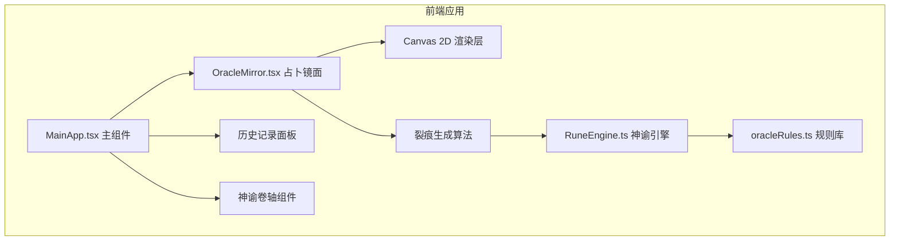

## 1. 架构设计



## 2. 技术栈说明

- **前端框架**：React 18 + TypeScript
- **构建工具**：Vite 5 + @vitejs/plugin-react
- **动画库**：framer-motion
- **UI渲染**：Canvas 2D（裂痕、镜面装饰、粒子效果）
- **工具库**：uuid（记录ID）、zod（数据校验）
- **字体**：Google Fonts - Cinzel Decorative

## 3. 文件结构

```
.
├── package.json
├── vite.config.js
├── tsconfig.json
├── index.html
└── src/
    ├── MainApp.tsx        # 主应用组件，状态管理，布局
    ├── OracleMirror.tsx   # 占卜镜面组件，Canvas渲染，交互
    ├── RuneEngine.ts      # 神谕解读引擎，特征匹配
    └── oracleRules.ts     # 神谕规则库，10+条规则
```

## 4. 核心数据模型

### 4.1 裂痕特征向量
```typescript
interface CrackFeatures {
  totalCracks: number;      // 裂痕总数
  totalBranches: number;    // 分叉次数总和
  intersectionCount: number; // 两两裂痕交点数
  maxLengthRatio: number;   // 最长裂痕长度占比(相对直径)
}
```

### 4.2 神谕规则
```typescript
interface OracleRule {
  id: string;
  name: string;             // 神谕名称
  latinText: string;        // 拉丁文神谕
  chineseText: string;      // 中文释义
  beastSymbol: string;      // 兽形符号类型
  features: Partial<CrackFeatures>; // 特征匹配条件
}
```

### 4.3 占卜记录
```typescript
interface DivinationRecord {
  id: string;
  timestamp: number;
  clickX: number;
  clickY: number;
  crackFeatures: CrackFeatures;
  matchedOracle: OracleRule;
  crackData: CrackData;     // 用于回放的裂痕数据
}
```

## 5. 核心算法

### 5.1 裂痕生成算法
- 以点击点为中心，随机生成6-12条主裂痕
- 每条裂痕长度：50-180px随机
- 末端分叉1-3次，分叉角度30-60°随机
- 每段裂痕由多段短线组成，带有随机扰动模拟真实裂痕

### 5.2 特征计算
- 裂痕总数：主裂痕 + 所有分叉
- 分叉次数总和：所有分叉点计数
- 交点数：线段相交检测算法
- 最长裂痕占比：最长路径长度 / 镜面直径

### 5.3 规则匹配
- 计算每条规则与当前特征的欧氏距离
- 选择距离最近的规则
- 特征值归一化处理

## 6. 性能优化

- Canvas使用requestAnimationFrame实现60fps动画
- 离屏Canvas预渲染镜面背景
- 粒子系统使用对象池复用
- 历史记录上限30条，超出自动清理
- 裂痕计算与规则匹配控制在100ms内
