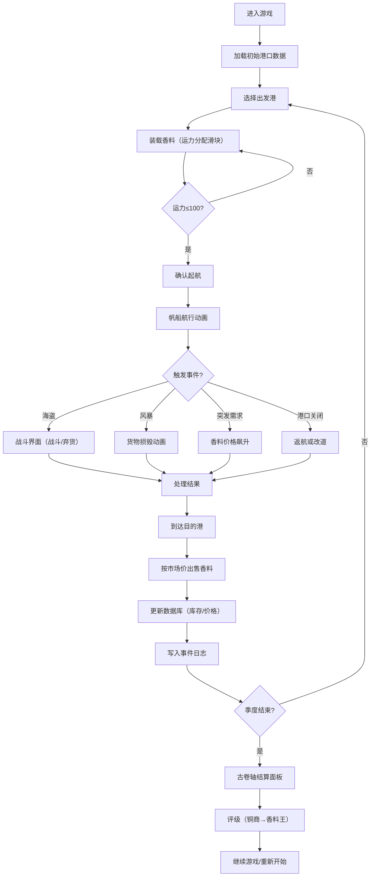

## 1. 产品概述
香料贸易商人模拟游戏 - 一款基于浏览器的中世纪海上贸易策略游戏。用户扮演威尼斯香料商人，通过规划贸易路线、管理船队运力、应对海盗与风暴等随机事件，并利用市场供需波动来最大化季度利润。

- **核心问题**：在不确定性（海盗、风暴、价格波动）中做出最优资源（运力、资金）分配决策
- **目标用户**：策略游戏爱好者、历史模拟游戏玩家
- **市场价值**：教育与娱乐兼具，模拟了古代海上丝绸之路的贸易生态

## 2. 核心功能

### 2.1 用户角色
| 角色 | 注册方式 | 核心权限 |
|------|---------|---------|
| 商人玩家 | 无需注册，直接进入游戏 | 完整游戏权限：贸易、航行、事件应对、查看市场数据 |

### 2.2 功能模块
1. **主地图视图**：Leaflet交互式航海地图，10个历史贸易港口标记，港口信息卡，航行动画
2. **贸易控制面板**：香料选择、运力分配滑块、起航确认
3. **事件系统**：海盗战斗、风暴损毁、港口关闭、突发需求事件
4. **市场价格系统**：实时供需价格计算、历史价格曲线图表
5. **事件日志**：按时间倒序的航行事件记录
6. **季度结算面板**：古卷轴风格利润汇总、评级系统

### 2.3 页面详情
| 页面名称 | 模块名称 | 功能描述 |
|---------|---------|---------|
| 主游戏页 | 地图区（2/3宽） | Leaflet航海地图，渐变海洋背景，金色锚点港口标记，帆船航行动画 |
| 主游戏页 | 控制面板（1/3宽） | 贸易面板：香料选择滑块、运力显示、起航按钮；价格图表：可切换商品折线图 |
| 主游戏页 | 事件日志面板 | 滚动日志区（max-height:60vh），按事件类型着色，时间倒序 |
| 事件弹窗 | 海盗战斗界面 | 半透明红色覆盖层，战斗/丢弃货物选择按钮，概率结果 |
| 事件弹窗 | 风暴/其他事件 | 货箱掉落动画，货物损毁数量显示 |
| 季度结算 | 古卷轴面板 | 纸张纹理背景，藤蔓装饰边框，航次/利润/成功率统计，铜商→香料王5级徽章 |

## 3. 核心流程
**主游戏流程**：用户选择出发港 → 装载3-5种香料（分配100运力）→ 确认起航 → 帆船沿航线移动（3-5秒动画）→ 航行中每10秒触发随机事件 → 到达目的港 → 按当前市场价格出售 → 更新港口库存/价格 → 记录日志 → 季度结算。

## 4. 用户界面设计

### 4.1 设计风格
- **主色调**：海洋渐变背景（地中海蓝#0277bd → 波斯湾绿#009688）
- **强调色**：金色锚点、铜色滑块按钮(#bcaaa4)、木纹滑块轨道(#8d6e63)
- **警告色**：海盗事件红(#b71c1c/#ffebee)
- **中性色**：卷轴纸色(#f5e6ca)、日志渐变背景(#e0f2f1→#fff3e0)
- **按钮风格**：圆角8px，悬停上浮（translateY(-2px) + 阴影增强）
- **字体**：Google Fonts - Cinzel（标题，古典衬线）+ Lora（正文，优雅衬线）
- **图标风格**：Font Awesome 航海/贸易主题图标 + SVG装饰元素

### 4.2 页面设计总览
| 页面名称 | 模块名称 | UI元素 |
|---------|---------|--------|
| 主游戏页 | 地图区 | 全屏渐变背景 + Leaflet瓦片层，10个金色SVG锚点，悬停信息卡（港口名/库存/治安），帆船SVG沿虚线路径动画 |
| 主游戏页 | 贸易面板 | 卡片式布局，香料列表（名称/基础价/质量/易腐度），木纹滑块，铜色按钮，剩余运力进度条 |
| 主游戏页 | 价格图表 | Chart.js折线图，X轴轮次/Y轴价格，商品颜色渐变(#ff6f00→#6a1b9a)，标签切换器 |
| 主游戏页 | 日志面板 | 滚动容器，时间倒序，事件类型图标，背景色渐变区分 |
| 事件弹窗 | 海盗战斗 | 半透明红色覆盖层，刀剑交叉SVG，概率条，双按钮选择 |
| 事件弹窗 | 风暴损毁 | 货箱掉落Framer Motion动画，数量徽章 |
| 季度结算 | 卷轴面板 | 纸张纹理背景，藤蔓SVG边框，分栏统计，5级徽章评级 |

### 4.3 响应式适配
- **桌面端（>768px）**：左右分栏布局，地图2/3 + 控制面板1/3
- **移动端（≤768px）**：地图全屏展示，控制面板以Bottom Sheet抽屉形式从底部滑出，可拖拽调整高度

### 4.4 性能目标
- 地图交互帧率：≥50fps
- 航行/事件动画：60fps
- 价格数据请求响应：<200ms
