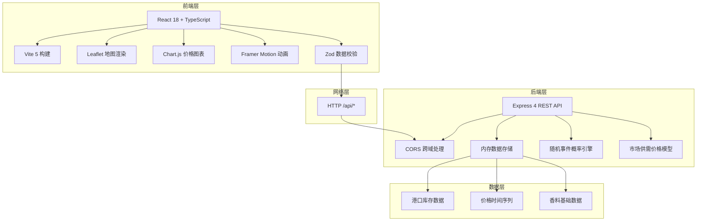
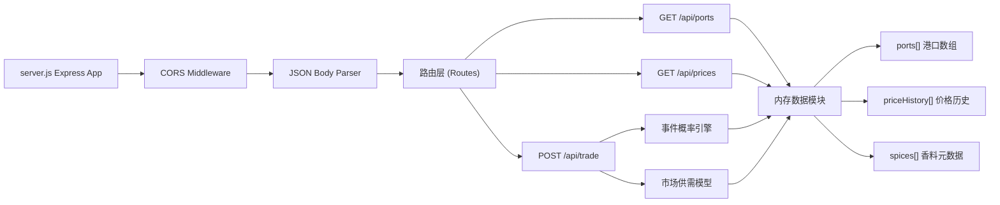
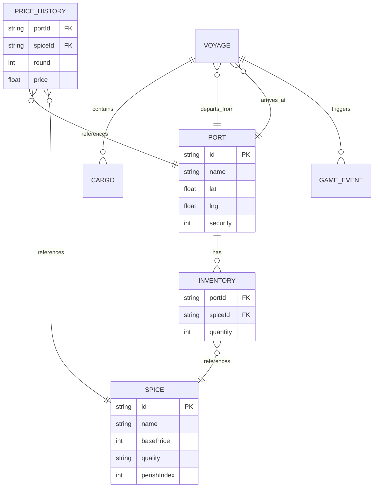

## 1. 架构设计



## 2. 技术说明
- **前端框架**：React 18 + TypeScript 5 + Vite 5
- **构建工具**：Vite 5（端口3000，Proxy /api → :4000）
- **UI路由**：React Router DOM 6（BrowserRouter）
- **地图库**：Leaflet + react-leaflet
- **图表库**：Chart.js + react-chartjs-2
- **动画库**：Framer Motion
- **数据校验**：Zod
- **状态管理**：自定义 Hook（useGameState + useReducer）
- **后端框架**：Express 4（端口4000）
- **跨域处理**：cors 中间件
- **ID生成**：uuid
- **数据存储**：内存数组模拟数据库（无需持久化）

## 3. 路由定义
| 路由 | 用途 |
|-----|------|
| / | 主游戏页面（地图+控制面板+日志） |
| /api/ports [GET] | 获取10个港口列表+初始库存+治安指数 |
| /api/trade [POST] | 提交贸易航次，后端触发随机事件，返回事件结果+更新后价格 |
| /api/prices [GET] | 获取所有港口各香料的历史价格时间序列 |

## 4. API 定义

```typescript
// ====== 基础数据类型 ======
interface Spice {
  id: string;              // 香料ID
  name: string;            // 名称：肉桂/胡椒/丁香/肉豆蔻/藏红花
  basePrice: number;       // 基础价格
  quality: 'A' | 'B' | 'C'; // 质量等级
  perishIndex: number;     // 易腐指数 1-10
  icon: string;            // emoji图标
}

interface Port {
  id: string;
  name: string;            // 港口名称：威尼斯/亚历山大/卡利卡特/马六甲...
  lat: number;             // 纬度
  lng: number;             // 经度
  security: number;        // 治安指数 0-100
  inventory: {             // 当前库存
    spiceId: string;
    quantity: number;
  }[];
}

interface CargoItem {
  spiceId: string;
  quantity: number;        // 装载数量（占运力单位）
  buyPrice: number;        // 买入单价
}

// ====== 请求/响应类型 ======
// GET /api/ports
type PortsResponse = Port[];

// POST /api/trade
interface TradeRequest {
  departurePortId: string;
  arrivalPortId: string;
  cargo: CargoItem[];      // 装载货物
  round: number;           // 当前轮次
}

type EventType = 'pirate' | 'storm' | 'port_closed' | 'demand_surge' | 'none';

interface TradeEvent {
  type: EventType;
  message: string;
  cargoLost?: { spiceId: string; quantity: number }[];  // 风暴/海盗损失
  priceMultipliers?: { spiceId: string; multiplier: number }[];  // 突发需求
  battleResult?: { won: boolean; lostCargo: CargoItem[] };  // 海盗战斗
  portClosed?: boolean;    // 港口关闭
}

interface TradeResponse {
  success: boolean;
  arrivalPortId: string;
  events: TradeEvent[];    // 航程中触发的事件
  finalCargo: CargoItem[]; // 最终抵达时剩余货物
  sellPrices: { spiceId: string; price: number }[];  // 目的地售价
  totalRevenue: number;
  totalProfit: number;
  updatedPorts: Port[];    // 更新后港口数据
  currentRound: number;
}

// GET /api/prices
interface PriceHistory {
  spiceId: string;
  portId: string;
  prices: { round: number; price: number }[];
}
type PricesResponse = PriceHistory[];
```

## 5. 后端服务架构



**模块职责**：
- **事件概率引擎**：按概率分布（海盗25%、风暴25%、突发需求15%、港口关闭5%、无事30%）生成事件
- **市场供需模型**：价格 = 基础价 × (1 + (供应量-需求量)/基准量) × 质量系数，每轮波动±15%
- **内存数据模块**：管理港口库存、香料基础数据、历史价格

## 6. 数据模型

### 6.1 实体关系图



### 6.2 初始数据（内存初始化）

```javascript
// 10个历史贸易港口坐标
const INITIAL_PORTS = [
  { id: 'venice', name: '威尼斯', lat: 45.4408, lng: 12.3155, security: 85 },
  { id: 'alexandria', name: '亚历山大', lat: 31.2001, lng: 29.9187, security: 70 },
  { id: 'aden', name: '亚丁', lat: 12.7851, lng: 45.0360, security: 50 },
  { id: 'muscat', name: '马斯喀特', lat: 23.5880, lng: 58.3829, security: 55 },
  { id: 'hormuz', name: '霍尔木兹', lat: 27.1467, lng: 56.8330, security: 60 },
  { id: 'calicut', name: '卡利卡特', lat: 11.2588, lng: 75.7804, security: 65 },
  { id: 'cochin', name: '科钦', lat: 9.9312, lng: 76.2673, security: 68 },
  { id: 'malacca', name: '马六甲', lat: 2.1896, lng: 102.2501, security: 72 },
  { id: 'zanzibar', name: '桑给巴尔', lat: -6.1630, lng: 39.2026, security: 45 },
  { id: 'constantinople', name: '君士坦丁堡', lat: 41.0082, lng: 28.9784, security: 75 }
];

// 5种基础香料
const SPICES = [
  { id: 'cinnamon', name: '肉桂', basePrice: 50, quality: 'A', perishIndex: 3, icon: '🌿' },
  { id: 'pepper', name: '胡椒', basePrice: 30, quality: 'B', perishIndex: 2, icon: '🌶️' },
  { id: 'cloves', name: '丁香', basePrice: 80, quality: 'A', perishIndex: 4, icon: '🌸' },
  { id: 'nutmeg', name: '肉豆蔻', basePrice: 70, quality: 'B', perishIndex: 5, icon: '🥜' },
  { id: 'saffron', name: '藏红花', basePrice: 150, quality: 'A', perishIndex: 6, icon: '🌼' }
];
```
