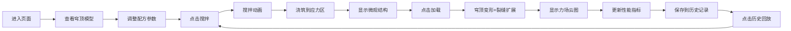

## 1. 产品概述

虚拟古罗马混凝土配方反演与建筑结构力场可视化交互系统，让用户以古罗马工程师的身份探索罗马混凝土配方与建筑结构力学。

- **主要目的**：通过交互式3D可视化，让用户理解罗马混凝土配方参数与结构力学性能的关系
- **解决的问题**：传统材料力学教学缺乏直观的可视化交互手段
- **目标用户**：建筑学学生、材料科学爱好者、历史建筑研究者
- **产品价值**：将复杂的材料科学和结构力学知识转化为沉浸式交互体验

## 2. 核心功能

### 2.1 用户角色
| 角色 | 注册方式 | 核心权限 |
|------|----------|----------|
| 访客用户 | 无需注册 | 完整使用所有交互功能，查看配方历史 |

### 2.2 功能模块
1. **3D穹顶场景**：万神庙穹顶剖面模型，四层混凝土填充层，可旋转缩放
2. **配方控制面板**：火山灰比例、粗骨料直径、水灰比三个参数滑块
3. **搅拌动画系统**：Canvas 2D绘制的搅拌罐颗粒碰撞动画
4. **微观结构视窗**：混凝土试样微观晶相可视化
5. **结构力学模拟**：静力荷载下穹顶变形、裂缝扩展、力场云图
6. **性能指标面板**：实时显示抗压强度、弹性模量、孔隙率等参数
7. **配方历史记录**：竖向时间轴记录最近6次配方，支持回放

### 2.3 页面详情
| 页面名称 | 模块名称 | 功能描述 |
|-----------|-------------|---------------------|
| 主页面 | 3D穹顶场景 | Three.js渲染的万神庙穹顶剖面，OrbitControls交互，四分之一透明剖面 |
| 主页面 | 右侧控制面板 | 三个滑块（火山灰10%-60%、骨料3-20mm、水灰比0.3-0.6）、搅拌/加载按钮 |
| 主页面 | 左侧性能面板 | 实时显示抗压强度、弹性模量、孔隙率、裂缝长度、脆性指数 |
| 主页面 | 底部历史栏 | 竖向时间轴，最近6次配方记录，点击回放 |
| 主页面 | 微观视窗 | 500x300px浮动窗口，显示骨料颗粒、基质、微裂缝 |
| 主页面 | 裂缝叠加层 | Canvas 2D绘制裂缝路径和力场云图，随视角同步更新 |

## 3. 核心流程

用户进入页面 → 查看默认穹顶模型 → 调整配方参数 → 点击搅拌按钮 → 观看搅拌动画 → 试样浇筑到应力集中区 → 查看微观结构 → 点击加载按钮 → 观看穹顶变形和裂缝扩展 → 查看性能指标 → 配方自动保存到历史记录 → 可点击历史记录回放

## 4. 用户界面设计

### 4.1 设计风格
- **主色调**：石灰白(#f5f5dc)、陶土红(#d84315)、古铜金(#bf9b50)、火山灰灰(#5d4037)
- **背景**：从石灰白到火山灰灰的全屏散射渐变
- **按钮风格**：圆角矩形 + 雕刻边框（box-shadow内阴影），点击0.15秒scale抖动
- **滑块**：古铜金渐变填充轨道，拖拽时圆形气泡显示数值
- **字体**：Cinzel（古典罗马风格标题）、Crimson Pro（正文）
- **整体风格**：古罗马工程美学，庄重典雅，带有历史厚重感

### 4.2 页面设计概述
| 页面名称 | 模块名称 | UI元素 |
|-----------|-------------|-------------|
| 主页面 | 3D场景 | 渐变背景、穹顶径向渐变（基座橙黄#e65100到采光眼天蓝#64b5f6）、表面粗粝质感扰动 |
| 主页面 | 控制面板 | 雕刻边框卡片、古铜金滑块、陶土红按钮、雕刻效果文字 |
| 主页面 | 性能面板 | 石灰白底卡片、古铜金分隔线、数值动态变化动画 |
| 主页面 | 历史记录 | 竖向时间轴、古铜金节点、悬停放大效果 |
| 主页面 | 微观视窗 | 雕刻边框浮动窗口、可拖动、半透明背景 |
| 主页面 | 金色粒子 | 抗压强度>40MPa时触发，2秒闪烁效果 |

### 4.3 响应性
- **桌面优先**：针对大屏幕优化，1920px以上最佳体验
- **响应式**：在1280px-1920px自动调整布局
- **触控支持**：OrbitControls支持触控旋转缩放

### 4.4 3D场景指导
- **环境**：渐变散射背景，柔和环境光 + 方向光模拟日光
- **光照**：两盏方向光（主光暖白色、补光冷白色），半球光模拟环境反射
- **相机**：PerspectiveCamera，初始位置(15, 10, 15)，目标原点
- **交互**：OrbitControls，阻尼系数0.05，最小距离8，最大距离30
- **穹顶模型**：半径10单位，厚度0.3单位，四分之一剖面，四层填充层各0.08单位
- **动画**：顶部下沉最大0.5单位的逐帧插值变形
- **性能**：60fps旋转延迟<30ms，微观视窗和裂缝层30fps刷新
