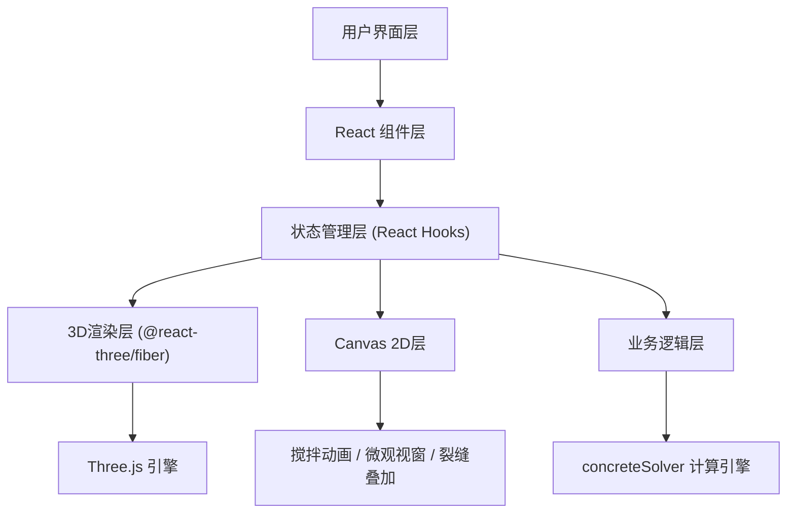

## 1. 架构设计



## 2. 技术描述

- **前端框架**：React 18 + TypeScript 5
- **构建工具**：Vite 5
- **3D渲染**：Three.js + @react-three/fiber + @react-three/drei
- **UI动效**：framer-motion
- **类型校验**：zod
- **ID生成**：uuid
- **状态管理**：React useState/useRef/useCallback (轻量级场景无需状态管理库)

## 3. 文件结构定义

| 文件路径 | 用途 |
|----------|------|
| `/package.json` | 项目依赖和脚本配置 |
| `/index.html` | 入口HTML页面 |
| `/vite.config.js` | Vite构建配置 |
| `/tsconfig.json` | TypeScript配置 |
| `/src/types.ts` | 所有TypeScript类型接口定义 |
| `/src/App.tsx` | 主应用组件，状态管理和UI布局 |
| `/src/components/Scene.tsx` | Three.js 3D场景组件 |
| `/src/components/Panel.tsx` | 左侧控制面板组件 |
| `/src/components/HistoryBar.tsx` | 底部历史记录栏 |
| `/src/utils/concreteSolver.ts` | 混凝土性能计算纯函数 |
| `/src/styles.css` | 全局样式和罗马风格主题 |

## 4. 数据模型

### 4.1 核心类型定义

```typescript
// 配方参数
interface MixFormula {
  id: string;
  volcanicAshRatio: number;      // 火山灰比例 10-60%
  aggregateDiameter: number;     // 粗骨料直径 3-20mm
  waterCementRatio: number;      // 水灰比 0.3-0.6
  timestamp: number;
}

// 测试结果
interface TestResult {
  formulaId: string;
  compressiveStrength: number;   // 抗压强度 MPa
  elasticModulus: number;        // 弹性模量 GPa
  porosity: number;              // 孔隙率 %
  crackTotalLength: number;      // 裂缝总长度 px
  brittlenessIndex: number;      // 脆性指数 0-1
}

// 裂缝数据
interface CrackPoint {
  x: number;
  y: number;
}

interface CrackBranch {
  id: string;
  points: CrackPoint[];
  width: number;
}

interface CrackData {
  branches: CrackBranch[];
  totalLength: number;
}

// 力场数据
interface ForceFieldPoint {
  x: number;
  y: number;
  stress: number;                // -1 压缩(蓝) 到 +1 拉伸(红)
}

interface ForceField {
  points: ForceFieldPoint[];
  gradient: string[];            // 颜色渐变数组
}

// 微观结构颗粒
interface MicroParticle {
  x: number;
  y: number;
  diameter: number;
  color: string;
  rotation: number;
}

interface MicroCrack {
  x1: number;
  y1: number;
  x2: number;
  y2: number;
  width: number;
}

interface MicroStructure {
  particles: MicroParticle[];
  cracks: MicroCrack[];
  matrixColor: string;
}

// 搅拌颗粒
interface MixingParticle {
  x: number;
  y: number;
  vx: number;
  vy: number;
  radius: number;
  color: string;
}

// 历史记录条目
interface HistoryEntry {
  id: string;
  formula: MixFormula;
  result: TestResult;
  timestamp: number;
}

// 应用状态
interface AppState {
  currentFormula: MixFormula;
  currentResult: TestResult | null;
  isMixing: boolean;
  isLoading: boolean;
  showMicroscope: boolean;
  showCracks: boolean;
  domeDeformation: number;
  history: HistoryEntry[];
  playingHistoryId: string | null;
}
```

## 5. 核心算法

### 5.1 混凝土性能计算 (concreteSolver.ts)

```
抗压强度 = 基础强度 × 火山灰优化因子 × 骨料级配因子 × 水灰比因子
  - 基础强度: 25 MPa
  - 火山灰优化因子: 1 + 0.6 × sin(π × (火山灰比例-35)/50)  [35%左右最优]
  - 骨料级配因子: 1 - 0.15 × |骨料直径-10|/10  [10mm左右最优]
  - 水灰比因子: 1.5 - 1.5 × 水灰比  [水灰比越低强度越高]

弹性模量 = 20 + 0.5 × 抗压强度

孔隙率 = 5 + 15 × 水灰比 - 3 × (火山灰比例/60)

脆性指数 = 0.3 + 0.5 × (1 - 水灰比) + 0.2 × (骨料直径/20)

裂缝总长度 = 基础长度 × (1 - 抗拉强度/最大抗拉强度)
  - 基础长度: 500 px
  - 抗拉强度 = 抗压强度 × 0.1 × (1 - 脆性指数)
```

### 5.2 裂缝生成算法

1. 从加载点（穹顶顶部中心）开始
2. 生成3-5条主裂缝，沿径向向外延伸
3. 每条主裂缝随机分叉1-3次，分叉角度±30°
4. 裂缝长度与抗拉强度成反比
5. 裂缝宽度随机1-3px

### 5.3 力场云图算法

1. 穹顶表面网格点计算应力值
2. 顶部受压区（应力负，蓝色）
3. 底部受拉区（应力正，红色）
4. 线性插值生成渐变色
5. 使用Canvas 2D绘制半透明色点

## 6. 性能优化

- **3D场景**：使用BufferGeometry，禁用不必要的阴影
- **Canvas动画**：requestAnimationFrame，分层渲染（搅拌/微观/裂缝各独立canvas）
- **帧率控制**：3D场景60fps，Canvas叠加层30fps
- **内存管理**：及时清理动画帧ID，避免内存泄漏
- **几何体复用**：穹顶几何体使用instancedMesh或共享geometry
