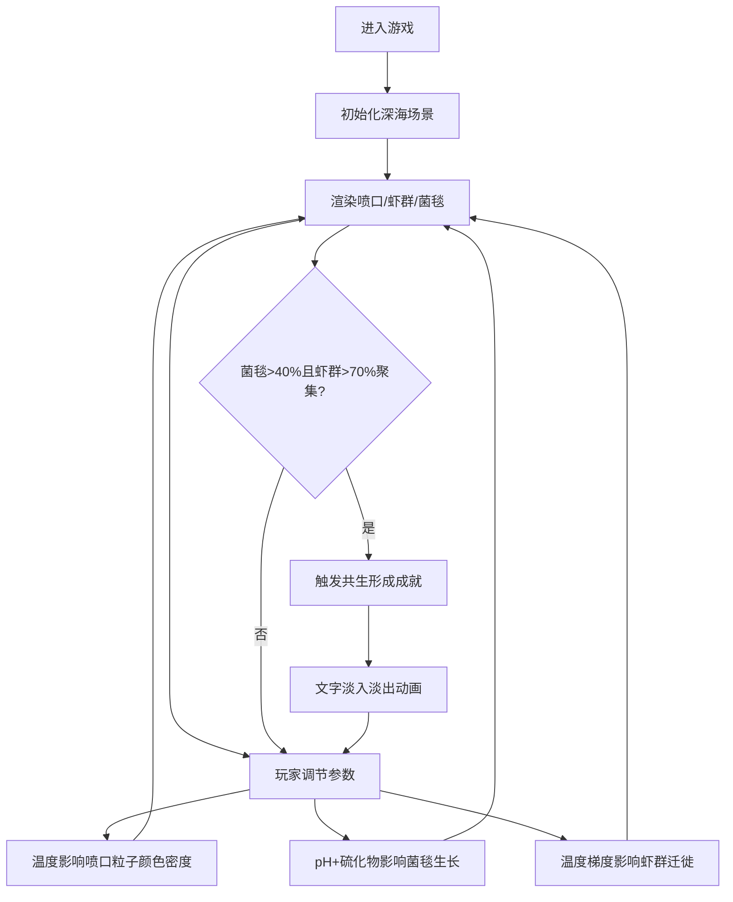

## 1. 产品概述

深海热液喷口盲虾迁徙与共生菌群培养模拟游戏。玩家扮演深海生物学家，通过调节热液喷口的环境参数（温度、pH值、硫化物浓度），观察盲虾在极端环境中的迁徙行为，并引导其在喷口附近形成共生菌毯，探索深海生态系统的奥秘。

- 核心玩法：环境调节 + 生物观察 + 生态系统培养
- 目标用户：对深海生物、生态模拟感兴趣的科普教育玩家
- 市场价值：寓教于乐，科普深海热液喷口生态系统知识

## 2. 核心功能

### 2.1 用户角色
| 角色 | 注册方式 | 核心权限 |
|------|---------|---------|
| 深海生物学家 | 无需注册，直接进入 | 调节环境参数、观察生物行为、触发成就 |

### 2.2 功能模块
1. **主模拟界面**：Canvas 2D 绘制深海场景，包含热液喷口、盲虾群、菌毯热力图、背景粒子
2. **控制面板**：温度、pH值、硫化物浓度三个参数滑块，实时调节环境
3. **信息提示系统**：鼠标悬停盲虾时显示能量值和温度
4. **成就系统**：共生形成成就触发及文字动画
5. **响应式布局**：桌面端右侧面板 + 移动端底部导航栏

### 2.3 页面详情
| 页面名称 | 模块名称 | 功能描述 |
|---------|---------|---------|
| 主游戏页 | 深海场景渲染 | Canvas 2D 绘制喷口、虾群、菌毯、背景粒子，60fps流畅动画 |
| 主游戏页 | 控制面板 | 三个滑块调节温度(0-100)、pH(5-9)、硫化物(0-10)，毛玻璃效果 |
| 主游戏页 | 信息提示框 | 鼠标悬停盲虾时显示能量值和所在网格温度，半透明跟随鼠标 |
| 主游戏页 | 成就提示 | 菌毯覆盖>40%且虾群聚集>70%时触发"共生形成"文字淡入淡出动画 |
| 主游戏页 | 响应式适配 | 宽度<768px时面板折叠为底部导航，滑块变数字输入框 |

## 3. 核心流程

玩家进入游戏后，首先看到深海场景和初始状态的喷口、虾群、菌毯。通过右侧控制面板调节温度、pH值和硫化物浓度，观察虾群根据温度梯度进行迁徙，菌毯在合适条件下生长。当菌毯覆盖面积超过喷口周围40%且盲虾聚集比例超过70%时，触发"共生形成"成就，显示庆祝动画。玩家可继续微调参数探索不同生态状态。

## 4. 用户界面设计

### 4.1 设计风格
- **主色调**：深海蓝黑渐变（#0a0f1c → #1a3a5c），营造深海压抑神秘感
- **强调色**：喷口粒子（蓝#5dade2 → 红#e74c3c渐变）、菌毯暖黄（#ffb347 → #ff8c00）、盲虾浅灰（#dcdcdc）
- **字体**：Google Fonts - Orbitron（科技感标题）+ Nunito（正文）
- **控件风格**：毛玻璃面板（backdrop-filter: blur(8px)）、圆角滑块、颜色过渡条
- **动画风格**：framer-motion 驱动面板过渡、成就文字淡入淡出、滑块过渡

### 4.2 页面设计概览
| 页面名称 | 模块名称 | UI元素 |
|---------|---------|--------|
| 主游戏页 | 深海场景 | 蓝黑径向渐变背景、微妙粒子流动(≤100个,60fps)、居中偏下喷口 |
| 主游戏页 | 热液喷口 | 岩石轮廓+动态粒子烟雾，温度影响颜色密度 |
| 主游戏页 | 盲虾群 | 40-60只半透明浅灰虾，8-12px随机大小，闪烁眼睛小亮点 |
| 主游戏页 | 菌毯层 | 喷口半径80px内暖黄透明度渐变热力图 |
| 主游戏页 | 控制面板（桌面） | 右侧固定，毛玻璃半透明，三个滑块带颜色渐变条 |
| 主游戏页 | 控制面板（移动） | 底部导航栏，数字输入框替代滑块 |
| 主游戏页 | 悬停提示 | 跟随鼠标半透明框，显示能量值和温度 |
| 主游戏页 | 成就提示 | 屏幕中央淡入淡出文字动画 |

### 4.3 响应式设计
- **桌面优先（≥768px）**：Canvas占满屏幕，控制面板固定右侧（宽度280px），毛玻璃效果
- **平板/移动端（<768px）**：控制面板折叠为底部导航栏（高度auto），滑块改为数字输入框以节省空间
- **触摸优化**：移动端按钮和输入框增大点击区域，最小44x44px

### 4.4 性能优化
- 更新循环帧率稳定55-60fps，使用requestAnimationFrame
- 盲虾数量>80时自动降低绘制精度（虾身简化为更少顶点）
- Canvas分层渲染（背景层/喷口层/菌毯层/虾群层）减少重绘开销
