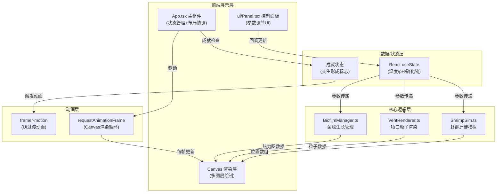

## 1. 架构设计



## 2. 技术栈说明

- **前端框架**: React 18 + TypeScript 5
- **构建工具**: Vite 5 + @vitejs/plugin-react
- **UI动画**: framer-motion 11
- **Canvas渲染**: 原生 Canvas 2D API（多层canvas）
- **辅助工具**: uuid（唯一ID生成）、zod（运行时类型校验）
- **样式方案**: 内联CSS + framer-motion动画，毛玻璃效果使用CSS backdrop-filter
- **初始化方式**: npm init vite-init@latest（react-ts模板）

## 3. 目录结构

```
auto297/
├── .trae/documents/
│   ├── PRD.md          # 产品需求文档
│   └── TECH.md         # 技术架构文档
├── index.html          # 入口HTML（加载Google Fonts）
├── package.json        # 依赖与脚本
├── vite.config.js      # Vite配置（React插件）
├── tsconfig.json       # TypeScript配置（严格模式+ESNext）
└── src/
    ├── App.tsx         # 主组件：状态管理、布局、渲染循环
    ├── ShrimpSim.ts    # 虾群迁徙逻辑类
    ├── VentRenderer.ts # 喷口渲染模块（粒子系统）
    ├── BiofilmManager.ts # 菌毯生长管理器
    └── ui/
        └── Panel.tsx   # 控制面板组件
```

## 4. 核心模块数据结构

### 4.1 盲虾数据结构 (ShrimpSim)
```typescript
interface Shrimp {
  id: string;           // uuid
  x: number;            // 位置X
  y: number;            // 位置Y
  vx: number;           // 速度X分量
  vy: number;           // 速度Y分量
  angle: number;        // 朝向角度(弧度)
  energy: number;       // 能量值 0-100
  size: number;         // 大小 8-12px随机
  eyePhase: number;     // 眼睛闪烁相位
}

interface ShrimpSimOptions {
  count: number;        // 40-60只
  canvasWidth: number;
  canvasHeight: number;
  ventX: number;
  ventY: number;
}
```

### 4.2 喷口粒子数据结构 (VentRenderer)
```typescript
interface VentParticle {
  x: number;
  y: number;
  vx: number;
  vy: number;
  life: number;         // 剩余生命值
  maxLife: number;
  size: number;
  color: string;        // 蓝-红插值
}

interface VentState {
  temperature: number;  // 0-100
  particleDensity: number; // 0.2-0.8
}
```

### 4.3 菌毯数据结构 (BiofilmManager)
```typescript
interface BiofilmCell {
  density: number;      // 0-1 菌群密度
}

interface BiofilmState {
  gridSize: number;     // 网格单元大小(px)
  radius: number;       // 生长半径 80px
  centerX: number;
  centerY: number;
  ph: number;           // 5-9
  sulfide: number;      // 0-10
  temperature: number;  // 0-100
}
```

### 4.4 游戏状态 (App.tsx)
```typescript
interface GameState {
  temperature: number;  // 0-100, 默认50
  ph: number;           // 5-9, 默认7
  sulfide: number;      // 0-10, 默认5
  achievementShown: boolean; // 共生形成成就是否已触发
}
```

## 5. 核心算法

### 5.1 温度梯度计算（虾群方向引导）
```
喷口温度分布: T(x,y) = T_vent * exp(-dist^2 / (2 * sigma^2))
sigma = 120px (温度扩散范围)
虾群感知方向: 对周围8方向采样温度，选择梯度上升方向（需30-50度区间）
```

### 5.2 菌毯生长速率
```
生长条件: 6 ≤ pH ≤ 8
基础速率: base_rate = 0.05
硫化物加成: rate += sulfide * 0.3  (每增加1浓度提升0.3单位/秒)
实际速率: growth_rate = base_rate * (pH适宜 ? 1 : 0)
单元更新: density_new = min(1, density_old + growth_rate * dt)
```

### 5.3 盲虾行为状态机
```
能量 < 20 (饥饿): 目标温度30-50度区域，速度*1.5，寻路+梯度上升
20 ≤ 能量 ≤ 70 (正常): 漫游+趋向适宜温度区，正常速度
能量 > 70 (饱腹): 纯随机漫游，正常速度
能量恢复: 在菌毯区(density>0.5)且温度30-50时 +5/秒
能量消耗: 每秒 -0.5 (基础)，高速移动时 -1.0/秒
```

### 5.4 成就判定
```
菌毯覆盖比例: count(density>0.5的单元) / total_cells_in_radius > 40%
虾群聚集比例: count(距喷口<80px的虾) / total_shrimp > 70%
两条件同时满足 → 触发"共生形成"成就
```

### 5.5 喷口粒子颜色插值
```
t = (temperature - 30) / (70 - 30), clamp to [0,1]
R = lerp(93, 231, t)  (#5dade2 → #e74c3c)
G = lerp(173, 76, t)
B = lerp(226, 60, t)
density = lerp(0.2, 0.8, t)
```

### 5.6 性能降级策略
```
shrimpCount > 80 时:
  - 虾身绘制: 椭圆 → 圆形（减少path顶点）
  - 眼睛: 每3帧更新一次（而非每帧）
  - 轨迹: 不绘制附加阴影
```

## 6. 渲染循环架构

```typescript
// App.tsx 主循环
useEffect(() => {
  let rafId: number;
  let lastTime = performance.now();
  
  const loop = (now: number) => {
    const dt = Math.min(0.05, (now - lastTime) / 1000); // 限帧防止跳变
    lastTime = now;
    
    // 1. 逻辑更新 (约16ms预算)
    shrimpSim.update(dt, { temperature, ph });
    ventRenderer.update(dt, temperature);
    biofilmManager.update(dt, { temperature, ph, sulfide });
    
    // 2. 成就检查
    checkAchievement();
    
    // 3. Canvas渲染
    renderBackground();
    ventRenderer.render(ctx);
    biofilmManager.render(ctx);
    shrimpSim.render(ctx, shrimpCount > 80);
    renderHoverTooltip();
    
    rafId = requestAnimationFrame(loop);
  };
  
  rafId = requestAnimationFrame(loop);
  return () => cancelAnimationFrame(rafId);
}, [temperature, ph, sulfide, achievementShown]);
```
