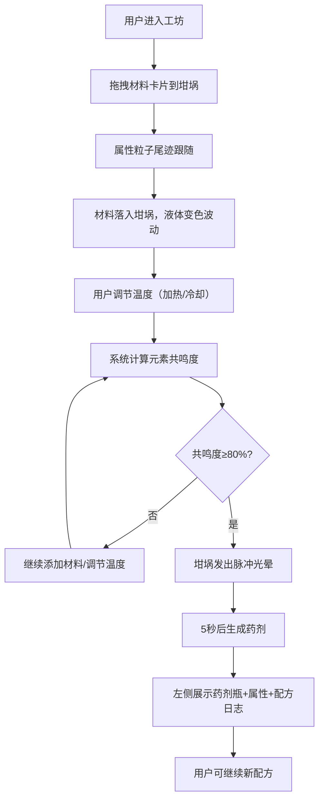

## 1. 产品概述

虚拟中世纪炼金工坊是一款沉浸式Web应用，用户扮演炼金术士在昏暗石墙与烛火摇曳的实验室中，通过混合火、水、土、气四种属性的基础材料，配合加热/冷却操作触发元素共鸣，最终合成带有魔法纹路的药剂并记录分享配方。

- **目标用户**：对炼金术、魔法元素合成感兴趣的休闲玩家和DIY爱好者
- **核心价值**：提供沉浸式炼金体验，可视化展示元素反应过程，支持配方记录与分享

## 2. 核心功能

### 2.1 用户角色
| 角色 | 注册方式 | 核心权限 |
|------|----------|----------|
| 炼金术士（用户）| 无需注册，直接访问 | 材料拖拽、温度控制、药剂合成、查看配方日志 |

### 2.2 功能模块
1. **工坊主场景**：石墙渐变背景、三脚坩埚、悬浮元素符号
2. **材料台系统**：6种基础材料卡片、SVG属性图标、拖拽交互
3. **坩埚操作系统**：Canvas实时液体渲染、波动动画、气泡/冰晶特效
4. **温度控制系统**：加热/冷却按钮、0-100°C温度条可视化
5. **元素共鸣系统**：六边形共鸣雷达图、共鸣度计算、脉冲光晕特效
6. **药剂生成系统**：属性合成、魔法药剂命名、细颈玻璃瓶Canvas渲染
7. **配方日志系统**：时间戳记录、配方回溯、左侧输出区展示

### 2.3 页面详情
| 页面名称 | 模块名称 | 功能描述 |
|----------|----------|----------|
| 炼金工坊主页面 | 背景场景 | 昏暗石墙灰(#2c2c2c)到烛火暖黄(#f5deb3)全屏径向渐变背景 |
| 炼金工坊主页面 | 三脚坩埚 | Canvas绘制青铜质感坩埚(直径180px)，内部液体sin波实时波动，颜色随材料和温度变化 |
| 炼金工坊主页面 | 悬浮元素符号 | 坩埚上方四种属性符号(火:红三角、水:蓝水滴、土:绿方块、气:白旋涡)，每30秒顺时针旋转排列 |
| 炼金工坊主页面 | 材料台 | 坩埚下方展示6种材料卡片，深色木质边框包裹，SVG属性图标(火焰纹/波浪线)，支持拖拽到坩埚 |
| 炼金工坊主页面 | 拖拽粒子系统 | 拖拽时生成属性粒子尾迹(火:橙红微粒、水:淡蓝光点、土:褐色尘雾、气:白色弧线)，到达坩埚后消散 |
| 炼金工坊主页面 | 温度控制区 | 右侧温度条(0-100°C)实时显示；加热按钮触发沸腾气泡(3-8px直径，橙红到透明渐变上升)；冷却按钮触发六边形冰晶(2-5px边长，旋转下沉) |
| 炼金工坊主页面 | 共鸣雷达图 | 坩埚上方六边形共鸣图，六顶点对应元素，线条粗细和饱和度表示浓度，共鸣度>80%触发脉冲光晕(周期1.2秒)，5秒后生成药剂 |
| 炼金工坊主页面 | 药剂输出区 | 左侧展示Canvas绘制的细颈玻璃瓶(高60px)，显示药剂名称、属性和配方日志(格式：YYYY-MM-DD HH:mm:ss 配方: 材料x数量) |

## 3. 核心流程

用户打开应用 → 沉浸于昏暗工坊场景 → 从材料台拖拽材料卡片到坩埚（伴随属性粒子尾迹）→ 材料落入坩埚液体变色并产生波动 → 根据需要点击加热/冷却按钮调节温度 → 系统实时计算元素共鸣度并更新六边形雷达图 → 共鸣度≥80%时坩埚发出脉冲光晕 → 5秒后合成成功，左侧输出区生成魔法药剂和配方记录 → 用户可继续添加材料尝试新配方

## 4. 用户界面设计

### 4.1 设计风格
- **主色调**：昏暗深灰#2c2c2c（背景）、木质棕#5d4037（边框/面板）、金属铜#8d6e63（坩埚）、烛光辉#ffd54f（点缀）、渐变过渡#f5deb3（顶部暖光）
- **辅助色**：火属性红#e53935、水属性蓝#1e88e5、土属性绿#43a047、气属性白#eceff1
- **按钮风格**：深木质底+金属质感边框，hover时微亮+轻微上浮，active时凹陷，圆角6px，0.3s过渡
- **字体**：标题使用哥特/中世纪风格衬线字体（如Cinzel或UnifrakturCook），正文使用清晰衬线体（如Crimson Pro），中文使用楷体或宋体营造复古感
- **布局风格**：左右分栏+中央聚焦式布局，中央坩埚为视觉核心，左侧药剂输出区，右侧温度控制，底部材料台
- **手绘复古风**：所有边框带轻微毛边纹理，按钮有木纹质感，图标带不规则手绘线条，整体做旧滤镜感

### 4.2 页面设计概览
| 页面名称 | 模块名称 | UI元素 |
|----------|----------|--------|
| 炼金工坊 | 背景层 | 径向渐变(中心#f5deb3→边缘#2c2c2c)，叠加石墙纹理噪点，角落烛火光晕动画 |
| 炼金工坊 | 中央坩埚区 | 直径180px青铜坩埚Canvas，三脚支架，内部sin波液体（频率随操作变化），上方悬浮四元素符号（30s旋转），共鸣雷达图悬浮顶部 |
| 炼金工坊 | 材料台（底部） | 2行3列材料卡片网格，每张卡片：木质边框+SVG图标+材料名+属性标签，拖拽时卡片半透明+缩放，拖放区高亮 |
| 炼金工坊 | 温度控制（右侧） | 垂直温度条（木质外壳，内部液体渐变），上下两个圆形按钮（火焰/雪花图标），温度数值显示 |
| 炼金工坊 | 药剂输出区（左侧） | 卷轴风格面板，Canvas药剂瓶列表，每项含瓶图+名称+属性标签+配方日志，新药剂入场有滑落动画 |
| 炼金工坊 | 交互反馈 | 全部动画由framer-motion驱动0.3-0.6s，拖拽粒子60FPS，坩埚液体逐帧刷新，脉冲光晕1.2s周期 |

### 4.3 响应式设计
- **桌面端（≥1920px）**：三栏布局，左20%输出区+中60%核心区+右20%控制区，底部材料台全宽
- **平板端（768-1919px）**：两栏布局，中央核心区占主视觉，左/右控制区改为浮动抽屉或底部Tab切换
- **移动端（<768px）**：单栏堆叠，坩埚占满屏上半部分，温度控制改为底部浮层按钮，材料台改为横向滑动卡片，药剂输出改为可展开抽屉

### 4.4 性能指标
- **操作响应时间**：≤200ms（拖拽开始→粒子出现、按钮点击→状态变化）
- **动画帧率**：粒子/液体/气泡/冰晶维持60FPS
- **内存占用**：浏览器标签≤150MB
