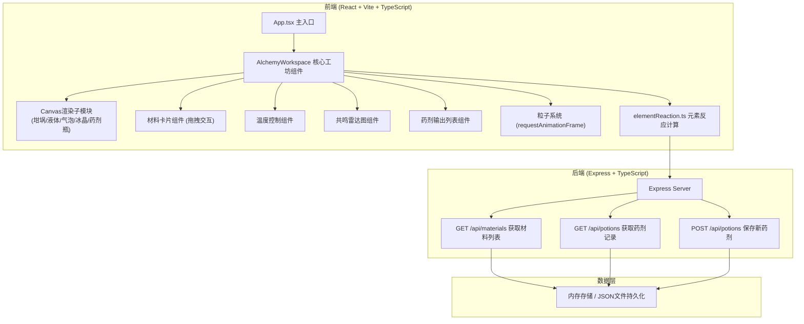
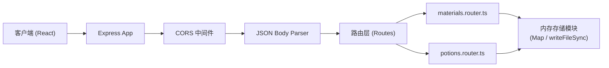
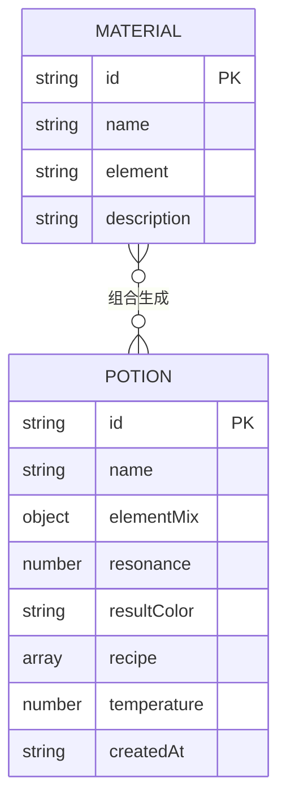

## 1. 架构设计

全栈Web应用采用前后端分离架构，前端负责沉浸式交互与Canvas动画渲染，后端提供材料数据与配方记录持久化API。



## 2. 技术选型说明

| 层级 | 技术栈 | 版本/说明 |
|------|--------|-----------|
| 前端框架 | React | 18.x，函数组件+Hooks |
| 前端语言 | TypeScript | 严格模式(strict: true)，target ES2022 |
| 构建工具 | Vite | 5.x，@vitejs/plugin-react插件 |
| 路由 | react-router-dom | 单页应用，主路由/ |
| 动画 | framer-motion | 所有DOM过渡动画0.3-0.6s，拖拽反馈 |
| Canvas绘制 | 原生Canvas 2D API | 无第三方库，手动实现sin波、粒子、形状 |
| 类型校验 | zod | 请求/响应数据结构校验 |
| 状态管理 | React useState + useRef | 轻量级，无需全局状态库 |
| HTTP | fetch API | 调用后端接口 |
| 后端框架 | Express | 4.x，CORS中间件 |
| 后端语言 | TypeScript + ts-node | 与前端共享类型 |
| 唯一ID | uuid | 药剂记录唯一标识 |
| 包管理器 | npm | 环境默认 |

## 3. 路由定义

| 路由 | 页面组件 | 说明 |
|------|----------|------|
| / | AlchemyWorkspace | 炼金工坊主页面，唯一页面 |

## 4. API 接口定义

### 4.1 材料接口

**GET /api/materials** - 获取全部基础材料
```typescript
// 响应类型
interface Material {
  id: string;
  name: string;           // 材料名称：硫磺/水银/硝石/朱砂/石膏/明矾
  element: 'fire' | 'water' | 'earth' | 'air';  // 属性
  description: string;    // 描述文本
}

// 响应体
{
  success: boolean;
  data: Material[];
}
```

### 4.2 药剂记录接口

**GET /api/potions** - 获取所有历史药剂记录
```typescript
interface Potion {
  id: string;
  name: string;                 // 药剂名称：烈焰治愈药水/寒冰屏障药剂等
  elementMix: Record<string, number>;  // 各属性份数 {fire:2, water:1}
  resonance: number;            // 共鸣度 0-100
  resultColor: string;          // 混合结果颜色 hex
  recipe: { materialId: string; materialName: string; count: number }[];
  temperature: number;          // 合成时温度
  createdAt: string;            // ISO时间戳
}

// 响应体
{
  success: boolean;
  data: Potion[];
}
```

**POST /api/potions** - 保存新生成的药剂
```typescript
// 请求体 (zod校验)
{
  name: string;
  elementMix: Record<string, number>;
  resonance: number;
  resultColor: string;
  recipe: Array<{ materialId: string; materialName: string; count: number }>;
  temperature: number;
}

// 响应体
{
  success: boolean;
  data: Potion;  // 带id和createdAt
}
```

## 5. 服务器架构图



## 6. 数据模型

### 6.1 实体关系



### 6.2 初始材料数据

| id | name | element | description |
|----|------|---------|-------------|
| sulfur | 硫磺 | fire | 燃烧之精华，火属性核心材料 |
| cinnabar | 朱砂 | fire | 赤色灵石，增强火焰之力 |
| mercury | 水银 | water | 流动之银，水属性基础材料 |
| saltpeter | 硝石 | air | 寒冰结晶，气属性催化剂 |
| gypsum | 石膏 | earth | 大地之骨，土属性稳定剂 |
| alum | 明矾 | water | 清澈之石，净化水性 |

## 7. 文件结构

```
项目根/
├── package.json
├── vite.config.ts
├── tsconfig.json
├── index.html
├── .trae/documents/
│   ├── PRD.md
│   └── TechArchitecture.md
├── src/
│   ├── client.tsx                 # React入口
│   ├── App.tsx                    # 主组件
│   ├── components/
│   │   └── AlchemyWorkspace.tsx   # 核心工坊组件(>800行需拆分)
│   ├── utils/
│   │   └── elementReaction.ts     # 纯函数计算模块
│   ├── types/
│   │   └── index.ts               # 共享类型定义
│   └── server/
│       └── index.ts               # Express服务器
└── shared/                        # 前后端共享类型(可选)
```

## 8. 关键模块实现说明

### 8.1 Canvas渲染模块（内置于AlchemyWorkspace.tsx）
- **drawCrucible()**：绘制青铜质感三脚坩埚，直径180px，径向渐变+高光
- **drawLiquid()**：sin波叠加实现液面波动，频率随温度/操作变化，颜色RGB插值混合
- **drawBubbles()**：加热时生成3-8px随机气泡，底部橙红→顶部透明渐变，向上运动
- **drawCrystals()**：冷却时生成六边形冰晶(2-5px)，旋转矩阵+下沉动画
- **drawPotionBottle()**：左侧输出区Canvas绘制细颈玻璃瓶(高60px)，内部液体填充
- **drawResonanceChart()**：六边形雷达图，极坐标转换计算顶点，线条粗细映射浓度

### 8.2 粒子系统
- 拖拽开始：创建粒子发生器，每16ms生成5-8个粒子
- 粒子属性：位置跟随鼠标+随机偏移，速度向量，生命周期，颜色随属性
- 消散：粒子到达坩埚边界时opacity→0，从数组中splice移除
- 性能：使用对象池复用粒子对象，≤200个活跃粒子

### 8.3 元素反应计算（elementReaction.ts 纯函数）
```typescript
// 计算元素共鸣度 0-100
calculateResonance(mix: Record<Element, number>, temp: number): number
// 规则：互补元素(fire-water, earth-air)比例接近1:1时共鸣高
// 温度匹配元素偏好(fire→高温, water→低温)加成

// RGB颜色混合，按份数加权平均
mixColors(mix: Record<Element, number>): string  // hex颜色

// 药剂命名：主属性前缀+效果后缀
generatePotionName(mix: Record<Element, number>, resonance: number): string
// 例：2火+1水→"烈焰治愈药水"；2水+1土→"寒冰屏障药剂"
```

### 8.4 拖拽交互（framer-motion + HTML5 Drag API）
- 材料卡片：whileDrag={{scale:0.9, opacity:0.7}}
- 拖放区高亮：isDragOver状态时坩埚边框发光
- 拖放成功：onDrop触发addMaterial()，播放粒子消散动画

## 9. 性能优化策略

1. **Canvas分层**：坩埚/液体使用独立Canvas，粒子系统使用单独离屏Canvas
2. **脏矩形渲染**：局部重绘而非全画面clear
3. **粒子池化**：对象复用避免GC抖动
4. **节流防抖**：温度调节按钮节流100ms，共鸣计算防抖300ms
5. **requestAnimationFrame**：所有动画统一调度，非激活标签页自动暂停
6. **内存控制**：粒子数组长度上限，药剂列表最多保留50条
