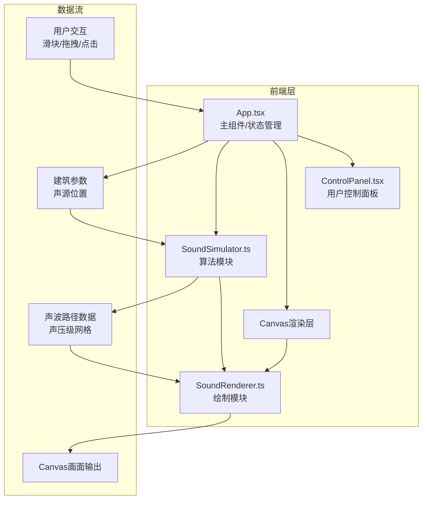

## 1. 架构设计



## 2. 技术描述

- **前端**：React@18 + TypeScript@5 + Vite@5
- **状态管理**：React useState/useRef（轻量级场景，无需zustand）
- **动画**：framer-motion@11
- **渲染**：Canvas 2D API
- **算法**：射线追踪法（Ray Tracing）+ 几何声学
- **数据验证**：zod@3
- **工具库**：uuid@9
- **构建工具**：Vite@5 + @vitejs/plugin-react@4

### 依赖版本说明
- react: ^18.2.0
- react-dom: ^18.2.0
- typescript: ^5.4.0
- vite: ^5.2.0
- @vitejs/plugin-react: ^4.2.0
- framer-motion: ^11.0.0
- uuid: ^9.0.0
- zod: ^3.22.0
- @types/uuid: ^9.0.0

## 3. 目录结构与文件职责

```
src/
├── types/
│   └── index.ts          # 全局类型定义（建筑、声波、参数等接口）
├── SoundSimulator.ts     # 核心算法：射线追踪、反射计算、RT60、声压级
├── SoundRenderer.ts      # Canvas渲染：声波路径、热力图、建筑、植被
├── App.tsx               # 主组件：状态管理、事件处理、组件整合
├── ControlPanel.tsx      # 控制面板：滑块、响应式抽屉、framer-motion动画
├── index.css             # 全局样式：CSS变量、字体、响应式
└── main.tsx              # 应用入口
```

### 调用关系
1. **App.tsx** → 导入并调用 **SoundSimulator** 的计算方法
2. **App.tsx** → 传入声波数据给 **SoundRenderer** 进行绘制
3. **App.tsx** → 渲染 **ControlPanel** 组件，传递参数与回调
4. **ControlPanel** → 用户操作触发回调，更新App状态
5. **SoundSimulator** → 纯计算模块，无副作用，输入输出明确

### 数据流向
```
用户输入 → App状态更新 → SoundSimulator计算 → SoundRenderer渲染 → Canvas显示
          ↓
        ControlPanel → 实时反馈参数值
```

## 4. 核心数据模型

### 4.1 TypeScript 类型定义

```typescript
// 建筑定义
interface Building {
  id: string;
  x: number;      // 左上角x坐标（像素）
  y: number;      // 左上角y坐标（像素）
  width: number;  // 宽度（像素）
  height: number; // 高度（像素，对应实际米数）
  realHeight: number; // 实际建筑高度（米）
  color: string;
}

// 树篱点
interface HedgePoint {
  x: number;
  y: number;
  radius: number;
}

// 声源
interface SoundSource {
  x: number;
  y: number;
  frequency: number; // Hz
}

// 声波路径点
interface PathPoint {
  x: number;
  y: number;
  distance: number;  // 从声源累计距离
  reflectionCount: number;
  pressureLevel: number; // 声压级 dB
}

// 声波射线
interface SoundRay {
  id: string;
  points: PathPoint[];
  initialAngle: number;
}

// 热力图网格
interface HeatmapGrid {
  resolution: number; // 50x50
  cells: number[][];  // 每个格子的声压级
}

// 模拟参数
interface SimulationParams {
  buildingHeight: number;   // 10-80m
  streetWidth: number;      // 10-40m
  hedgeDensity: number;     // 0-1
  sourceFrequency: number;  // 200-4000Hz
}

// 模拟结果
interface SimulationResult {
  rays: SoundRay[];
  heatmap: HeatmapGrid;
  rt60: number;  // 混响时间 秒
}
```

### 4.2 核心算法说明

**射线追踪算法 SoundSimulator.traceRays()**
- 发射16条均匀分布的射线（0-360度，间隔22.5度）
- 每条射线检测与建筑边缘的碰撞
- 反射计算：入射角=反射角，法线为建筑边缘垂线
- 最多反射3次，超过则停止追踪
- 每段距离计算声压级衰减：`dB = sourceLevel - 20*log10(distance) - absorption*distance`

**混响时间RT60计算（Sabine公式简化版）**
```
RT60 = 0.161 * V / (A * (1 - α))
其中：
V = 街道峡谷体积 = 街道长度 × 宽度 × 建筑平均高度
A = 总吸声面积 = 2 × 街道长度 × 建筑高度（两侧墙面）+ 街道长度 × 宽度（地面）
α = 平均吸声系数 = (墙面0.02 × 墙面面积 + 地面0.05 × 地面面积 + 树篱0.3 × 树篱面积) / 总面积
```

**热力图计算**
- 50x50网格覆盖街道区域
- 每个格子计算：所有射线在该点的声压级叠加 + 混响贡献
- 使用距离反比定律 + 混响场叠加

## 5. 性能优化策略

1. **计算节流**：使用 requestAnimationFrame 控制渲染频率
2. **防抖处理**：滑块输入使用 16ms 防抖（约1帧）
3. **离屏Canvas**：热力图预渲染到离屏Canvas，避免每帧重绘
4. **增量更新**：仅当参数变化时重新计算声波，否则只更新动画
5. **Web Worker**：声波计算可移至Worker（预留架构，首版本主线程）
6. **对象池**：复用 PathPoint 和 SoundRay 对象，减少GC

## 6. 路由定义

| 路由 | 页面 | 组件 |
|-------|------|------|
| / | 主模拟页 | App.tsx |

（单页应用，无需多路由）
