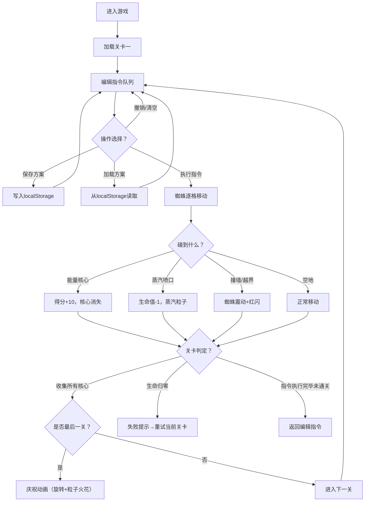

## 1. 产品概述

蒸汽朋克机械蜘蛛指令编程解谜游戏 —— 玩家通过编写指令序列，指挥机械蜘蛛在管道网络上巡逻，收集能量核心并避开蒸汽喷口。游戏融合编程逻辑思维与蒸汽朋克美学，适合喜欢解谜和编程挑战的玩家。

- 核心玩法：通过方向指令（前进、左转、右转）控制蜘蛛沿管道移动，收集能量核心得分，躲避蒸汽喷口
- 目标用户：编程初学者、解谜游戏爱好者、蒸汽朋克文化爱好者
- 产品价值：寓教于乐，锻炼逻辑思维能力，同时提供沉浸式蒸汽朋克视觉体验

## 2. 核心功能

### 2.1 用户角色
本游戏为单机游戏，无角色区分。

### 2.2 功能模块
1. **主游戏界面**：Canvas画布渲染管道网格、机械蜘蛛、能量核心、蒸汽喷口
2. **指令编辑区**：方向按钮、指令队列显示、撤销/清空/执行操作
3. **方案管理**：保存/加载/删除指令序列方案（localStorage持久化）
4. **关卡系统**：三个预置难度递增关卡，通关判定与失败重试
5. **动画效果**：蜘蛛步态动画、粒子特效、庆祝动画

### 2.3 页面详情

| 页面名称 | 模块名称 | 功能描述 |
|---------|---------|---------|
| 主游戏页 | Canvas渲染区 | 10x8管道网格，铜色管道连接，能量核心（金色闪烁齿轮），蒸汽喷口（红色脉动圆点），机械蜘蛛及机械步态动画 |
| 主游戏页 | 状态栏 | 当前关卡、得分、生命值（蒸汽管状图标）显示 |
| 主游戏页 | 指令编辑区 | 前进/左转/右转/执行按钮，彩色条块指令队列（前进绿、左转蓝、右转红），单条删除、撤销、清空按钮 |
| 主游戏页 | 方案管理区 | 最多保存3个方案（6字以内命名），方案卡片带加载/删除按钮，加载缩放动画 |
| 主游戏页 | 关卡提示 | 通关进入下一关、失败重试提示、全部通关庆祝动画 |

## 3. 核心流程

玩家进入游戏 → 查看当前关卡管道布局 → 点击方向按钮编辑指令队列 → 可撤销/清空/保存方案 → 点击执行按钮 → 蜘蛛逐格执行指令（每步0.4秒）→ 收集核心得分/碰到喷口减生命 → 判定关卡结果：通关进入下一关，失败可重试 → 全部通关触发庆祝动画。

## 4. 用户界面设计

### 4.1 设计风格
- **色彩主题**：深铜色渐变背景（#2d1b0e → #4a2c14），黄铜色按钮（#c9a84c → #a0842b），铜色管道（#b87333），金色核心（#ffd700），红色喷口（#dc143c）
- **按钮样式**：黄铜金属质感线性渐变，圆角，点击时内凹阴影
- **边框**：铆钉装饰齿轮纹理边框（CSS repeating-linear-gradient模拟）
- **字体**：标题使用复古衬线字体，正文使用清晰无衬线字体
- **图标风格**：蒸汽朋克机械风格 —— 齿轮、管道、铆钉元素

### 4.2 页面设计概览

| 页面名称 | 模块名称 | UI元素 |
|---------|---------|--------|
| 主游戏页 | Canvas画布 | 深铜背景，铜色管道网络，金色闪烁齿轮核心，红色脉动喷口，机械蜘蛛 |
| 主游戏页 | 状态栏 | 深色底，黄铜色文字，蒸汽管生命值图标，齿轮得分图标 |
| 主游戏页 | 指令编辑区 | 半透明深色面板，黄铜按钮，彩色圆角条块队列，微光效果 |
| 主游戏页 | 方案管理区 | 卡片式布局，黄铜边框，加载/删除小按钮，hover缩放效果 |
| 主游戏页 | 弹窗层 | 半透明遮罩，居中黄铜边框面板，庆祝/失败动画 |

### 4.3 响应式设计
- **桌面端优先**：主画布居中，编辑区在画布下方，方案区在编辑区右侧
- **移动端适配**：按钮尺寸放大（最小48x48px触控区域），触控点击放大1.1倍0.1秒反馈，方案区改为下方布局，整体垂直排列
- **画布自适应**：Canvas根据容器宽度等比缩放，保持10:8网格比例

### 4.4 动画与特效
- **加载动画**：齿轮旋转动画
- **蜘蛛步态**：腿部关节交替摆动的机械动画
- **核心闪烁**：金色呼吸灯效果
- **喷口脉动**：红色圆点缩放脉动
- **收集特效**：金色粒子炸裂扩散
- **蒸汽特效**：白色半透明小圆向上扩散
- **错误反馈**：蜘蛛快速震动+红色闪光
- **执行高亮**：当前执行指令条块高亮边框
- **庆祝动画**：蜘蛛中心旋转+金色粒子火花放射
- **方案加载**：0.2秒缩放动画
