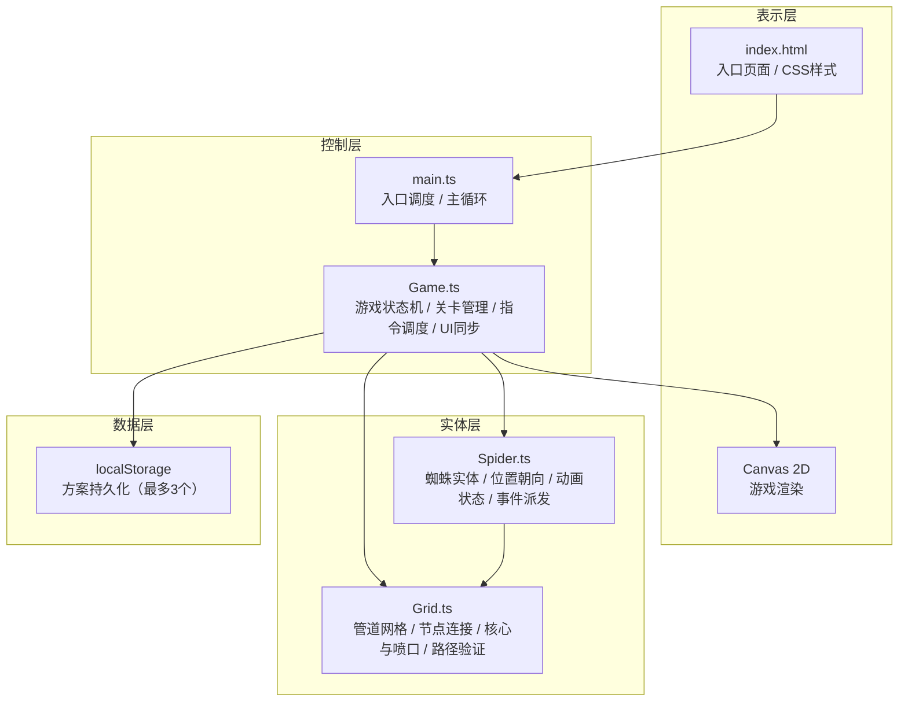

## 1. 架构设计



**数据流向说明**：
1. 用户点击方向按钮 → Game.ts 接收输入 → 加入指令队列 → 更新DOM显示
2. 用户点击执行 → Game.ts 遍历指令队列 → 逐条发送给 Spider.ts
3. Spider.ts 调用 Grid.ts 验证移动可行性 → Grid.ts 返回新位置/碰撞信息
4. Spider.ts 更新位置/触发事件（收集、受伤、错误）→ Game.ts 监听事件
5. Game.ts 更新得分/生命/关卡状态 → 触发 Canvas 重绘 + UI同步
6. 保存/加载方案 → Game.ts 读写 localStorage

## 2. 技术描述

- **前端框架**：原生 TypeScript（无UI框架），HTML5 Canvas 2D渲染
- **构建工具**：Vite 5.x（启用TypeScript支持，base: './'）
- **语言规范**：TypeScript 5.x，严格模式（strict: true），目标 ES2020
- **样式方案**：原生 CSS3，渐变、动画、媒体查询
- **数据持久化**：浏览器 localStorage（方案存储）
- **性能预算**：主循环稳定60fps，复杂动画≥45fps，单步指令动画≤5ms，localStorage读写≤2ms

## 3. 文件结构与职责

| 文件 | 职责 | 调用关系 |
|-----|------|---------|
| `package.json` | 项目依赖与脚本（typescript、vite，npm run dev） | - |
| `vite.config.js` | Vite构建配置，启用TypeScript，base: './' | - |
| `tsconfig.json` | TS编译配置，严格模式，target ES2020 | - |
| `index.html` | 入口HTML，深铜渐变背景，齿轮加载动画，Canvas+UI布局 | 引入 main.ts |
| `src/main.ts` | 游戏入口：初始化Canvas、启动requestAnimationFrame主循环、加载资源、调度各模块 | 实例化 Game，驱动 Game.update/render |
| `src/Grid.ts` | 管道网格类：生成随机网络、管理节点连接、蒸汽喷口触发逻辑、路径查询接口 | 被 Game 与 Spider 调用；数据：接收指令→验证→返回新位置 |
| `src/Spider.ts` | 机械蜘蛛实体类：管理位置/朝向/能量值、执行指令动画（步态）、派发事件 | 调用 Grid 验证路径；被 Game 驱动执行指令；派发onCollect/onHurt/onError事件 |
| `src/Game.ts` | 游戏主控制器：关卡状态、指令编辑、得分/生命、事件监听、UI同步 | 持有 Grid 与 Spider 实例；接收用户输入→组合指令队列→驱动Spider→更新UI与Canvas |

## 4. 核心数据模型

### 4.1 TypeScript 类型定义

```typescript
// 方向枚举
type Direction = 0 | 1 | 2 | 3; // 0=上, 1=右, 2=下, 3=左

// 指令类型
type CommandType = 'forward' | 'turnLeft' | 'turnRight';

interface Command {
  id: string;
  type: CommandType;
}

// 网格节点
interface GridNode {
  x: number;
  y: number;
  connections: Direction[]; // 可通行的方向
  hasCore: boolean;
  hasVent: boolean;
}

// 关卡配置
interface LevelConfig {
  id: number;
  name: string;
  coreCount: number;
  ventCount: number;
  layout: 'straight' | 'detour' | 'cross'; // 布局类型
}

// 保存方案
interface SavedScheme {
  name: string;
  commands: Command[];
  timestamp: number;
}

// 蜘蛛状态
interface SpiderState {
  x: number;
  y: number;
  direction: Direction;
  lives: number;
  animFrame: number; // 步态动画帧
}

// 粒子
interface Particle {
  x: number;
  y: number;
  vx: number;
  vy: number;
  life: number;
  maxLife: number;
  color: string;
  size: number;
}

// 游戏状态
type GameStatus = 'editing' | 'executing' | 'levelComplete' | 'gameOver' | 'victory';
```

### 4.2 模块间数据流契约

```
Grid.validateMove(fromX, fromY, direction) → { success: boolean, newX, newY, event: 'core'|'vent'|'wall'|'none' }
Spider.executeCommand(command) → Promise<执行结果>
Spider.on('collect', (x, y) => void)
Spider.on('hurt', (x, y) => void)
Spider.on('error', (x, y) => void)
Game.runCommands() → 逐条执行，间隔400ms
Game.saveScheme(name, commands) → 写入 localStorage（最多3个，超限提示）
Game.loadScheme(index) → 从 localStorage 读取并填充指令队列
```

## 5. 渲染循环与性能

- **主循环**：`requestAnimationFrame` 驱动，每帧调用 `Game.update(deltaTime)` → `Game.render(ctx)`
- **状态插值**：蜘蛛移动使用线性插值（lerp）确保平滑，0.4秒完成一格移动
- **粒子系统**：固定上限粒子数（≤200），超出后淘汰最旧粒子；每帧批量更新渲染
- **脏矩形渲染**：静态管道图层缓存至离屏Canvas，仅重绘动态元素（蜘蛛、核心闪烁、粒子）
- **节流**：localStorage读写在宏任务中异步执行，避免阻塞主线程
- **Canvas DPR适配**：根据设备像素比缩放画布，保证清晰度

## 6. 关卡布局算法

- **关卡一（简单直线）**：管道沿水平/垂直直线连接，核心分布在主干路径上，喷口在分支
- **关卡二（绕路路径）**：部分通道被阻断，需绕路收集核心，喷口增加至4个
- **关卡三（交叉路径）**：十字交叉管道，多分支，喷口增加至5个，需规划最优路径

算法：使用DFS生成连通图确保所有核心可达，根据布局类型调整连接密度和喷口位置。
