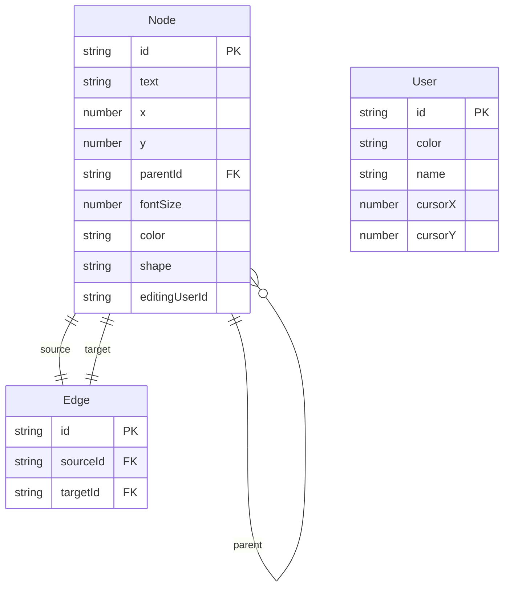

## 1. 架构设计

```mermaid
flowchart TB
    "Frontend[前端 React+TypeScript+Vite]" --> "WebSocket[WebSocket 连接层]"
    "WebSocket" --> "Server[WebSocket 服务器]"
    "Server" --> "Broadcast[广播同步]"
    "Frontend" --> "Store[useReducer 状态管理]"
    "Store" --> "Canvas[画布组件]"
    "Store" --> "TreePanel[层级树组件]"
    "Store" --> "NodeEditor[属性编辑组件]"
```

纯前端架构，WebSocket服务器负责消息转发与广播，无后端数据库。所有状态在客户端维护。

## 2. 技术说明

- 前端：React@18 + TypeScript + Vite
- 初始化工具：Vite
- 状态管理：useReducer（非Zustand，按用户需求）
- 通信：原生WebSocket
- 后端：无（WebSocket服务器仅做消息中转，可使用简单ws服务）
- 数据库：无（内存状态）
- 依赖：react、react-dom、typescript、vite、@vitejs/plugin-react、uuid、react-icons

## 3. 路由定义

| 路由 | 用途 |
|------|------|
| / | 主工作台页面（唯一页面，三栏布局） |

## 4. API定义

### 4.1 WebSocket消息协议

```typescript
type WSAction =
  | { type: 'ADD_NODE'; payload: { id: string; text: string; x: number; y: number; parentId: string | null; userId: string } }
  | { type: 'MOVE_NODE'; payload: { id: string; x: number; y: number; userId: string } }
  | { type: 'UPDATE_NODE_TEXT'; payload: { id: string; text: string; userId: string } }
  | { type: 'DELETE_NODE'; payload: { id: string; userId: string } }
  | { type: 'UPDATE_NODE_STYLE'; payload: { id: string; fontSize: number; color: string; shape: string; userId: string } }
  | { type: 'CURSOR_MOVE'; payload: { userId: string; x: number; y: number } }
  | { type: 'PING' }
  | { type: 'PONG' }

type WSMessage = {
  action: WSAction
  timestamp: number
}
```

## 5. 服务器架构

```mermaid
flowchart LR
    "ClientA[客户端A]" --> "WSServer[WebSocket服务器]"
    "ClientB[客户端B]" --> "WSServer"
    "ClientC[客户端C]" --> "WSServer"
    "WSServer" --> "ClientA"
    "WSServer" --> "ClientB"
    "WSServer" --> "ClientC"
```

WebSocket服务器仅做消息广播中转，不存储状态。收到任一客户端消息后广播给所有其他客户端。

## 6. 数据模型

### 6.1 数据模型定义



### 6.2 文件组织

```
├── package.json
├── vite.config.js
├── tsconfig.json
├── index.html
├── server.mjs          # 简易WebSocket中转服务器
└── src/
    ├── main.tsx         # 应用入口，初始化React根节点，WebSocket连接
    ├── store.ts         # useReducer状态管理，action定义与reducer
    ├── App.tsx          # 主布局组件（三栏）
    ├── Canvas.tsx       # 画布核心组件
    ├── NodeEditor.tsx   # 右侧属性编辑面板
    ├── TreePanel.tsx    # 左侧层级树状列表
    ├── ThemeSwitch.tsx  # 主题切换组件
    ├── websocket.ts     # WebSocket封装
    ├── types.ts         # TypeScript类型定义
    └── themes.ts        # 主题配置
```
