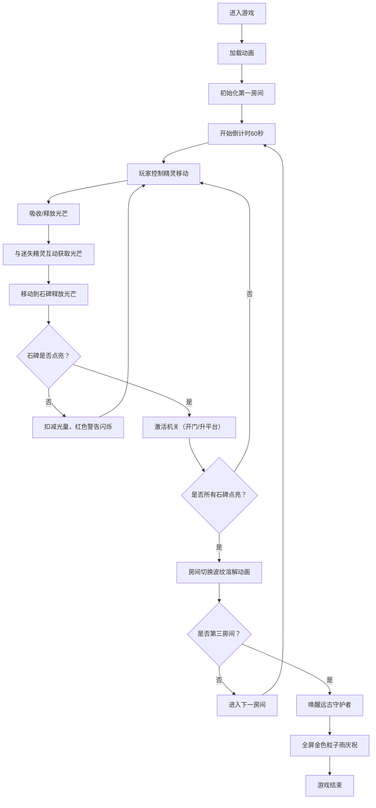

## 1. 产品概述

《光影遗迹》是一款基于HTML5 Canvas的光影解密游戏，玩家操控光影精灵在被遗忘的古代遗迹中探索，通过吸收和释放光芒点亮石碑、激活机关，最终唤醒沉睡的远古守护者。

- **核心玩法**：控制光影精灵移动、吸收/释放光芒，解开三个房间的谜题
- **目标用户**：休闲游戏爱好者、解密游戏玩家
- **产品价值**：提供沉浸式的光影解密体验，考验玩家的逻辑思维和操作能力

## 2. 核心功能

### 2.1 用户角色

| 角色 | 注册方式 | 核心权限 |
|------|----------|----------|
| 玩家 | 无需注册，直接进入游戏 | 完整游戏体验，所有关卡权限 |

### 2.2 功能模块

1. **游戏主场景**：遗迹地图渲染、房间切换动画、粒子特效系统
2. **精灵控制系统**：WASD移动、空格键吸收/释放光芒、粒子拖尾效果
3. **关卡谜题系统**：三个独立房间谜题、石碑点亮机制、机关激活逻辑
4. **NPC互动系统**：迷失精灵NPC、光芒赠与机制、冷却系统
5. **UI界面系统**：光量能量条、倒计时、房间编号、胜利庆祝动画
6. **移动端适配**：虚拟摇杆、触摸按钮、响应式布局

### 2.3 页面详情

| 页面名称 | 模块名称 | 功能描述 |
|----------|----------|----------|
| 游戏主页面 | 加载动画 | 渐隐入场动画，加载游戏资源 |
| 游戏主页面 | 画布渲染 | 60fps渲染游戏场景、精灵、石碑、机关 |
| 游戏主页面 | HUD界面 | 左上角能量条和倒计时，右下角房间编号 |
| 游戏主页面 | 移动端控件 | 虚拟摇杆和操作按钮，触屏适配 |
| 游戏主页面 | 胜利界面 | 全屏金色粒子雨庆祝动画 |

## 3. 核心流程

## 4. 用户界面设计

### 4.1 设计风格

- **主色调**：古墓青苔色（#2D4A3E）和淡金色（#D4AF37）
- **辅助色**：淡蓝色（#87CEEB）→ 亮金色（#FFD700）渐变（精灵光量变化）
- **警告色**：红色（#FF4444）用于错误提示
- **字体**：Cinzel Decorative（标题/装饰）+ Lato（正文）
- **布局**：全屏Canvas渲染，HUD元素浮动叠加
- **按钮风格**：半透明圆形按钮，发光边框，点击波纹效果
- **视觉层次**：精灵 > 石碑 > 机关 > 墙壁 > 地面

### 4.2 页面设计概述

| 页面名称 | 模块名称 | UI元素 |
|----------|----------|--------|
| 游戏主页面 | 加载动画 | 深色背景渐隐，淡金色光芒扩散，加载进度条 |
| 游戏主页面 | 场景渲染 | 不规则石板纹理地面，风化砖块墙壁，发光石碑 |
| 游戏主页面 | 精灵设计 | 半透明发光球体，光量渐变，粒子拖尾 |
| 游戏主页面 | HUD界面 | 左上角渐变色能量条（光量0-10），圆形倒计时器 |
| 游戏主页面 | 移动端控件 | 左下角虚拟摇杆，右下角A/B按钮，半透明UI |
| 游戏主页面 | 胜利动画 | 全屏金色粒子雨，守护者剪影浮现 |

### 4.3 响应式设计

- **桌面优先**：PC端使用键盘WASD+空格操作
- **移动适配**：屏幕宽度<768px时自动显示虚拟摇杆和触摸按钮
- **Canvas缩放**：保持16:9比例，letterbox适配不同屏幕
- **触摸优化**：按钮最小尺寸48x48px，足够触摸间距

### 4.4 动画与特效

- **入场动画**：0.5秒渐隐，光芒从中心扩散
- **房间切换**：波纹溶解动画（0.8秒）
- **吸收光芒**：向内光粒子流，精灵亮度增强
- **释放光芒**：向外光晕扩散，精灵变暗
- **石碑点亮**：环形光波扩散，短暂照亮房间
- **机关激活**：0.5秒齿轮转动动画
- **错误警告**：0.3秒红色屏幕闪烁
- **胜利庆祝**：金色粒子雨（持续3秒）
