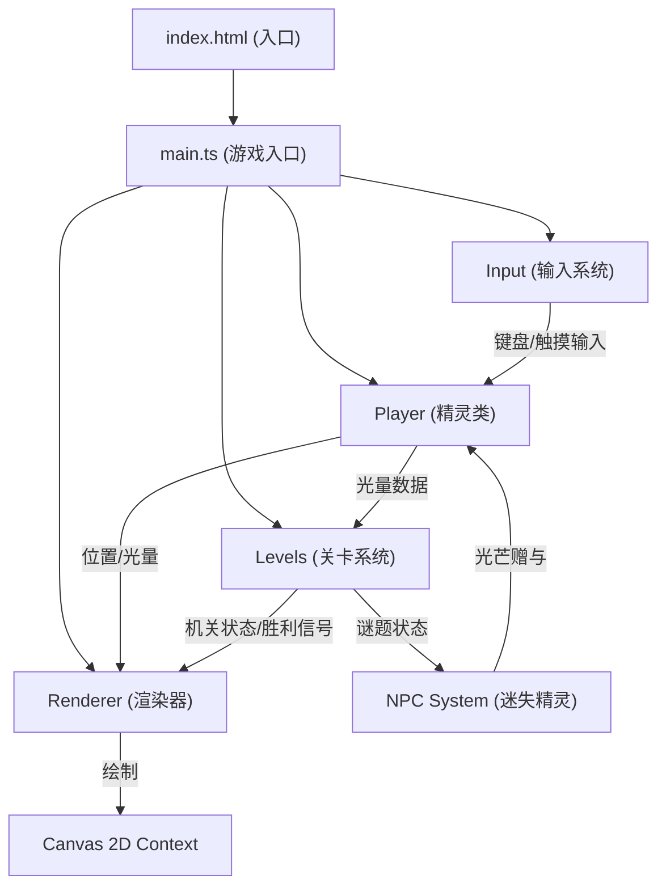

## 1. 架构设计



**数据流向说明：**
1. `main.ts` 作为调度中心，接收输入并分发给各模块
2. `Input` 系统捕获键盘WASD/空格和移动端触摸事件，传给 `Player`
3. `Player` 更新位置和光量状态，输出给 `Renderer` 和 `Levels`
4. `Levels` 根据 `Player` 光量判断谜题进度，输出机关状态给 `Renderer`
5. `Renderer` 整合所有状态数据，以60fps绘制到Canvas
6. `NPC System` 独立运行，与 `Player` 交互时修改光量

## 2. 技术描述

- **前端框架**：纯TypeScript + HTML5 Canvas（无框架）
- **构建工具**：Vite 5.x
- **编程语言**：TypeScript 5.x（严格模式）
- **目标平台**：ES2020
- **第三方依赖**：无（纯原生实现）
- **初始化方式**：手动创建配置文件

## 3. 文件结构与职责

```
project/
├── package.json              # 项目配置与依赖
├── vite.config.js            # Vite构建配置
├── tsconfig.json             # TypeScript配置
├── index.html                # 入口HTML页面
└── src/
    ├── main.ts               # 游戏入口，主循环调度
    ├── player.ts             # 光影精灵类（移动、吸收/释放、粒子）
    ├── levels.ts             # 关卡数据与谜题逻辑
    ├── renderer.ts           # Canvas场景渲染器
    ├── input.ts              # 键盘与触摸输入处理
    ├── npc.ts                # 迷失精灵NPC系统
    ├── particles.ts          # 粒子系统管理
    ├── types.ts              # 全局TypeScript类型定义
    └── utils.ts              # 工具函数（碰撞检测、数学计算）
```

**模块调用关系：**
- `main.ts` 依赖：`player.ts`、`levels.ts`、`renderer.ts`、`input.ts`、`npc.ts`、`particles.ts`
- `player.ts` 依赖：`types.ts`、`utils.ts`
- `levels.ts` 依赖：`types.ts`、`utils.ts`
- `renderer.ts` 依赖：`types.ts`、`utils.ts`
- `input.ts` 依赖：`types.ts`
- `npc.ts` 依赖：`types.ts`、`utils.ts`
- `particles.ts` 依赖：`types.ts`、`utils.ts`

## 4. 核心数据结构

### 4.1 类型定义

```typescript
// 位置坐标
interface Vector2 {
  x: number;
  y: number;
}

// 玩家状态
interface PlayerState {
  position: Vector2;
  lightAmount: number;      // 0-10
  maxLight: number;         // 10
  isAbsorbing: boolean;
  isReleasing: boolean;
  velocity: Vector2;
}

// 石碑状态
interface Stele {
  id: string;
  position: Vector2;
  requiredLight: number;    // 需要的光量
  isLit: boolean;
  color: string;            // 符文颜色提示
  lightRemaining: number;   // 残余光芒
}

// 机关状态
interface Mechanism {
  id: string;
  type: 'door' | 'platform';
  position: Vector2;
  isActive: boolean;
  activationTime: number;   // 动画时间戳
}

// 房间数据
interface Room {
  id: number;
  name: string;
  tiles: number[][];        // 地图瓦片数据
  steles: Stele[];
  mechanisms: Mechanism[];
  timeLimit: number;        // 60秒
  clueText: string;         // 解密线索
  npcs: NPC[];
}

// NPC状态
interface NPC {
  id: string;
  position: Vector2;
  isOnCooldown: boolean;
  cooldownEndTime: number;
  targetPosition: Vector2;
}

// 粒子
interface Particle {
  id: number;
  position: Vector2;
  velocity: Vector2;
  color: string;
  life: number;
  maxLife: number;
  size: number;
  type: 'trail' | 'absorb' | 'release' | 'victory';
}

// 游戏状态
type GameState = 'loading' | 'playing' | 'roomTransition' | 'victory' | 'gameOver';
```

### 4.2 瓦片地图编码

```
0 = 空地（可通行）
1 = 墙壁（不可通行）
2 = 石板地面（装饰）
3 = 机关位置
4 = 石碑位置
```

## 5. 性能优化策略

### 5.1 渲染优化

- **离屏Canvas**：地面、墙壁等静态元素预渲染到离屏Canvas
- **脏矩形渲染**：只重绘变化区域（精灵、粒子、动画元素）
- **粒子池**：对象池复用粒子，避免频繁GC
- **帧率控制**：requestAnimationFrame + deltaTime计算，固定60fps逻辑更新

### 5.2 内存管理

- 粒子数量上限：1000个，超出时淘汰最旧粒子
- 房间切换时清理上一房间的临时数据
- 事件监听器在销毁时正确移除

### 5.3 加载优化

- 无外部资源，纯代码和Canvas绘制，加载时间<2秒
- 按需生成纹理数据，避免预加载大量图片

## 6. 关键算法

### 6.1 碰撞检测

```typescript
// AABB碰撞检测，网格对齐
function checkCollision(pos: Vector2, tiles: number[][]): boolean {
  const gridX = Math.floor(pos.x / TILE_SIZE);
  const gridY = Math.floor(pos.y / TILE_SIZE);
  return tiles[gridY]?.[gridX] === 1;
}
```

### 6.2 波纹溶解动画

```typescript
// 基于噪声的波纹过渡效果
function rippleTransition(t: number, x: number, y: number): number {
  const centerX = canvas.width / 2;
  const centerY = canvas.height / 2;
  const dist = Math.sqrt((x - centerX) ** 2 + (y - centerY) ** 2);
  const wave = Math.sin(dist * 0.02 - t * 5) * 0.5 + 0.5;
  return wave > t ? 1 : 0;
}
```

### 6.3 粒子系统更新

```typescript
// 粒子更新，带生命周期和物理模拟
function updateParticles(particles: Particle[], dt: number): void {
  for (let i = particles.length - 1; i >= 0; i--) {
    const p = particles[i];
    p.position.x += p.velocity.x * dt;
    p.position.y += p.velocity.y * dt;
    p.life -= dt;
    if (p.life <= 0) {
      particles.splice(i, 1);
    }
  }
}
```

## 7. 移动端适配方案

### 7.1 虚拟摇杆

- 左下角触控区域，触摸点偏移计算方向向量
- 摇杆范围：半径60px，中心跟随首次触摸位置
- 输出标准化方向向量（-1到1）给Player移动系统

### 7.2 触摸按钮

- 右下角两个圆形按钮：A键（吸收/释放）、B键（预留）
- 按钮尺寸：60x60px，间距20px
- 触摸开始触发按下事件，触摸结束触发释放事件

### 7.3 响应式Canvas

```css
canvas {
  width: 100%;
  height: 100%;
  object-fit: contain;
  background: #1a1a1a;
}
```

## 8. 构建与部署

- **开发命令**：`npm run dev` - 启动Vite开发服务器
- **构建命令**：`npm run build` - 生产构建，输出到dist目录
- **预览命令**：`npm run preview` - 预览生产构建
- **base路径**：`./` - 相对路径，支持任意目录部署
