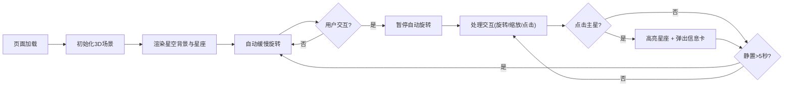

## 1. 产品概述
一个基于3D粒子系统的交互式星座可视化Web应用，用户可通过鼠标操控视角，在星空中探索不同星座的立体结构。
- 主要用途：沉浸式星空体验与星座知识科普
- 目标用户：天文爱好者、教育工作者、普通用户
- 产品价值：提供沉浸式、交互性强的3D星空探索体验

## 2. 核心功能

### 2.1 用户角色
| 角色 | 注册方式 | 核心权限 |
|------|----------|----------|
| 游客用户 | 无需注册 | 浏览星空、交互探索、查看星座信息 |

### 2.2 功能模块
1. **3D星空场景**: 包含数千颗随机分布的背景星星，带有亮度闪烁动画
2. **星座展示系统**: 预定义多个星座，由主星和连接线组成，支持高亮显示
3. **视角交互系统**: 鼠标拖拽旋转、滚轮缩放、点击选中
4. **星座控制面板**: 快速切换星座、重置视角
5. **星座信息卡**: 显示星座名称、星星数量、神话故事

### 2.3 页面详情
| 页面名称 | 模块名称 | 功能描述 |
|----------|----------|----------|
| 主页面 | 3D星空背景 | 2000+颗星星随机分布，带有正弦波闪烁动画 |
| 主页面 | 星座结构渲染 | 主星(发光球体) + 连接线(半透明线段) + 辉光效果 |
| 主页面 | 交互控制 | 鼠标拖拽旋转视角、滚轮缩放(5-50单位)、点击主星高亮 |
| 主页面 | 控制面板 | 左下角毛玻璃风格面板，星座切换按钮 + 重置视角 |
| 主页面 | 信息浮窗 | 右上角滑入式信息卡，弹性过渡动画 |

## 3. 核心流程

用户进入页面 → 视角自动缓慢旋转展示星空 → 用户可拖拽旋转/滚轮缩放探索 → 点击主星高亮星座并弹出信息卡 → 使用控制面板快速切换星座视角 → 静置5秒后恢复自动旋转

## 4. 用户界面设计

### 4.1 设计风格
- **主色调**: 深空蓝黑渐变背景(从上到下 #0a0a2e → #000011)
- **辅助色**: 白色/淡蓝色(普通星星)、蓝色/橙色/白色(主星辉光)
- **按钮风格**: 圆角按钮，半透明背景，悬停微光效果
- **字体**: 现代无衬线字体，标题醒目，正文清晰
- **布局风格**: 沉浸式全屏3D场景，悬浮式控制面板和信息卡
- **视觉效果**: 毛玻璃模糊、辉光、弹性动画过渡

### 4.2 页面设计概述
| 页面名称 | 模块名称 | UI元素 |
|----------|----------|--------|
| 主页面 | 3D星空 | 渐变背景、闪烁星点、彩色主星、半透明连接线 |
| 主页面 | 控制面板(左下角) | rgba(255,255,255,0.1)背景、10px模糊、圆角按钮 |
| 主页面 | 信息卡(右上角) | 从右侧滑入、0.3秒弹性过渡、星座信息展示 |

### 4.3 响应式
- 桌面优先设计，移动设备自适应
- 支持从手机到桌面的全尺寸适配
- 仅支持鼠标操作，不支持触控

### 4.4 3D场景指导
- **环境**: 深空蓝黑渐变背景，无HDRI
- **光照**: 主星自发光 + 环境光，确保星空层次分明
- **相机**: PerspectiveCamera，初始距离适中，支持轨道旋转
- **构图**: 星座分布在空间不同位置，具有纵深感
- **交互**: 鼠标拖拽旋转(绕X/Y轴)、滚轮缩放(5-50)、点击选中
- **后处理**: 无复杂后处理，辉光使用Sprite或自定义着色器实现
- **性能预算**: 粒子总数≤3000，移动端30fps+，桌面端60fps
