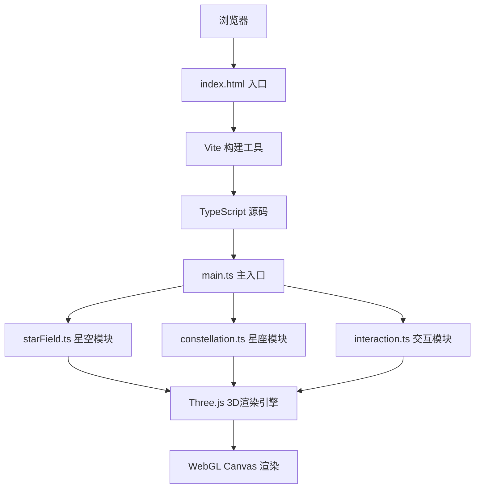

## 1. 架构设计



## 2. 技术描述
- **前端**: TypeScript + Three.js@0.160.0 + Vite
- **构建工具**: Vite 5.x
- **样式**: 原生CSS (嵌入HTML内联样式)
- **无后端**: 纯前端应用，所有数据硬编码
- **无数据库**: 星座数据内置在代码中

## 3. 文件结构
```
auto4/
├── package.json              # 依赖与脚本配置
├── vite.config.js            # Vite构建配置(含TS支持)
├── tsconfig.json             # TypeScript配置(严格模式, ES2020)
├── index.html                # 入口HTML页面
└── src/
    ├── main.ts               # 主入口: 场景/相机/渲染器初始化
    ├── starField.ts          # 星空背景模块: 2000+星星与闪烁动画
    ├── constellation.ts      # 星座模块: 数据模型/主星/连接线/高亮
    └── interaction.ts        # 交互模块: 拖拽旋转/缩放/点击/控制面板
```

## 4. 模块职责定义

### 4.1 main.ts
- 初始化 Three.js Scene、PerspectiveCamera、WebGLRenderer
- 设置深空渐变背景
- 启动 requestAnimationFrame 动画循环
- 协调 starField、constellation、interaction 三个模块
- 处理窗口 resize 事件

### 4.2 starField.ts
- 生成 2000+ 颗随机分布的背景星星 (BufferGeometry + Points)
- 每颗星星亮度随机 0.3-1.0，闪烁频率 0.5-2Hz
- 使用正弦波实现平滑亮度过渡
- 星星颜色: 白色/淡蓝色

### 4.3 constellation.ts
- 定义星座数据接口: 名称、主星位置数组、连接线、颜色、神话描述
- 预定义3个星座: 猎户座(橙色)、大熊座(蓝色)、仙后座(白色)
- 主星: SphereGeometry 半径0.3，带自发光材质
- 辉光效果: Sprite + Canvas 纹理实现径向渐变
- 连接线: LineSegments + 半透明材质
- 提供 highlight() / unhighlight() 方法

### 4.4 interaction.ts
- 鼠标拖拽旋转 (绕X/Y轴)
- 滚轮缩放 (范围 5-50 单位)
- Raycaster 点击检测主星
- 星座高亮与信息卡弹出
- 左下角控制面板 (HTML DOM元素)
- 视角平滑飞行动画 (1.5秒 tween)
- 自动旋转 + 静置5秒恢复逻辑

## 5. 性能优化策略
- 星星使用 BufferGeometry + Points (单个DrawCall)
- 避免后处理效果，辉光用Sprite实现
- 粒子总数 ≤ 3000
- 使用 requestAnimationFrame + delta time 平滑动画
- 材质共享、几何体复用
