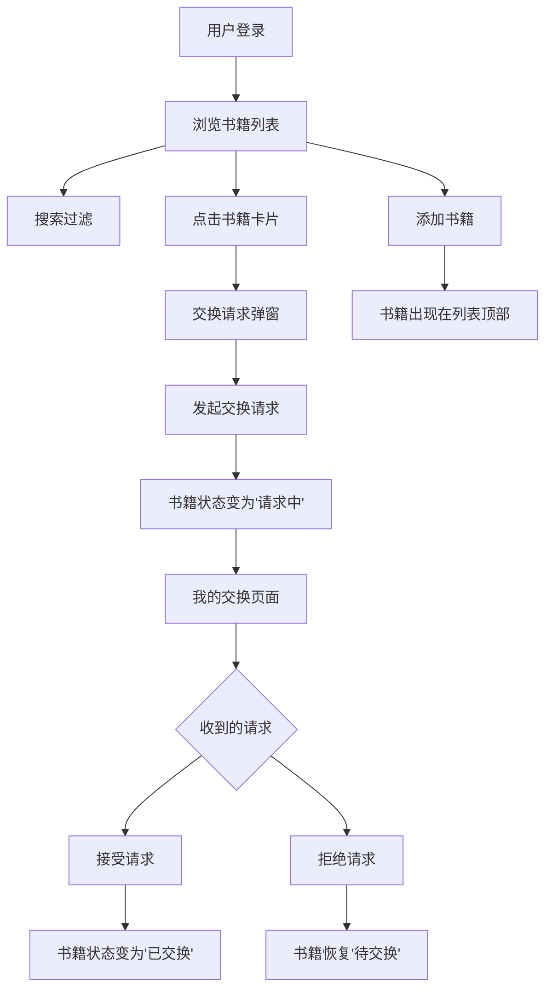

## 1. 产品概述

在线书籍交换社区——让用户发布闲置书籍、浏览他人藏书并发起交换请求的社交平台。目标用户为热爱阅读、希望以书换书的人群，通过社区化交换模式减少资源浪费，构建阅读者之间的连接。

## 2. 核心功能

### 2.1 用户角色

| 角色 | 注册方式 | 核心权限 |
|------|----------|----------|
| 普通用户 | 模拟登录 | 浏览书籍、发布书籍、发起/接受/拒绝交换请求 |

### 2.2 功能模块

1. **首页**：书籍网格列表、搜索过滤、书籍详情面板、添加书籍入口
2. **我的交换**：发起的交换请求列表、收到的交换请求列表、请求详情展开、接受/拒绝操作

### 2.3 页面详情

| 页面名称 | 模块名称 | 功能描述 |
|----------|----------|----------|
| 首页 | 搜索栏 | 按标题或作者实时过滤书籍，0.3秒防抖延迟 |
| 首页 | 书籍网格 | 两列网格展示所有书籍卡片，占70%宽度 |
| 首页 | 详情面板 | 展示选中书籍详情，占30%宽度 |
| 首页 | 添加书籍 | 弹出表单输入书名、作者、封面URL |
| 首页 | 交换弹窗 | 点击卡片弹出交换请求弹窗，显示书籍详情和发起者信息 |
| 我的交换 | 发起的请求 | 按时间倒序展示发起的交换请求 |
| 我的交换 | 收到的请求 | 按时间倒序展示收到的交换请求，支持接受/拒绝操作 |
| 我的交换 | 请求详情 | 点击请求卡片展开查看详细信息 |

## 3. 核心流程

用户登录后进入首页浏览书籍列表，可通过搜索框按标题或作者过滤。点击任意书籍卡片弹出交换请求弹窗，查看书籍详情和所有者信息后可发起交换请求。请求发出后书籍状态变为"请求中"，卡片上状态标签闪烁提示。用户可在"我的交换"页面查看所有交换请求，对收到的请求可选择接受或拒绝。接受后书籍状态变为"已交换"，拒绝后书籍恢复为"待交换"并带抖动动画。用户还可通过添加书籍功能发布自己的闲置书籍。

## 4. 用户界面设计

### 4.1 设计风格

- 主色调：暖色米白（#FAF6F0），辅助色：深棕（#5C4033）、柔橙（#D4956A）
- 按钮：柔和圆角（8px），暖色填充，悬停加深
- 字体：衬线体作为标题字体（如 Playfair Display），无衬线作为正文字体
- 布局：左右分栏（70%/30%），移动端上下布局
- 图标：线性风格，搭配 lucide-react
- 阴影：浅灰柔和阴影，悬停时加深并上浮

### 4.2 页面设计概述

| 页面名称 | 模块名称 | UI元素 |
|----------|----------|--------|
| 首页 | 搜索栏 | 圆角输入框、搜索图标、暖色聚焦边框、防抖提示 |
| 首页 | 书籍网格 | 两列卡片布局、柔和圆角、浅灰阴影、悬停上浮动画 |
| 首页 | 书籍卡片 | 封面占位图、书名、作者、状态标签（待交换/请求中/已交换）、已交换灰色覆盖层 |
| 首页 | 详情面板 | 右侧固定面板、书籍大图、完整信息、交换按钮 |
| 首页 | 交换弹窗 | 底部滑入动画、半透明遮罩、目标书籍信息、发起者信息、确认/取消按钮 |
| 首页 | 添加书籍 | 模态表单、书名/作者/封面URL输入、提交后左侧飞入弹簧动画 |
| 我的交换 | 请求列表 | 卡片式布局、时间倒序、状态标签、展开/收起动画 |
| 我的交换 | 接受/拒绝 | 接受按钮（绿色）、拒绝按钮（红色）、拒绝抖动动画 |

### 4.3 响应式设计

- 桌面端：左右分栏布局（70%/30%）
- 平板端：左右分栏缩小比例
- 移动端：上下布局，搜索框和按钮最小44px点击区域
- 所有交互反馈0.2-0.3秒CSS过渡动画

### 4.4 动画效果

- 书籍卡片：悬停上浮+阴影加深（0.2s ease）
- 交换弹窗：底部滑入+遮罩渐显（0.3s ease-out）
- 状态标签闪烁：请求中状态闪烁提示（CSS animation）
- 添加书籍：从左侧飞入+弹簧弹性过渡（cubic-bezier弹簧曲线）
- 拒绝请求：0.5秒抖动动画（CSS keyframes shake）
- 已交换书籍：灰色覆盖层+"已交换"水印
- 列表切换：渐入动画（0.3s fade-in）
